### 开局闲扯

​	或许，看到这个标题的时候，你就知道我已经拥有一台MacBook Pro了。是的，我没有做标题党（噗呲），我确确实实是历经艰难、痛下决心买了一台远远超过我收入的Mac电脑，到现在我还在思考到底值得吗？（真相警告）

那天，当我下班拿到顺丰给我邮过来的快递，就在B站下发了个动态，让大家猜一下是什么（竟然有人说是烧烤架？？？），也就是在那天晚上（我下班已经8点多了）我熬夜装好了MacBookPro的基础环境，像我常用的Vs Code、IDEA、docker等，包括创建个人用户，完成电脑的初始化工作。等到了第二天的凌晨快一点的时候，简单的设置就搞好了，可能是自己第一次用mac的原因，所以那天就熬夜了，虽然第二天还是要上班。康康我设置好的效果吧..

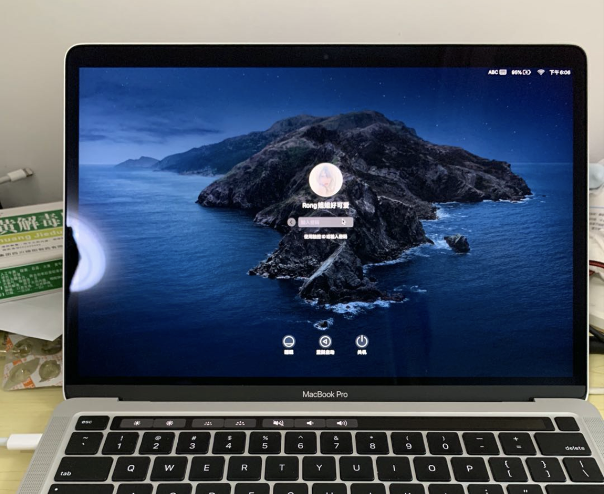

正如你们看到了，我把用户名设置成B站一样的呢，不要问为什么，我只是想偷偷告诉你，但凡你在各大平台上，看到这个title基本就是我了（像掘金、抖音....）hhhh，当然了解我的人肯定知道心里会想“就这？？”，那行吧，**既然要追求刺激，那就贯彻到底......**

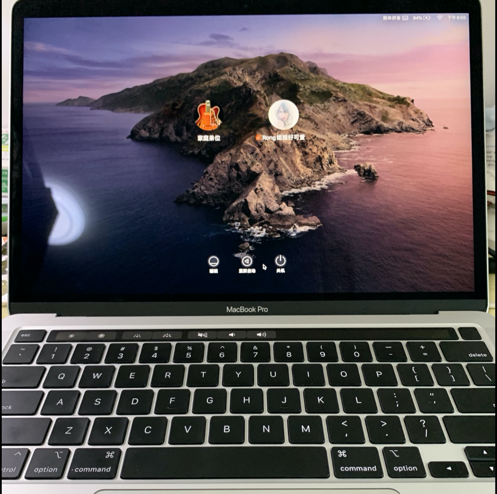

没错，我搞了两个用户，也就是两个管理员。。。这就叫双管齐下~~~

### 购机原因

作为一个毕业一年，使用Windows看剧、学习、开发五年的我，为什么会突然更换为Mac呢？其实从操作系统的本质来看，Windows和Mac在使用上有很多不一样的地方，对于那些习惯Windows操作的小伙伴来说，适应Mac的使用可能需要一段时间，比如我~，当然我买Mac的想法其实在去年九月份在杭州西湖的Apple体验店里就已经有了，之所以拖到了现在，很大程度上是因为穷甚至自己做事犹豫；不过现在买下来，我总结了下主要有这四个方面的原因：

- 旧电脑不能满足需求
- 基金追求落袋为安
- 程序开发确实需要
- 换一种编程系统使用习惯

#### 旧电脑不能满足需求

可能关注我B站动态的人朋友知道，我已经不止一次在B站吐槽我那个用来五年的Windows的在集群环境开发的时候各种发烧、白屏、蓝屏的问题，就比如有一次B站有个朋友找我帮忙看一下JavaWeb的代码（我也不怎么懂Java开发，其实），光在配置maven环境，就直接卡死........(由于我当时在做分布式的尝试，电脑上开了很多虚拟机构建的集群,配置Java的时候没有关，真的蠢）

那天的GitHub也没有更新，我记得本来本地代码做了很多改动，断更了就很可惜...

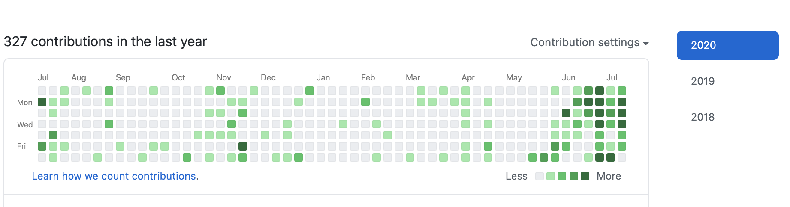

用了新电脑后，就基本每天都会提交了，可能是代码改动、可能是思维导图、也可能是记录想法的md文档，总之各种各样的，都会有一些提交..

#### 基金追求落袋为安

说到基金，能够暂时有能力换MacBookPro,真的得益于基金的帮助，众所周知Apple系列产品价格都不肥，仅仅依靠我这每个月几千块的工资，至少要3个月才能有能力去买，但那样我又舍不得..那几个月的工资去换一个硬件，当时我是从内心深处觉得不值得的，但是现在我用后的体验感告诉我——真香，真的很香

说说基金吧，由于武汉疫情，我被困在家里大概三个月，我很清楚的记得我是4月18号离开家的，当时武汉市4月8号解封的，想想好像自己有点任性、有点刚..在年初到4月底的那段时间里，美股经历了三次熔断，而且都是历史级别的，而我一个刚毕业一年多韭菜，配置偌大的美股资本市场经历了那次寒冬...当时我基本是亏的没得裤子穿的那种，2019年下半年，我本身手上也没能存多少，要是有，我想我一定能梭哈抄底的，即便抄在了山顶，看看那个时候的曲线

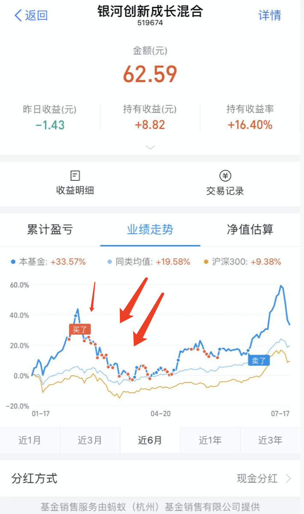

真的到现在我很心有余悸，真的是有越亏越加，一百两百...陪着资本家经历着此起彼伏...那个时候亏的真的很多很多..一度让我觉得是不是要去好好看几本书，分析一下基金行情，不能只看所谓的大V分享~

到后来，我离开了家，随着武汉慢慢的解封，全国疫情出现好转，甚至到6月份很多地方基本就恢复了原有的模样，只是出行的时候，脸上多了一个口罩...所以之前亏了那么多，但现在能够坐着写（水）文章，很大程度上依赖于喔4月底到6月初的梭哈抄底，这次是真的抄到了底吧，我也不太清楚到现在...

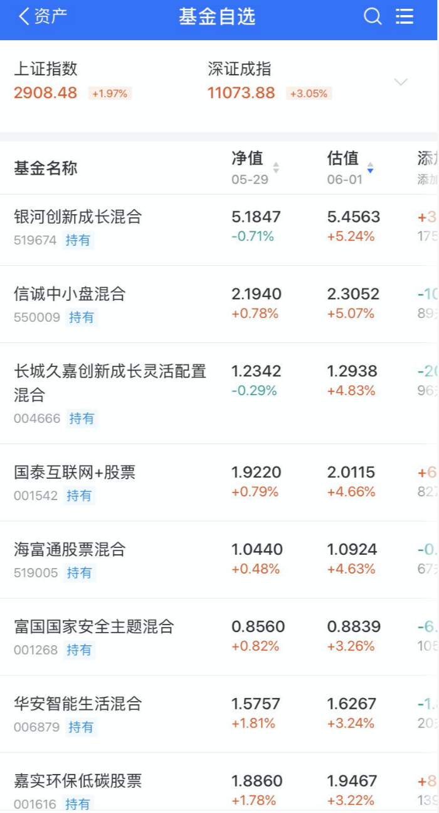

上面的那个涨幅，我很清楚地记得是在6月1日 ，因为那天我正在高铁上准备回老家，看到那个涨幅之后，我觉得我差不多了，就陆陆续续的卖了，因为当时当时是在高铁上卖的，网络很不好，记得比较深刻

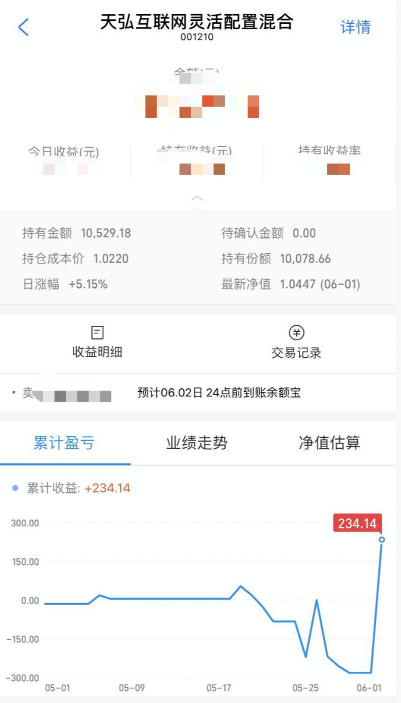

​		我也记得当时的`天弘互联网`一下子把我从`-`拉满到`+`,很开心，一向战略保守的我，那一刻是真的知足了，因为从4月底到6月初，资本市场的回暖以及自己的一些操作，年初亏进去的钱很多都已经回来了。所以我痛定思痛的考虑之后，大部分的都抛了，后来时间也证明，那次全部抛了的做法是正确的；也就是在6月1日那天，我回老家很自然的跟高中同学吃了一顿饭，在她家停留片刻、也看了她们打麻将（hhhhh，我是不会了这玩意儿）

​     回来后，我还发了个朋友圈，一是多年没见，有些感慨，二是我已经毕业了，她们仍然在选择深造，攻读研究生，而且都是211以上的研究生，作为互联网学徒、菜鸡属性的我，有些汗颜...扯远了，其实也就在那个时候，我看了看自己基金的收益，两个支付宝上的综合起来（如果你非要问我为什么会有两个支付宝，我会让你去问问小猪为什么会有两个微信....hhh），大概也有了一些，所以我当时就很有买MacBookPro的想法了，只是在由于14寸什么时候出（原来的笔记本是14.4寸，想着13寸会比较小，后来用后发现我又犯主观错误了..）,后来的后来，MacBook全网等等党都输了，新更新的2020款，也只有13寸的....

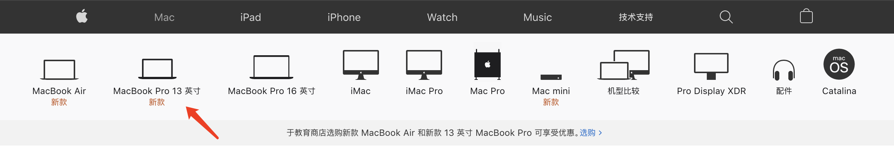

所以，看了看自己手上基金的收益，掂量掂量我自已一个月几千块的工资，我越来越心动了

  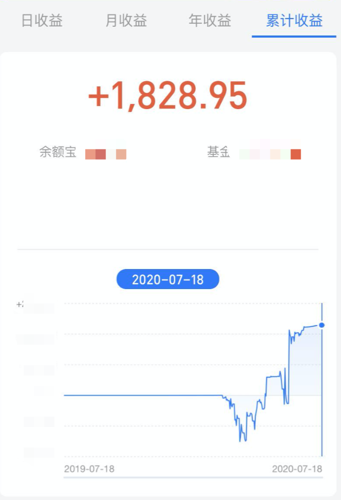
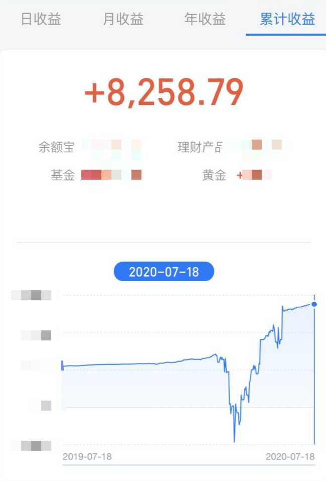

两份下来，其实也有基本1w的钱，再加上我每个月5k的工资，我觉得可以了...但是我一次性花那么多，我内心是非常抗拒的，毕竟掏出去1w多，为什么不选择24分期呢？？？？？毕竟1w多我放在手上还可以假装有钱人，甚至应对不时之需，所以后来的后来，我选择了用信用卡去24期分开偿还了..

​	因此，我简单总结下就是基金可能有了一点收益，我希望落袋为安，花完了再重新去基金市场.也就更加坚定了换电脑的决心!

#### 程序开发确实需要

​	其实吧，我记得原来的电脑，写程序确实满足不了我的需求了，而且我现在Java写得少，很多时候都是些js或者搞docker之类的，要是跑Java，估计电脑都要进土了。而且也有看网上很多关于Mac系统的使用，也是很多写代码人士推崇的工具了，尤其是不需要配置环境变量，也很大程度上帮助我们集中在更为重要的事情上..是吧！所以我觉得作为一个写代码的“程序员”，我觉得我需要一台顺手的MacBookPro了，虽然我很抗拒被叫做程序员..但这MacBookPro 是要定了（来自基金的底气）

#### 换一种编程系统使用习惯

​	已经使用了5年Windows操作系统的我，对Mac系统的使用还是小白，而现在很多大厂像某米、某头条、某金服、某巴巴的员工都会配置有macbook用来办公，虽然入职前会有系统选择，但很多人还是倾向于MacBook，所以呀，这个mac系统的使用，还是有必要在能力范围内，学一学、用一用的！！

我记得我在6月份的时候，还觉得不会用mac，那以后那天我时来运转要是去了大厂，有mac资源不会用岂不是很可惜，所以我就考虑，尝试换一种编程系统的使用习惯，向大厂靠旗，假装大厂会要我....hhh

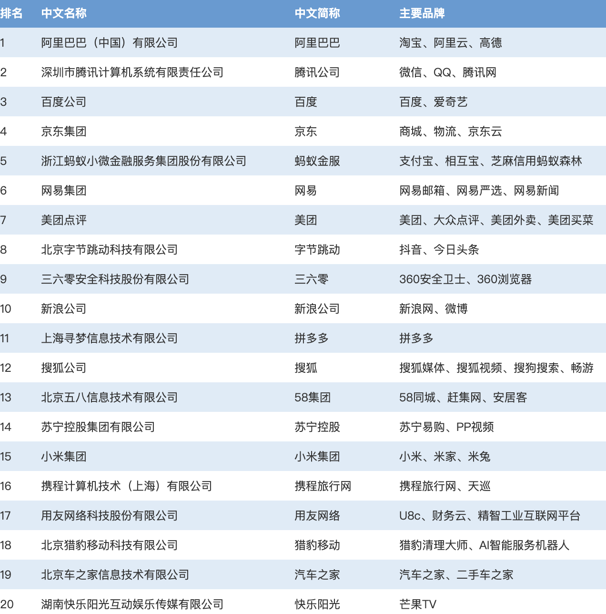

虽然我现在还只是一个只有几k薪资的小白，但梦想还是要有的...giao

### 购买过程

​	讲到购买经历，真的是一波三折，因为自己对apple系列产品不是很熟悉，并且apple的官网国内访问效果也不是很好，很多次在官网上看的时候，都会被官网体验劝退，尤其是在确定买新款的MacBook Pro的之后，笔记本的颜色也纠结了很长时间，就我个人而言我是比较喜欢灰色的，但是NTMD 偌大的apple公司，良好的MacBook竟然会掉色、掉漆，后来的后来我也就放弃了，直接选了银色..

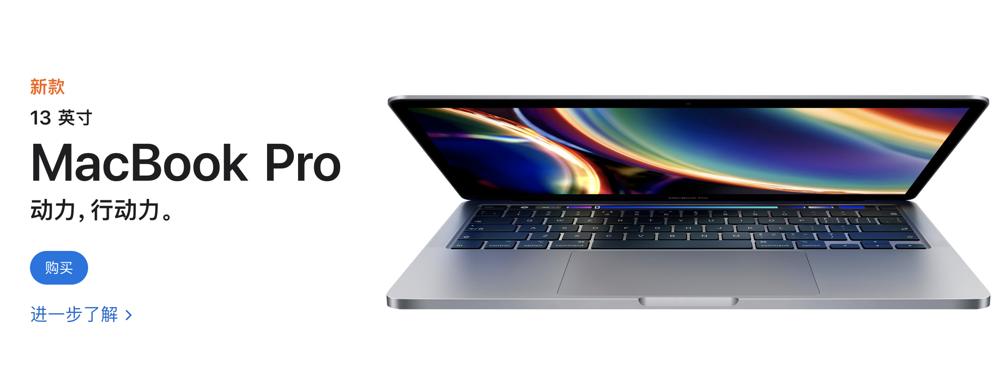

#### 官网选购

我是买的13寸的2020款的MacBook Pro，并且是通过[官网](https://www.apple.com.cn/mac/)买的，光那个购买流程我都模拟了好几次，因为是第一次买，而且是想用信用卡的方式进行分期，自己又很担心不能支持24期分期或者有手续费什么的之类的，也看了很多说明甚至购买协议等.最后我直接来到了13寸的区域，进行选择

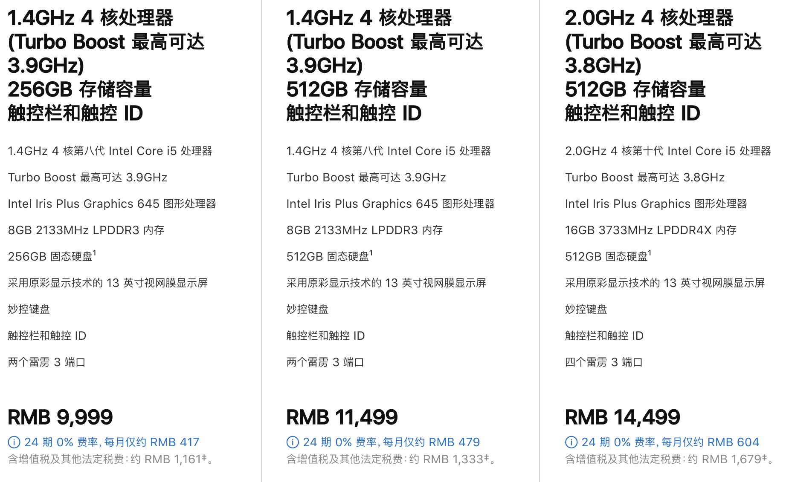

我的目标就直接放在这三种上面的了，其实还有第四种，我自己看了看自己的，觉得倾家荡产也不够，就只能选择所谓额乞丐版的了，具体是哪一款大家就猜吧..

#### 早起下单

​	大概在7月2日的早晨，还是工作日周四 ，我大概6点就起来了，赶紧到官网上将购买时需要的信息都一一填写好，在手抖的过程中，哆哆嗦嗦的使用了信用卡进行分期付款，记得上一次买电脑自己也是哆哆嗦嗦的，好像每一次在一个新的环境下都很紧张、很焦虑、很迷茫...下单后就收到了，“温馨”的apple公司发来的确认邮件

之后就平平淡淡的过了几天，我以为周四下单，到周六就可以拿到，我以为快递会很快，结果到了第二周的周三才拿到，这个过程一度让我觉得顺丰好像也不太行，直到后来我才了解到，apple的发货日在3-5个工作日内，下单后只能耐性的等待~然后等待

#### 耐心等待

周四下单的我，在等了3-5个工作日后，记住是工作日，apple作为外企，周六周日不算，所以我理论上是等了5-7天，才开始发货，终于随着apple store 里面订单状态的更新，距离拿到顺丰快递的日子越来越近了..

- 订单进度

- 拆开快递

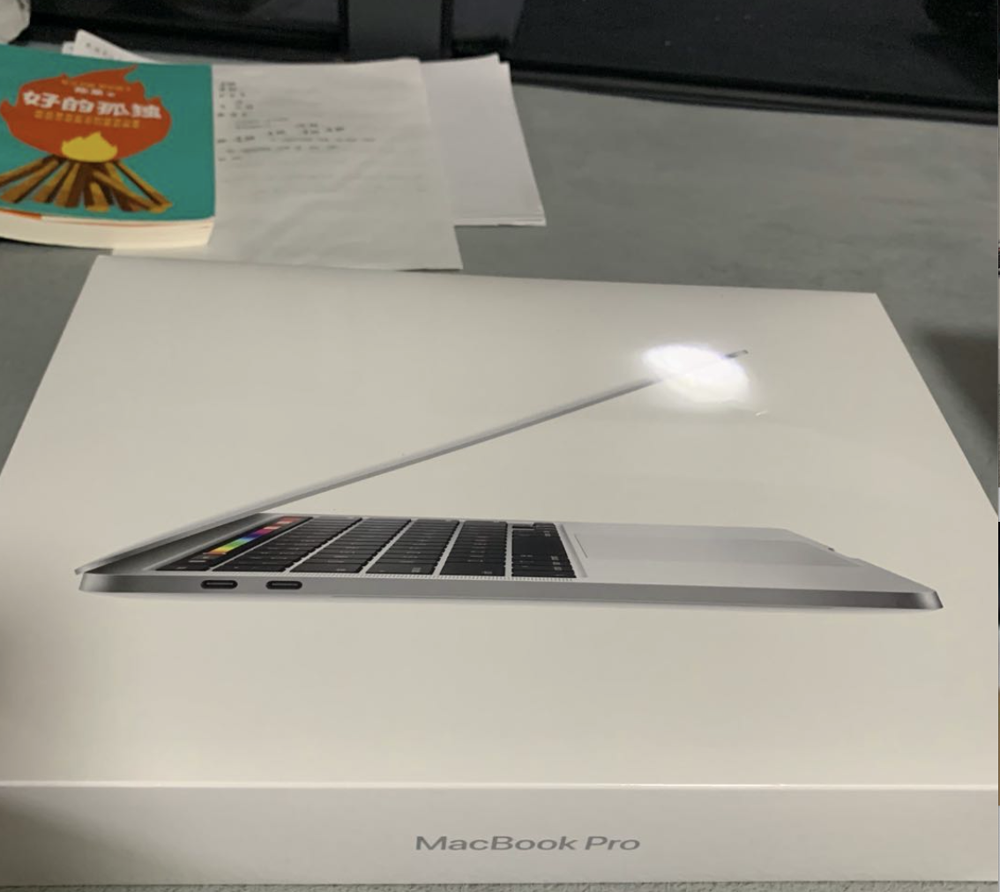

- 初始化系统

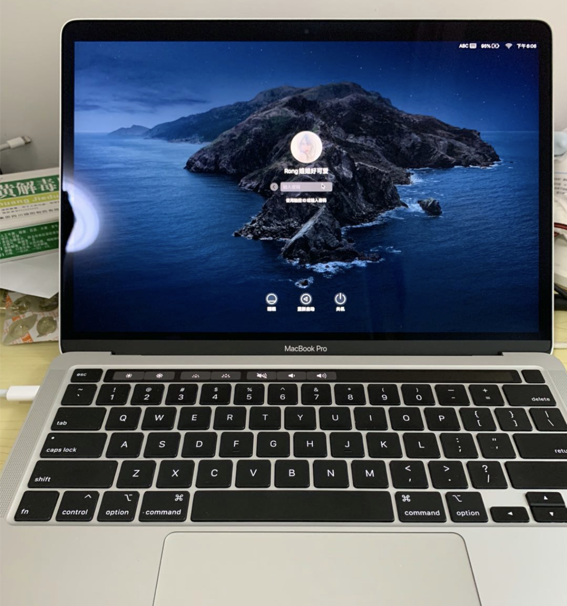

- touchBar效果

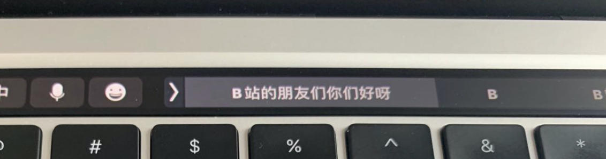

一切下来，虽然有些颠簸，但总体效果还是满意，可能是写代码或者日常使用都比较平滑吧~

#### 教育优惠小插曲

就在我拿到快递的当天，apple官网推出了所谓的教育优惠，以前我不是很了解，但当我了解到教育优惠一周，我我觉得我亏了，于是我就跟之前的同学发微信，想让帮忙买一个，我把这个退了，毕竟前后隔大约2000块.

而且我还有发朋友圈确定教育优惠这东西到底靠谱靠谱，当时确实是忙了我一阵，不过最后我思前想后，还是没有退，一是当时我已经拿到手了，而且用的也比较顺利，二是手上自己的网站迫切需要进行服务更新、服务器到期了，进行迁移，三是即便我让同学帮忙买一个，最后的购买凭证上也是她的信息，那么我自己用也就没了所谓的保修或者售后了，，，哎思来想去，还是算了，也不麻烦她了，就用这个吧..万一以后坏了，我还可以自己拿去apple体验店保修..

不过，这里也非常感谢我那同学，能够帮忙出想法、思路、甚至帮忙做决定操作，所以就还是用这个吧..贵一点就贵一点，谁让我考不上研究生呢...也就不想那么多了..

### 资金来源

在我之前的描述中，我买电脑的钱的主要还是来源于4月底到6月初的基金收益，再加上自己两个月存的工资，其实咬咬牙基本就够了，但是我还是毅然决然的去办了张信用卡..分24期，但凡我有点资金，我也不知去分期这么卑微了(微笑face)

#### 基金收益

讲道理，自己能够在毕业一年后买得起昂贵甚至奢侈的MacBook Pro很大程度上依赖于基金带来的一点收益，以及我迫切想要花掉它，重返基金市场，后来的6月底的基金行情告诉我，我的选择是对的。

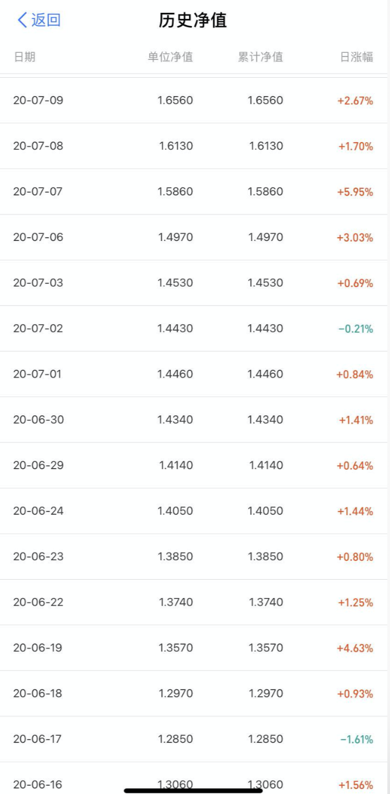

6月底的A股市场表现好，甚至一度冲高到3440点，我很多同学和朋友都在这段时间里赚到了钱，基本都涨了20%左右，但是截至到我完成这篇文章的时候，也就是7月初，A股回落很多板块两天都掉15%左右，也有一些坚持A股的，把前段时间的收益都吐出去了，所以呀！还是要及时的控制，永远不要想着靠股票、基金发大财，或许只能算作是生活的乐趣吧...

如果你非要问我，后来持仓多少，赚了多少？？我只能老老实实的说，在6月底冲高的阶段，我一度一周800块钱，也就是在每天涨9个点的时候，我20块的持仓处变不惊、不痛不痒

也就有了后来我跟朋友的一段话：

> 朋友问： 你为什么走路一瘸一拐的呀？
>
> 我回答：你看一下最近的A股，这大腿呀，都是拍肿、拍断的呀，所以走路一瘸一拐...

总之，结合我支付宝上管理的28只左右的基金来看，我错过了6月的A股市场，却也收获的自己可遇不可求的梭哈抄底，换了第一台MacBook Pro ，可谓：“有舍亦有得，知足！”

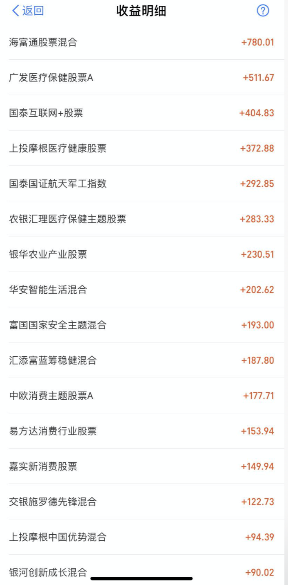

#### 两月工资

当然，买apple的产品这么贵，光靠基金的收益，也不太现实，所以我就基本也要存两个月的工资，再加上基金才能支付的起一台MacBook Pro，说来惭愧，毕业一年了，这工资还是那么几K ..

#### 信用卡分期

对于信用卡，只要你有相关的账户流水都是可以办的，只是额度的问题，我在办的时候跟业务员有很好的沟通，希望将额度提高一些、方便支付分期，所以也就有了后来顺利的下单，每个月都要还好几百块，虽然有些麻烦，但我想既然花呗也是每个月要还的，那多个信用卡其实效果也是差不多的..

哎，不说了，离还信用卡的日子越来越近了，要去借钱还了...

### 实际用途

​	就我自己而言，我平时不打游戏，无非会在B站看看视频，然后就是代码开发，剪辑视频，学习在B站做一个合格的Up主，毕竟B站人才那么多，说话要好听，做up也不是那么多的容易，因此MacBook Pro于我而言主要就是项目开发、视频剪辑等作业了

#### 项目开发

目前我主要从事的是后端开发，写JavaScript，其次Go和Java在换了电脑之后都会有涉猎，当然想前端开发、微服务自己运用在网站重构中，事情比较多，项目开发就很需要它了...

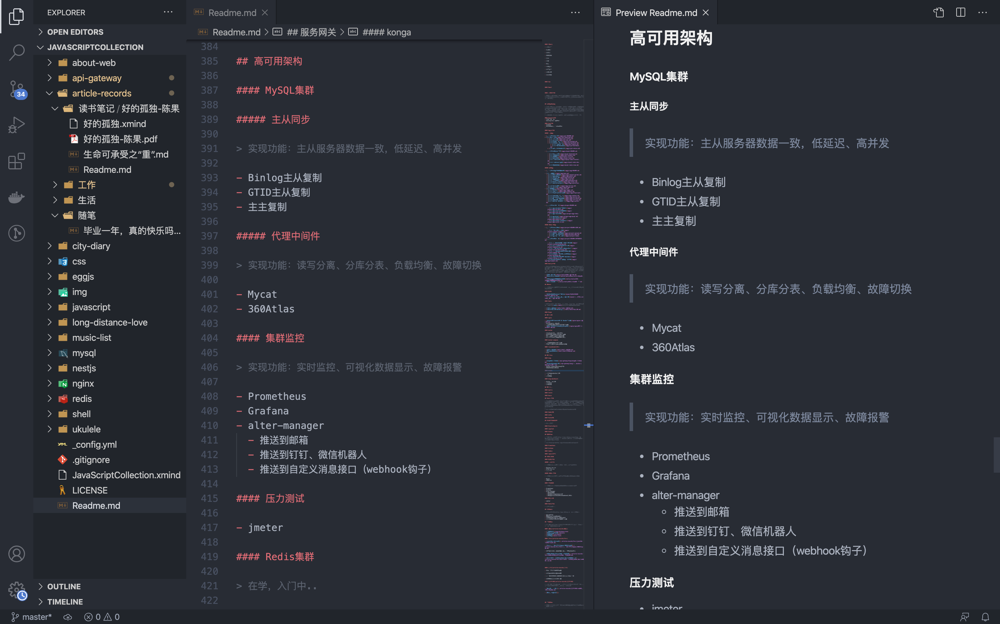

同时自己也在GitHub上开了一些仓库，其中主要是[JavaScriptCollection](https://github.com/mmdapl/JavaScriptCollection)和[408CSFamily](https://github.com/mmdapl/408CSFamily)，进行维护,基本每天都会抽出时间把自己认为重要的知识总结到这两个仓库里面，欢迎大家补充、star、关注，另外GitHub里面也会有自己其他的一些开元项目和插件。

#### 视频剪辑

作为一个up，要说不会视频剪辑，这我真的就很愧疚了，我也才开始学，想什么转场、配音、后期制作全都操作不熟练，但是等我....哈哈哈哈哈

#### 奖励自己

其实拿到这个电脑，很是感慨，说了那么多也没用，其实只是为了让自己觉得这么贵的东西花的值得，所以好好用它、多学一点东西，后面回想起来应该是不错的回忆吧~，我要去吃五谷鱼粉了，上次吃还是在学校，还是阿Rong带我去吃的

**生活有时候不那么如人意，手上抓的牌那么烂，但是没办法，只有努力打，才有机会赢...**

### 未来期许

- 学会视频剪辑、B站不断更

- 适应mac、微服务做完

- 多看几本书

