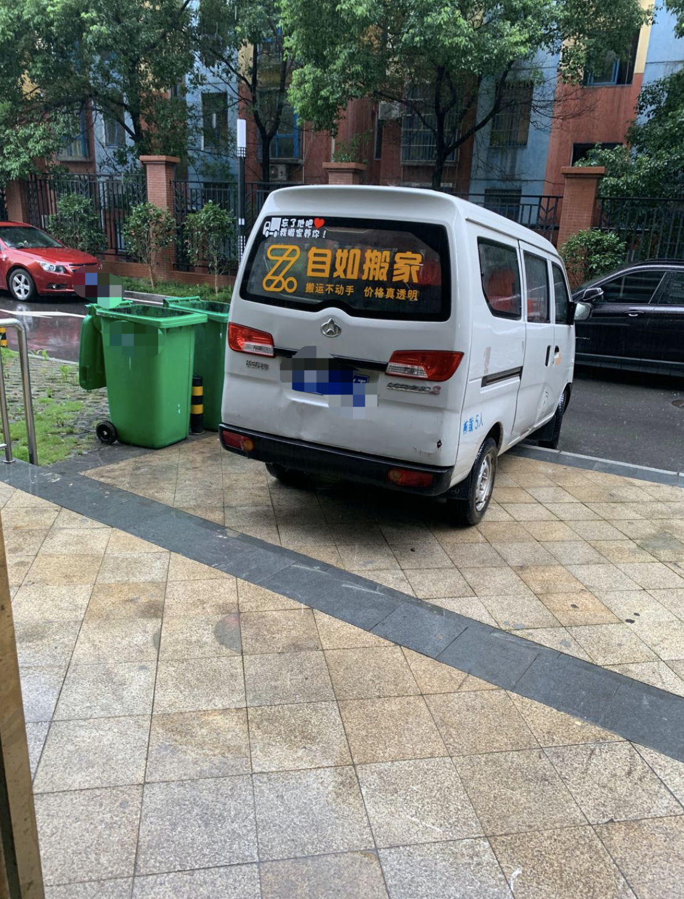
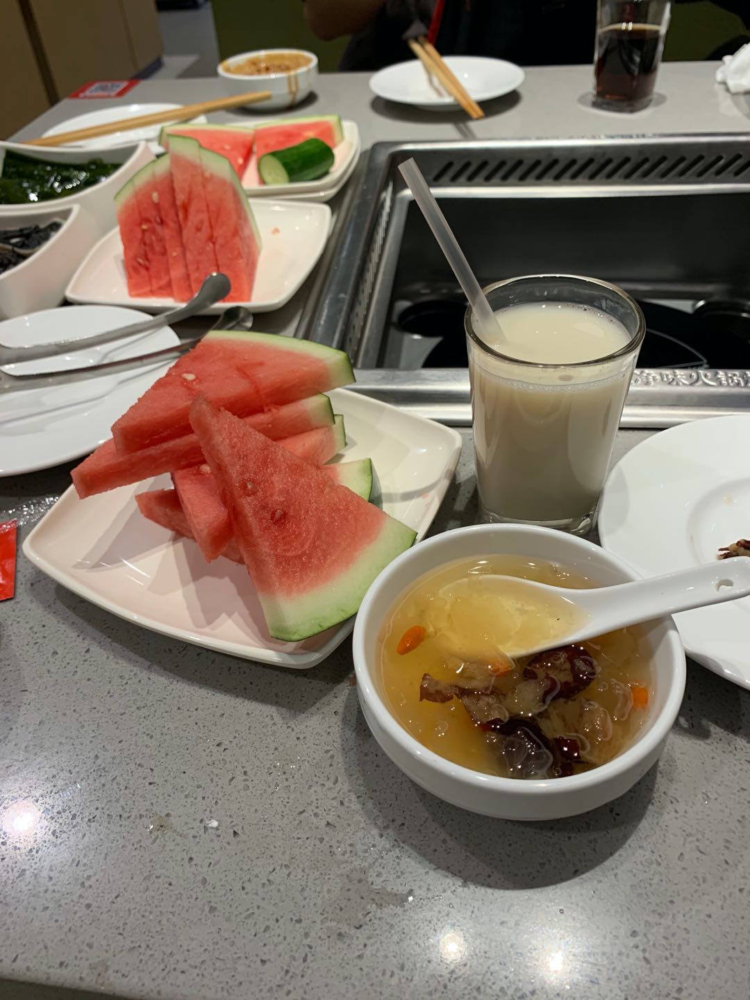
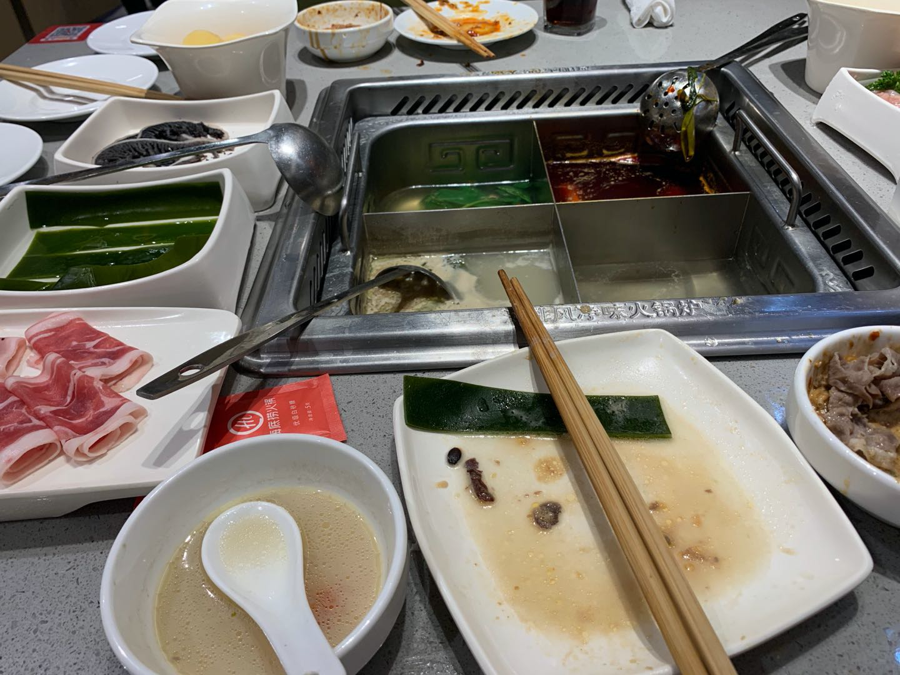
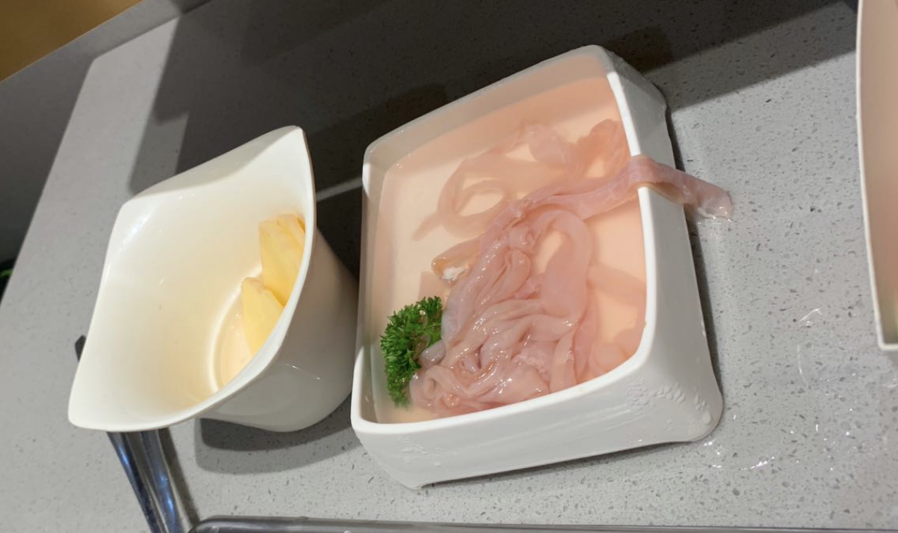
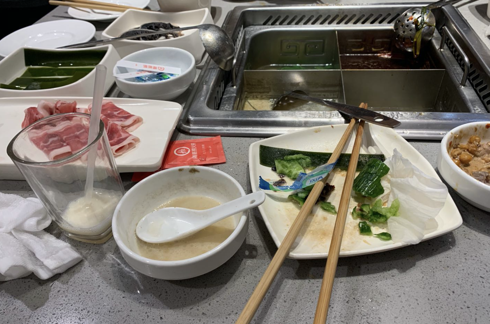
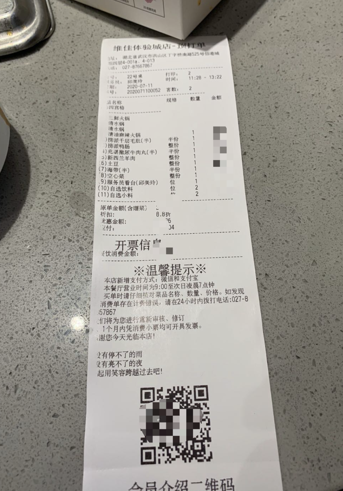

> 2020年7月11日，本来是是个高兴的日子，因为今天是星期六，可以在宿舍做一些想做的事情，有一些自己的时间；更因为昨天7月10号，发了工资...本来捉襟见肘的生活好像也多了希望。当时早上8点迷迷糊糊的醒来准备去卫生间刷牙的时候，看见门口室友收拾好自己的行李和电脑主机，我才意识到，原来自己一个人上下班的日志来的这么快，从去年9月份一起上下班都现在，时间过得竟然也那么快....

​      本来室友要换房子的事，我大概一个月前就知道了，并且上上周还和他趁着周五，提前跟组长说好，早早离开公司去自看房，我以为我心里多多少少会有些准备，只是当这一天到来的时候，我依旧有些懵逼。所以在今天早上8点多刷完牙之后，我很熟悉的看了看电脑，便到客厅问他需要帮忙搬家不（我看他东西比较多、好几个纸箱子）

时间回到去年9月份，我跟他一起是以校招的身份来的目前的这家公司（问就是某跳动、某金服之类），到现在基本10个多月了，但是我们相识应该一年多吧。在这里，我虽然把他叫做室友，但是并不是说我跟他住一间房，而是一户的不同房间；对于为什么他要搬出去另外找房子住，我总结了下：

- 目前室友（不是我）太吵，经常玩游戏到很晚，甚至自言自语
- 他希望找个安静的地方，静下来学习并沉淀技术
- 公司要换新地址了，后续可能都会搬，他提前去适应一下(我猜的)

从他决定搬出去到现在，很仓促也很果断，都说越果断的人、能力越强，我仿佛看到了一个大佬.分时间线记录一下，毕竟下周一开始，我就要一个人上下班，未免会有点难搞，没人说话、吹牛逼的行走，显得落寞、无趣！

#### 看房、租房、签合同

​	大概是在上上周五，我跟室友是约好自如租房的管家，去实地看房了的，大概看了三个，在周五晚上9点多就签合同了，大致记录一下三个房子的特点吧

- 10.4平、但室友养狗的自如单间

这个是在跟自如的管家见面简单闲聊熟悉后，带看的第一家房间，进门就被那里面的租户的宠物狗吓到了，而且房子里可能是因为养狗的原因，气味很重，当时我进去的第一印象都不是很好，如果不是想着带看的管家妹子很热情，真的就想但是就直接走，换下一间房子看；所以最后只是简单的看了看，总体感觉不是很好，于是我便把自己的体会跟室友沟通，他也觉得很有道理（哈哈哈），所以这间就直接pass掉

- 空有阳台、隔音极差的主卧

​	在结束完第一个房子的考察后，来到这一间主卧（其实是客厅隔空的），这间跟上一间不是同一栋，所以在来这一间的路上，我就疯狂的试探自如管家的态度，总之就是闲扯，看能够进行很好的沟通，因为我个人觉得沟通对于日后租房过程中有问题，至少可以更快、有效的解决。来到这个房间后，推门进去可以很明确的感受到这个房间很大，不关实际面积先比之前的要大很多，而且还带有一个阳台...

进门就发现房子大是有直接原因的，因为房租也贵了200左右，而且那个阳台其实什么都没有，连纱窗都没有，我想着怎么挡虫子什么的呀!!!!!随后跟室友简单沟通后，我直接让室友敲了一下墙，让他体验是否能够满足隔音效果（在我这里，着间房的隔音肯定是不合理的），可想而知，那个墙是明显隔离出来的，效果差到极致，就跟没有一样（简直就是合租的结构尿性）...二期对于室友来说，其实良好的隔音至少能够提供安静的环境，对于自己的日常学习也是大有裨益的。谁能够忍受吵，何况室友也是因为吵才选择搬出去租房住，因此这个房子也就没有考虑了！

- 空间足够、妹子合租的最终选择

​	在完成之前两件房子的考察后，感觉不是很满意，就跟自如管家沟通，然后重新进行选择，带看房间。于是就有了这一间，其实刚进门就能够很明显的感觉出来，客厅相比就不是那么挤，可能是由于户型的原因。在看3号房间的时候，觉得自如的这款设计风格能够满足基本需求，而且墙都是实心的，敲击也不会那么明显体验到隔音不好。相比之下这间房子就很有优势了，当我们正在讨论卫生间和房子空调的问题的时候，隔壁租客回来了，发现是个妹子。当时我就觉得这房子可以租，因为总比四个男的住在一起显得无聊、甚至吵、动静大。我想妹子也应该会比较注意卫生；果然在我的一番分析下，最终就选择了一间，定价990/月、不包水电网。虽然有一点点瑕疵——卫生间是坐便、不方便！！！应该可以理解。

​	很快，室友就跟自如管家妹子签订租房合同，价格大概是1000左右，包含各种中介费什么的呀，采用押一付三的方式，一下4000就没了，虽然当时室友好像觉得决定做的很快，但从他今天搬进去就可以看出来，其实他还是很满意的，毕竟作为一个程序员，有一个安静的学习环境是多么重要，更重要的还有个外地读书的女朋友，之后来武汉这边玩也是非常方便的。总之这一波下来不亏，至少解决很多问题

#### 清东西、搬家、海底捞

从上周签订合同后，每天下班室友回来都会简单收拾一下自己东西、慢慢的收拾，想着这周六（今天）进行搬家，原来我以为搬家很简单，搞一两个行李箱自己坐地铁就可以去，实在不济我也可以去帮忙坐地铁拖行李箱。但我没有考虑到室友5月份才买的主机，这要是搬过去地铁就显得完全不行了，这也就又来了后台的搬家公司，自如平台提供的搬家服务，早上九点半准备来!

 
  

我们也在约定好的时间的前五分钟将所有的东西搬下来了，接下来的就是很自然的装上车、开往新住处、安全入住（整个过程忽略2000字...）

当室友基本搜索的OK后，我们就下来了，这个时候也到了10:50左右。在跟自如管家小姐姐告别后，我提议去吃海底捞，一是因为饿了，二是毕竟一起上下班这么久，突然自己的生活也有了变化，就当做是践行吧，于是我就滴滴打车两个人来到的海底捞。开始我自己点了些肉和蔬菜，上图（随手牌的，喝点枸杞补一下）

  

反正西瓜是拿的比较多，海底捞的小姐姐服务也比较好，在简单的下单后，便开始日常吹牛和分享周围同事、工作的事情，想想这一年多来，其实很多东西都已经看清楚了。。。

大约吃到了下午1点多，吃了2个多小时，我们实在是撑得不行了，就面前坐着、慢慢吃、慢慢说，谈谈最近工作的不愉快的人和事、谈谈我的新MacBook Pro香不香.....不过有点鸭舌没吃完，真的挺可惜的，**以后一定要吃多少点多少了**

- 其实没有那么多吧，可能就是两个人都吃的比价少，还有我自己也吃的比较清淡（一直都是）

  

- 我的鸭舌，没有吃完是最可惜的（上次在杭州好像也没有吃完）

  

- 服务员小姐姐看我吃的差不多了，送上来了薄荷糖，我想说：我基本每天都在吃，公司前台的薄荷糖基本都是我吃的了，虽然现在牙齿可能不太好

  

最后觉得吃的OK了，就室友就结账了，关键是他竟然还可以用海底捞大学生优惠8.8折，我想难道我现在也是大学生？？？？？

  

结账完就坐地铁回来了，我也就开始今天的代码任务（GitHub仓库维护），回到住处我觉得有些感慨，觉得这个社会太现实，毕业出来工作的会遇到很多头痛的事情，自己可做的选择也不多，无非就摸爬滚打。于是就有了这篇md文档，简单记录一下自己的心情，毕竟下周一自己就要一个人去上下班，一个人吃蔡林记了..想想自己的生活节奏也会有变化.....但不论如何，出来工作了，就要学会适应社会、适应周围的变化，

**最高级的自律是独处，重视身边每一个觉得还不错的人！**

希望室友在新的小区能够快速适应，也希望在后面的日子里自己能够快速成长、平淡的做好工作任务。也不要过分去比较、过分的贩卖焦虑！！！