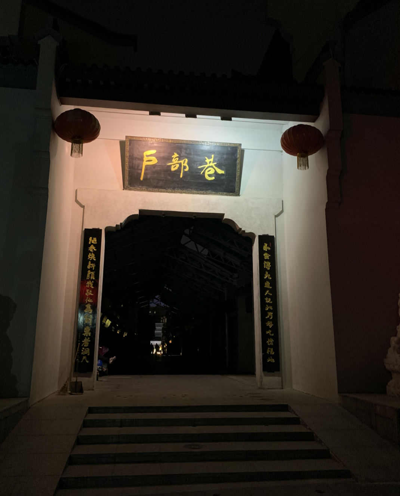
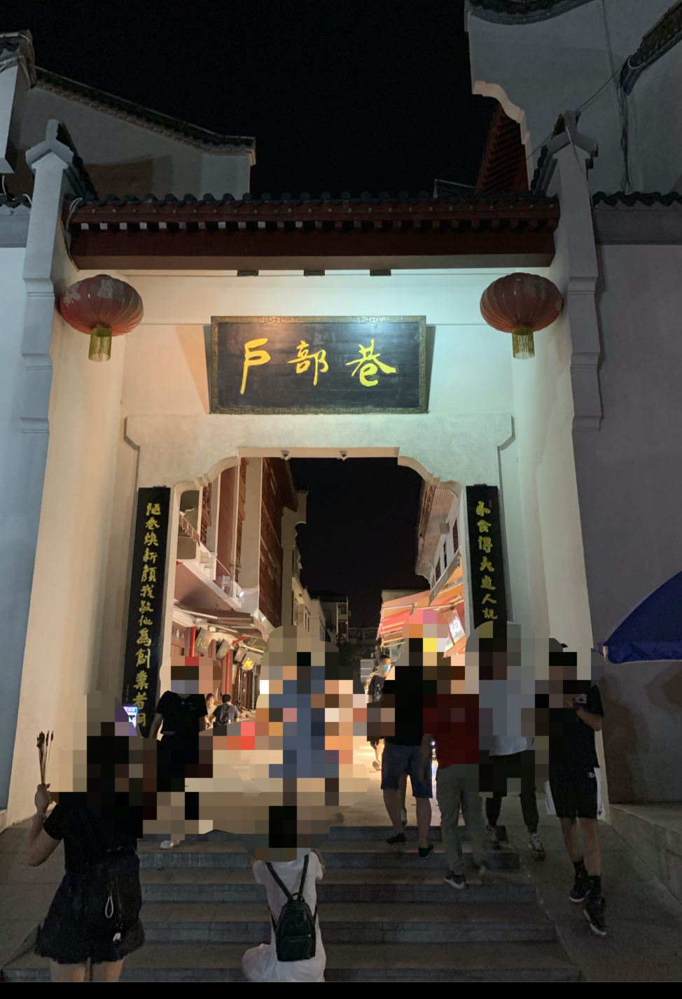
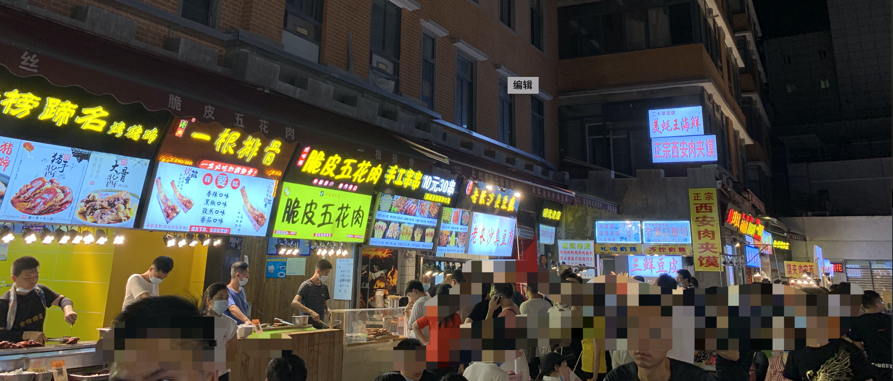
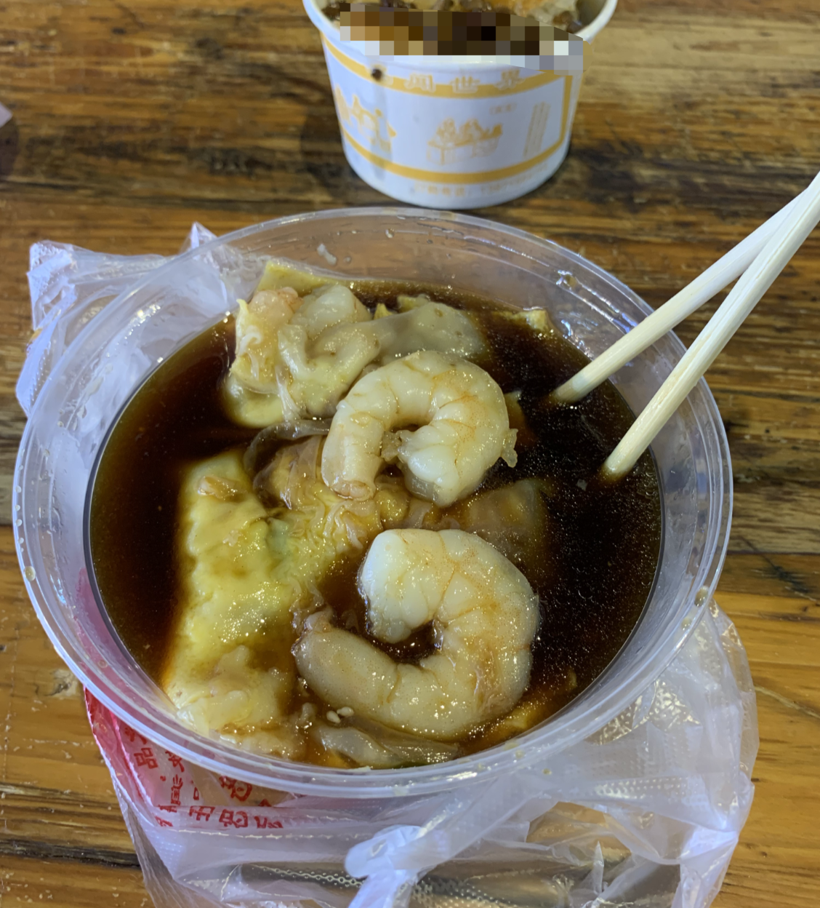
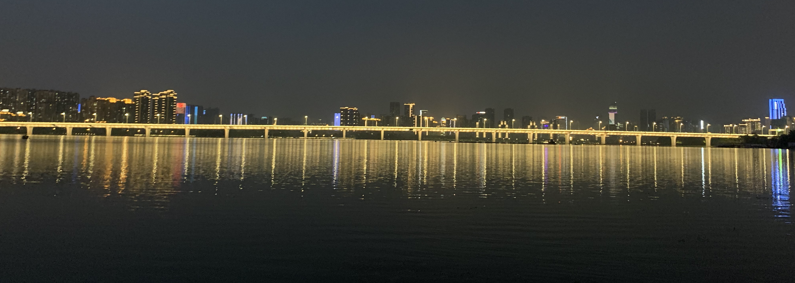
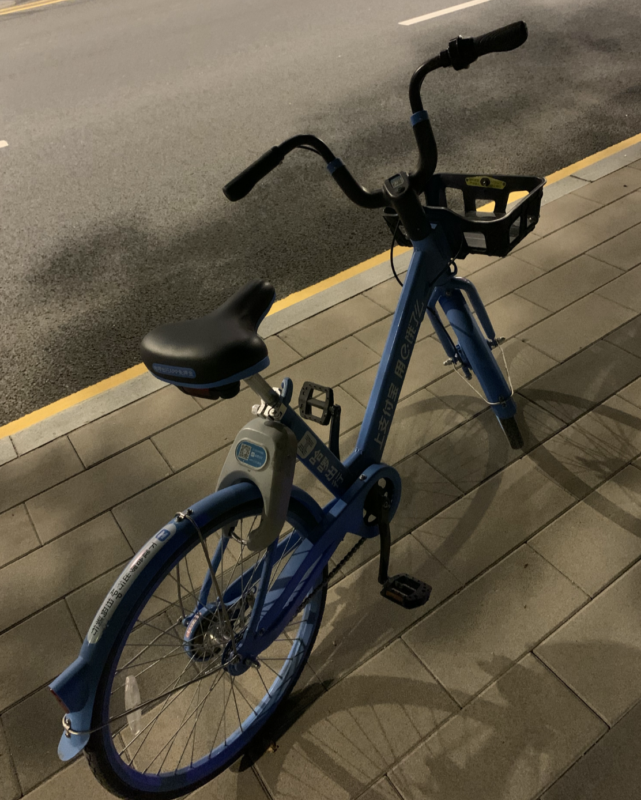
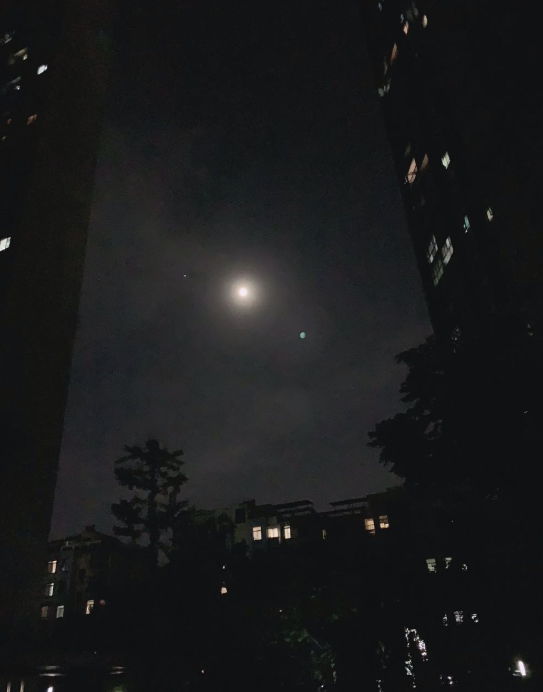

本来今天准备出门，把昨天计划好的事情的做完，谁知道下午睡到了4点，醒后部署项目到服务器上，镜像构建出了点问题。顿时就想放一放~~刚好同学D说要来我这边，问我去不去户部巷，说户部巷已经可以正常出入了，由于之前武汉疫情的原因，我大概在4月底的时候去过，那个时候，真实是空无一人！！！！

当时到处都是黑乎乎的，出入有严格的体温检查！不过既然她说已经开了，而我也很久没有出门，想想也就答应了，简单的换了双鞋就出门了。

​	户部巷离我不是很远，我以前以为很远很远，知道我慢慢熟悉了工作的节奏后，周末出门才发现离我很近很近，所以没有花多长时间，我就瞬移到户部巷了，此刻的户部巷比我之前来的时候，热闹了许多，但借用朱自清的一句话——热闹是她们的，我什么都没有~

一往里面走，人就越来越多，以前排长队等很久的长沙臭豆腐店，此刻依然要排起了长队..

​	我跟D交谈很久，见后一路上都在不停地说近况，吐槽着工作中的各种琐事。与她相识于高一，虽然很久很久没有联系，但毕业后在一个城市工作也就有了现在的交谈，她沉浸在刚升职级的喜悦中，一上来就买这种串串吃，我自然就有跟着吃了一些，但我对串串并没有太多的兴趣，倒是在武汉户部巷吃起了广东肠粉~带虾和鸡蛋的....

说来人也很奇怪，去年6月份在广州的时候，想吃武汉热干面，对肠粉没什么感冒，如今时过境迁在武汉竟然怀念起了广州的肠粉，味道很好，于我而言，在广州的那几个月，学到很多也收获不少，但仍然后很多遗憾，到现在依然无法忘怀

- 没有真正体验过台风，只是惊讶广州下雨是横着飘的
- 刚毕业，过多的考虑了自己，忽视了Rong当时的处境，甚至都没能在她需要的时候出现在她周围

关于广州，记忆深处依然有各种各样的影子，庆幸认识了技术不错的的M，湖南大学的GO语言大佬Z，也庆幸自己能够有所收获的回到武汉，回到这个不痛不痒的城市~

​	简单的跟D逛完户部巷之后，也不敢过多停留，毕竟这里始终没有恢复往日的繁华，只有稀稀散散的人群夹杂着断断续续的服务员吆喝。于是我提议去江边走走，我喜欢海、喜欢江、喜欢看着时而平静时而翻滚的水面，倘若周遭无人，便会坐下来静静的看着，以往我一个人来到江边都是这样的，可惜今天不能了，听着D说着在腾讯的工作，讨论着今年的打算，我也若有所思，会莫名其妙的想到很多，想到的自己的工作，想到周围的同学，更想到在杭州的Rong，虽然联系不那么多，但永远是报喜不报忧，永远是所有的烦恼在一见到她的那一刻都没有了...

​	大概到了9点半，我感觉时间有些晚了，就跟D说要早点回去，毕竟她那边离这里还是有些远的，所以我们就换了一个方向走，把她送到地铁站。。告别之后，我就准备自己骑车回来，结果找了周围大半天，没有找到一辆共享单车，走很久很久发现了它 

当我打开支付宝，看到它被停在了红色区域，心中的疑惑也就解开了，难怪周围没有一辆共享单车，敢情是在红色区域~~

回到家，大概已经10点半了，此时的D也已经到了她自己的住处，而我看着小区的月亮，想起了上个月在钱塘江边，指着江面的上弯月跟Rong说：杭州的月亮好圆呀~~虽然引得她冷笑（我猜的），说：明明是弯月，但我当时心里其实是想起了电影里面的情节——国外的月亮一样圆，而我说那句话的意思也其实就是想表达，当我在杭州的时候，比我现在要快乐~杭州的弯月我感觉圆，武汉的圆月倒也没有多圆...

​	写完这篇文档，整理完今天写的代码提交到Github上，今天的事情就告一段落，庆幸D能够找我闲聊，庆幸自己还能有所期待，晚安~