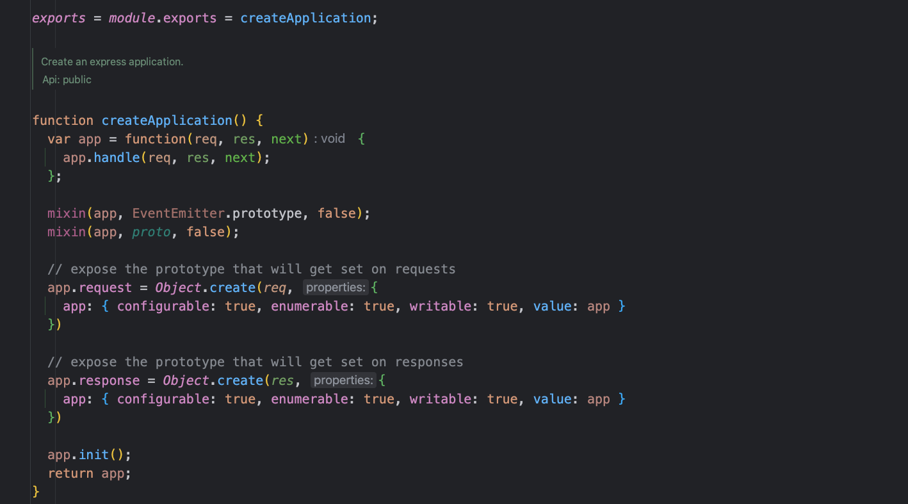
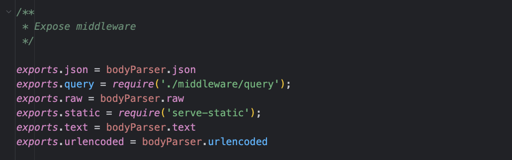
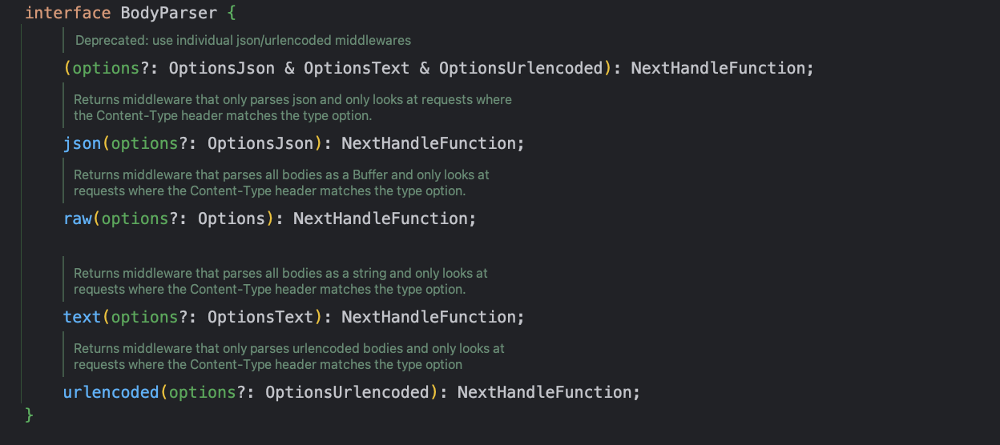
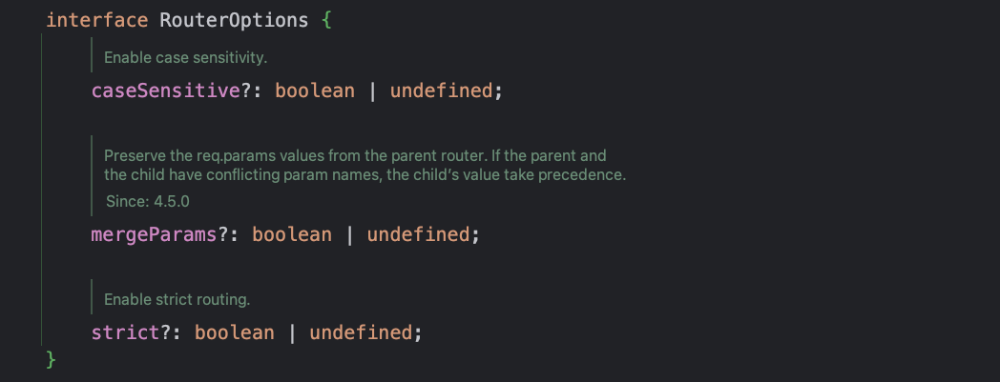

# Express框架的API演示Demo

`express`模块提供了很多API方法，要了解、使用这些API去解决一些实际问题，首先需要安装：

```shell
## 安装express
npm install express --save
```

Express框架主要提供了`express对象`、`application对象`、`request对象`、`response对象`、`router对象`的API方法，往往在使用Express框架时，
项目入口文件的第一行就是对框架的引用，例如：

```js
// 引入express模块
const express = require('express')
```

因为，这些API方法都来源`express`模块，针对不用的应用场景做的一些封装

## express()方法

express模块的入口其实是到处一个函数，通常是像上面引入一样，用变量`express`来接受，查看源码：



可以看出引入的`express`模块，实质是导出一个`createApplication`方法，用来创建`express`的应用实例，这也说明为什么往往在引入`express`后，
第二行代码就是创建`application`对象实例

```js
// 导入模块
const express = require('express')
// 创建express应用对象
const app = express()
```

设置可以从源码中看到，这个`application`对象上还绑定了`request`、`response`两个对象，使用`Object.create`创建的、分别处理请求和响应。

除了提供创建app实例的方法，在源码导出时，还在express模块上挂载一些中间件，查看源码：



> 这里也许会有疑惑，导出的一个函数，使用express变量去接收时，创建出app实例对象，为什么在函数上又能去挂载一些中间件呢？
> 其实在js发展早期，很多概念都是利用函数、对象、原型链去实现的，导出的函数可以理解为构造函数，挂载的中间件实质上也是一些方法、对象，
> 可以理解为使用static关键字标记的静态方法。

总之，如果将这里导出的express理解为一个`类`，将createApplication方法理解为构造函数，将中间件理解为静态方法，应该就要好理解很多。

> js也是到ES6推出后才有了类的概念，并且也是利用函数+对象来实现的。

这里的理解，我在阅读源码的时候发现，结合Java的面向对象思想获取更好理解，接下来就说说express类上面挂载的静态方法、中间件

### 数据处理

Express框架内置中间件

- `express.json()`
- `express.raw()`
- `express.text()`
- `express.urlencoded()`

都是基于`body-parser`模块，实质上就是利用`body-parser`中的`json()`、`raw()`、`text()`、`urlencoded()`方法，查看源码：



具体用法可以参考模块：[body-parser](https://www.npmjs.com/package/body-parser)

**可以对客户端请求传递的数据做处理，前置中间件处理好数据，交给下游的中间件、处理函数来实现逻辑**

数据处理中间件的一些参数含义：

@[code js](@code/express/apps/apis-demo/express.js)

这里要重点提一下JSON.parse()的用法，例如：

```js
JSON.parse('{}') // {}
JSON.parse('true') // true
JSON.parse('"foo"') // "foo"
JSON.parse('[1, 5, "false"]') // [1, 5, "false"]
JSON.parse('null') // null

JSON.parse(
  '{"p": 5}',
  (key, value) =>
    typeof value === 'number'
      ? value * 2 // return value * 2 for numbers
      : value, // return everything else unchanged
)
// { p: 10 }
```

参考：[JSON.parse() API用法](https://developer.mozilla.org/en-US/docs/Web/JavaScript/Reference/Global_Objects/JSON/parse#Example.3A_Using_the_reviver_parameter)

### 静态资源

Express中内置的中间件功能。提供静态文件托管管理，基于`serve-static`。

模块用法参考：[serve-static](https://www.npmjs.com/package/serve-static)

`express.static()`的基础用法：

@[code js](@code/express/apps/static-source-demo/app.js)

基于Express框架，关于静态文件托管，单独开了一篇做介绍。

### 路由

提供`express.Router()`创建一个新的路由器对象，约定接口的请求路径，例如：

@[code js](@code/express/apps/apis-demo/express-router.js)

express.Router()创建路由器对象时也支持一些额外的参数，查看源码：



其中：

- `caseSensitive`：配置是否对路由地址大小写敏感，布尔类型。默认false，即：大小写不敏感，`/test`与`/Test`效果一样。
- `mergeParams`：保留req.params父路由器的值，布尔类型。如果父级和子级的参数名称有冲突，则子级的值优先。默认false
- `strict`：是否开始严格模式路由，布尔类型。默认false，即：`/test`与`/test/`效果一样

[//]: # (路由器的用途还有很多，不仅支持多种请求类型的接口定义，还能分层管理，后面将单独开一篇详细讲讲，传送门：[路由的使用]&#40;./路由的使用.md&#41;)

## application对象

## request对象

## response对象

## router对象

## 参考

- <https://www.npmjs.com/package/express>
- <https://expressjs.com/en/4x/api.html>
