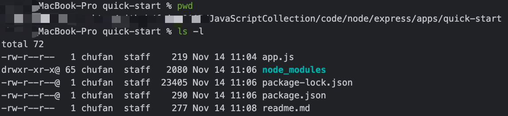

# Express框架快速开始演示Demo

## 项目初始化

```bash
## 初始化
npm init
```

## 下载依赖

```bash
# 安装Express模块
npm install express --save
npm ci
```

## 启动项目

查看项目路径：

```bash
## 查看项目路径
pwd
```



运行项目：

```bash
## 运行服务
node app.js
```

或者使用`package.json`中的脚本，启动服务

```bash
npm run dev
```

服务运行，监听`3000`端口

## 调用服务

```bash
## 调用API接口
curl -i http://127.0.0.1:3000
```

接口返回：`Hello World`


## 参考

- <https://www.expressjs.com.cn/>
- <https://www.npmjs.com/package/express>
