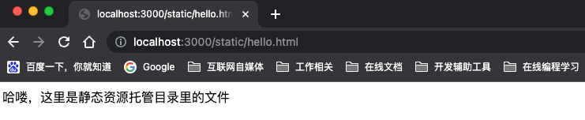
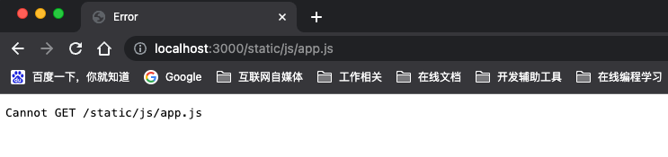

# Express框架前端静态资源托管服务演示Demo

Express框架不仅给出了前后端混合开发的解决方案，针对不同的业务场景的需要，也可以灵活运用：

- 只提供服务端接口，用做纯后端应用，开发restFul接口，舍弃掉模板引擎渲染前端页面。
- 提供静态资源托管服务，将前端需要使用的到图片、视频、js代码、css代码等托管起来，提供外部资源调用地址

## 简单介绍

使用`express.static` 内置中间件函数，可以将指定的文件目录设置成静态资源托管目录，函数的格式如下：

`express.static(root, [options])`

- root：必选参数， 静态资源目录地址，字符串类型
- options：可选参数，设置资源的一些属性，具体可以参考[API类型](https://www.expressjs.com.cn/4x/api.html#express.static)

创建`static-source-demo`项目，用来演示Express托管静态资源文件。在根目录下创建`app.js`，可以简单的使用static中间件函数，将根目录下的public目录设置成
静态资源托管的根目录，注意：**这里的public是相对路径**

```js
const express = require('express')
const app = express()
// 服务启动端口
const port = 3000

app.use(express.static('public'))

app.listen(port, () => {
  console.log(`quick-start app listening on port ${port}`)
})
```

## 使用

### 根目录的设置

使用相对路径设置

```js
// 设置静态资源托管的根目录
app.use(express.static('public'))
```

使用绝对路径设置

```js
const path = require('node:path')
// 设置静态资源托管的根目录
express.static(path.join(__dirname, 'public'))
```

### 设置多个目录

支持对多个目录的设置，提供静态资源托管服务

```js
// 分类托管视频文件
app.use(express.static('video'))

// 分类托管图片文件
app.use(express.static('images'))
```

### 资源的访问

express.static中间件函数，实质上返回的是一个请求处理器。当客户端发起请求后，分析请求路径，将命中的请求路径分发到不同的静态资源托管的根目录

所以，在使用过程中只是声明了托管资源的根目录是无效的，还需要指定该目录对应的访问路由，例如：

```js
app.use('/static', express.static('public'))
```

服务启动后，在浏览器中访问：

```text
http://localhost:3000/static/css/style.css
http://localhost:3000/static/js/app.js
http://localhost:3000/static/images/bg.png
http://localhost:3000/static/hello.html
```

文件存在时，返回渲染出文件内容：



文件不存在时，提供文件不存在：



至此，可以使用Express框架来更加方便的管理静态资源文件，给资源做托管了...

但是，这种做法已经是非常过时的，不推荐使用。使用静态资源托管更多的是推荐使用CDN服务，相比而言访问迅速、稳定性高，很多CDN服务厂商都提供了资源文件的管理后台，使用起来非常方便

**对于了解Express框架，学习、使用一些API还是非常推荐的**

## 参考

- <https://www.expressjs.com.cn/starter/static-files.html>
