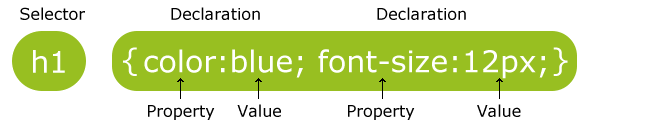
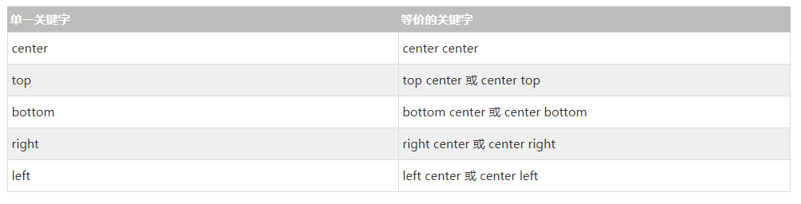
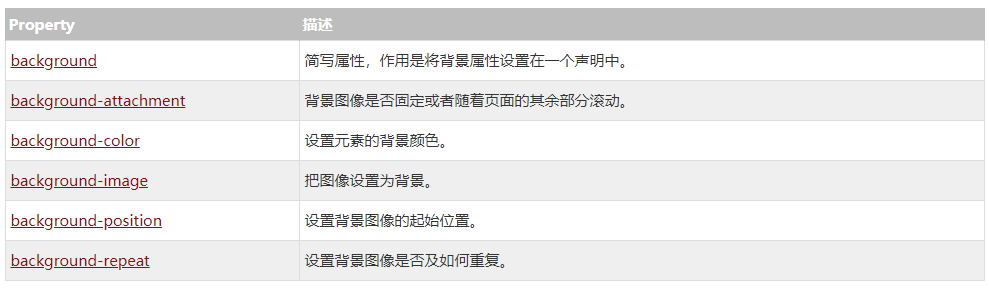
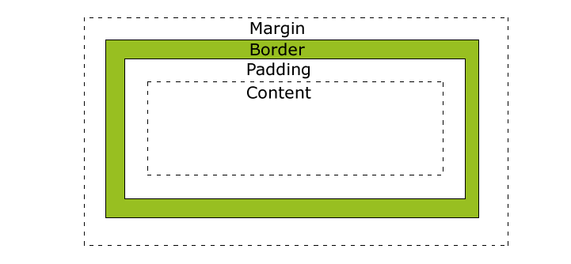
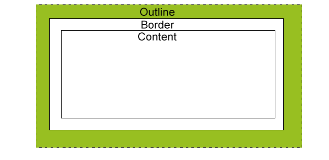

## CSS基础教程

> 后端开发Coder，为更好的学习、熟悉前端CSS结合W3CSchool文档进行总结和整理，方便后续查阅及扎实基础
>
> 参考资料：https://www.w3cschool.cn/css/
>
> 创建时间：2020年6月10日

### CSS 简介

- CSS 指层叠样式表 (**C**ascading **S**tyle **S**heets)
- 样式定义**如何显示** HTML 元素
- 样式通常存储在**样式表**中
- 把样式添加到 HTML 4.0 中，是为了**解决内容与表现分离的问题**
- **外部样式表**可以极大提高工作效率
- 外部样式表通常存储在 **CSS 文件**中
- 多个样式定义可**层叠**为一
- 样式对网页中元素位置的排版进行像素级精确控制

### CSS 样式

HTML 标签原本被设计为用于定义文档内容，如下：

```html
<h1>这是一个标题</h1>
<p>这是一个段落。</p>
```

样式表定义如何显示 HTML 元素，就像 HTML 3.2 的字体标签和颜色属性所起的作用那样。样式通常保存在外部的 .css 文件中。CSS样式表极大的提高了工作效率，通过仅仅编辑一个简单的 CSS 文档，外部样式表使你有能力同时改变站点中所有页面的布局和外观。

为了解决这个问题，万维网联盟（W3C），这个非营利的标准化联盟，肩负起了 HTML 标准化的使命，并在 HTML 4.0 之外创造出样式（Style）。

当代浏览器都支持 CSS 。

#### 多页面应用同一个样式

通常保存在外部的独立的.css文件（该文件不属于任何页面文件）可以在多个页面中使用同一个CSS样式表。通过在任何的页面文件中引用.css文件，你可以设置具有一致风格的多个页面。

#### 样式层叠

样式层叠就是对一个元素多次设置同一个样式，这将使用最后一次设置的属性值。

#### 样式层叠次序

当同一个 HTML 元素定义了多个样式时，应该使用哪个样式？

一般而言，所有的样式会根据下面的规则层叠于一个新的虚拟样式表中，其中数字 4 拥有最高的优先权。

1. 浏览器缺省设置
2. 外部样式表
3. 内部样式表（位于 <head> 标签内部）
4. 内联样式（在 HTML 元素内部）

因此，内联样式（在 HTML 元素内部）拥有最高的优先权，这意味着它将优先于以下的样式声明：<head> 标签中的样式声明，外部样式表中的样式声明，或者浏览器中的样式声明（缺省值）

### CSS 语法

#### CSS 实例

CSS 规则由两个主要的部分构成：

- 选择器（Selector）
- 以及一条或多条声明（Declaration）



**选择器通常需要改变样式的 HTML 元素，每条声明由一个属性和一个值组成。**

属性（property）是您希望设置的样式属性（style attribute）。每个属性有一个值。属性和值被冒号分开。

CSS声明总是以分号(;)结束，声明组以大括号({})括起来:

```css
p{
    color:red;
    text-align:center;
}
```

#### CSS 注释

注释是用来解释你的代码，并且可以随意编辑它，浏览器会忽略它。

CSS注释以 `/*` 开始, 以 `*/` 结束, 实例如下:

```css
/*这是个注释*/        
p{        
    text-align:center;       
    /*这是另一个注释*/        
    color:black;        
    font-family:arial;       
}
```

### CSS选择器

#### ID选择器

id 选择器可以为标有特定 id 的 HTML 元素指定特定的样式。

HTML元素以id属性来设置id选择器,**CSS 中 id 选择器以 "#" 来定义**。

```css
#para{
    text-align:center;
    color:red;
}
```

简单使用：

```html
<p id="para">内容居中显示,颜色为红色</p>
```


 ID属性不要以数字开头，数字开头的ID在 Mozilla/Firefox 浏览器中不起作用。

 **ID属性只能在每个 HTML 文档中出现一次**

#### Class选择器

class 选择器用于描述一组元素的样式，class 选择器有别于id选择器，class可以在多个元素中使用。

class 选择器在HTML中以class属性表示, 在 CSS 中，**类选择器以一个点"."号显示**：

```css
/*p标签内容居中显示*/
p.center {
    text-align:center;
}
```

简单使用：

```html
<p class="center">内容居中显示</p>
```

 **类名的第一个字符不能使用数字**！它无法在 Mozilla 或 Firefox 中起作用。

### CSS创建

插入样式表的方法：

- 外部样式表
- 内部样式表
- 内联样式

#### 外部样式表

当样式需要应用于很多页面时，外部样式表将是理想的选择。在使用外部样式表的情况下，你可以通过改变一个文件来改变整个站点的外观。每个页面使用 标签链接到样式表。 标签在（文档的）头部

```html
<head> <link rel="stylesheet" type="text/css" href="mystyle.css"> </head>
```

外部样式表可以在任何文本编辑器中进行编辑。文件不能包含任何的 html 标签。样式表应该以 .css 扩展名进行保存。

```css
hr {color:sienna;}           
p {margin-left:20px;}            
body {background-image:url(/images/back40.gif);}   
```

不要在属性值与单位之间留有空格。

#### 内部样式表

当单个文档需要特殊的样式时，就应该使用内部样式表。你可以使用 <style> 标签在文档头部定义内部样式表，就像这样:

```html
<head>
    <style>
        hr {color:sienna;}
        p {margin-left:20px;}
        body {background-image:url("images/back40.gif");}
    </style>
</head>
```


#### 内联样式
由于要将表现和内容混杂在一起，内联样式会损失掉样式表的许多优势。请慎用这种方法，例如当样式仅需要在一个元素上应用一次时。

要使用内联样式，你需要在相关的标签内使用样式（style）属性。Style 属性可以包含任何 CSS 属性。

```html
<!--改变段落的颜色和左外边距-->
<p style="color:sienna;margin-left:20px">这是一个段落。</p>
```


**多重样式**

如果某些属性在不同的样式表中被同样的选择器定义，那么属性值将从更具体的样式表中被继承过来。

例如，外部样式表拥有针对 h3 选择器的三个属性：

```css
h3{            
    color:red;            
    text-align:left;            
    font-size:8pt;            
}   
```

而内部样式表拥有针对 h3 选择器的两个属性：
```css
h3            
{            
    text-align:right;            
    font-size:20pt;            
}    
```


假如拥有内部样式表的这个页面同时与外部样式表链接，那么 h3 得到的样式是：
```css
color:red; text-align:right;           
font-size:20pt;   
```


即颜色属性将被继承于外部样式表，而文字排列（text-alignment）和字体尺寸（font-size）会被内部样式表中的规则**取代**。

**多重样式将层叠为一个**

样式表允许以多种方式规定样式信息。样式可以规定在单个的 HTML 元素中，在 HTML 页的头元素中，或在一个外部的 CSS 文件中。甚至可以在同一个 HTML 文档内部引用多个外部样式表。

**层叠次序**

当同一个 HTML 元素被不止一个样式定义时，一般而言，所有的样式会根据下面的规则层叠于一个新的虚拟样式表中，**其中数字 4 拥有最高的优先权**。

1. 浏览器缺省设置
2. 外部样式表
3. 内部样式表（位于 head 标签内部）
4. 内联样式（在 HTML 元素内部）

因此，**内联样式（在 HTML 元素内部）拥有最高的优先权，这意味着它将优先于以下的样式声明： 标签中的样式声明，外部样式表中的样式声明，或者浏览器中的样式声明（缺省值）**。

**提示:**如果你使用了外部文件的样式在内部样式中也定义了该样式，则内部样式表会取代外部文件的样式。


**多重样式优先级深入理解**

优先级用于浏览器是通过判断哪些属性值与元素最相关以决定并应用到该元素上的。

优先级仅由选择器组成的匹配规则决定的。

优先级就是分配给指定的CSS声明的一个权重，它由匹配的选择器中的每一种选择器类型的数值决定。


**多重样式优先级顺序**

下列是一份优先级逐级增加的选择器列表，其中数字 7 拥有最高的优先权：

1. 通用选择器（*）
2. 元素(类型)选择器
3. 类选择器
4. 属性选择器
5. 伪类
6. ID 选择器
7. 内联样式


**!important 规则例外**

当 !important 规则被应用在一个样式声明中时，该样式声明会覆盖CSS中任何其他的声明，无论它处在声明列表中的哪里。尽管如此，!important规则还是与优先级毫无关系。使用 !important 不是一个好习惯，因为它改变了你样式表本来的级联规则，从而使其难以调试。

一些经验法则：

- Always 要优化考虑使用样式规则的优先级来解决问题而不是 !important
- Only 只在需要覆盖全站或外部 css（例如引用的 ExtJs 或者 YUI ）的特定页面中使用 !important
- Never 永远不要在全站范围的 css 上使用 !important
- **Never 永远不要在你的插件中使用 !important**


**CSS 优先级法则**

-  A 选择器都有一个权值，权值越大越优先；
-  B 当权值相等时，后出现的样式表设置要优于先出现的样式表设置；
-  C 创作者的规则高于浏览者：即网页编写者设置的CSS 样式的优先权高于浏览器所设置的样式；
-  D 继承的CSS 样式不如后来指定的CSS 样式；
-  E 在同一组属性设置中标有"!important"规则的优先级最大；

### CSS 背景

CSS 背景属性用于定义HTML元素的背景。

CSS 属性定义背景效果：

- background-color
- background-image
- background-repeat
- background-attachment
- background-position

#### 背景颜色

background-color 属性定义了元素的背景颜色。CSS中，颜色值通常定义:

- 十六进制 - 如："#ff0000"
- RGB - 如："rgb(255,0,0)"
- 颜色名称 - 如："red"

```css
h1 {
    background-color:#6495ed;
}
p {
    background-color:#e0ffff;
}
div {
    background-color:#b0c4de;
}
```

可以为所有元素设置背景色，包括 body 一直到 em 和 a 等行内元素;

**background-color 不能继承，其默认值是 transparent。如果一个元素没有指定背景色，那么背景就是透明的，这样其父元素的背景才可见。**

#### 背景图像

background-image 属性描述了元素的背景图像.默认情况下，背景图像进行平铺重复显示，以覆盖整个元素实体.

```css
body {
    background-image:url('paper.gif');
}
```

如果需要在HTML页面上对背景图像进行平铺，可以使用 [background-repeat](https://www.w3cschool.cn/cssref/pr-background-repeat.html) 属性。

默认情况下 background-image 属性会在页面的水平或者垂直方向平铺。

如果不想让图像平铺，你可以使用 background-repeat 属性:

```css
body{
    background-image:url('img_tree.png');
    background-repeat:no-repeat;
}
```

为 background-position 属性提供值有很多方法。可以使用一些关键字：top、bottom、left、right 和 center；其次，可以使用长度值，如 100px 或 5cm；最后也可以使用百分数值。不同类型的值对于背景图像的放置稍有差异。

**关键字**

图像放置关键字最容易理解的作用就像其名字的意义。例如，top left 使图像放置在元素内边距区的左上角。

只要保证不超过两个关键字：一个对应水平方向，另一个对应垂直方向，那么你可以设置位置关键字以任何顺序出现。

如果只有一个关键字，则会默认另一个关键字为 center。



**背景- 简写属性**

在以上实例中我们可以看到页面的背景颜色通过了很多的属性来控制。

为了简化这些属性的代码，我们可以将这些属性合并在同一个属性中.背景颜色的简写属性为`background`:

```css
body {
    background:#ffffff url('img_tree.png') no-repeat right top;
}
```

当使用简写属性时，属性值的顺序为：:

- background-color
- background-image
- background-repeat
- background-attachment
- background-position



### CSS Text文本格式

通过CSS的Text属性，你可以改变页面中文本的颜色、字符间距、对齐文本、装饰文本、对文本进行缩进等等.

#### Text Color

颜色属性被用来设置文字的颜色。颜色是通过CSS最经常的指定：

- 十六进制值 - 如"＃FF0000"
- 一个RGB值 - "RGB（255,0,0）"
- 颜色的名称 - 如"红"

```css
body {
    color:blue;
}
h1 {
    color:#00ff00;
}
h2 {
    color:rgb(255,0,0);
}
```

**如果定义了颜色属性，你还必须定义背景色属性**

#### 对齐方式

文本排列属性是用来设置文本的水平对齐方式。**文本可居中或对齐到左或右,两端对齐**.当text-align设置为"justify"，每一行被展开为宽度相等，左，右外边距是对齐（如杂志和报纸）

```css
h1 {
    text-align:center;
}
p.date {
    text-align:right;
}
p.main {
    text-align:justify;
}
```

**如果想把一个行内元素的第一行“缩进”，可以用左内边距或外边距创造这种效果**

#### 文本修饰

text-decoration 属性用来设置或删除文本的装饰。

从设计的角度看 text-decoration属性主要是用来删除链接的下划线

```css
/* 无删除线*/
a {
    text-decoration:none;
}
/*顶部删除线*/
h1 {
    text-decoration:overline;
}
/*删除线中间穿过*/
h2 {
    text-decoration:line-through;
}
/*下划线*/
h3 {
    text-decoration:underline;
}
```

#### 文本缩进

文本缩进属性是用来指定文本的第一行的缩进。CSS 提供了 text-indent 属性，该属性可以方便地实现文本缩进。

**通过使用 text-indent 属性，所有元素的第一行都可以缩进一个给定的长度**。

```css
/* 首行缩进*/
p {
    text-indent:50px;
}
```

#### 文本间隔

word-spacing 属性可以改变字（单词）之间的标准间隔。其默认值 normal 与设置值为 0 是一样的。

```css
/* 指定段字之间的空间，30像素：*/
p{
    word-spacing:30px;
}
```

#### 所有CSS文本属性。

| 文本属性        | 意义描述                 |
| --------------- | ------------------------ |
| color           | 设置文本颜色             |
| direction       | 设置文本方向。           |
| letter-spacing  | 设置字符间距             |
| line-height     | 设置行高                 |
| text-align      | 对齐元素中的文本         |
| text-decoration | 向文本添加修饰           |
| text-indent     | 缩进元素中文本的首行     |
| text-shadow     | 设置文本阴影             |
| text-transform  | 控制元素中的字母         |
| unicode-bidi    | 设置或返回文本是否被重写 |
| vertical-align  | 设置元素的垂直对齐       |
| white-space     | 设置元素中空白的处理方式 |
| word-spacing    | 设置字间距               |

### CSS 字体

CSS字体属性定义字体，加粗，大小，文字样式。

#### CSS字型

在CSS中，有两种类型的字体系列名称：

- **通用字体系列** - 拥有相似外观的字体系统组合（如 "Serif" 或 "Monospace"）
- **特定字体系列** - 一个特定的字体系列（如 "Times" 或 "Courier"）

除了各种特定的字体系列外，CSS 定义了 5 种通用字体系列：

- Serif 字体
- Sans-serif 字体
- Monospace 字体
- Cursive 字体
- Fantasy 字体

#### 字体系列

font-family 属性设置文本的字体系列。

font-family 属性应该设置几个字体名称作为一种"后备"机制，如果浏览器不支持第一种字体，他将尝试下一种字体。

**如果字体系列的名称超过一个字，它必须用引号，如Font Family："宋体"。**多个字体系列是用一个逗号分隔指明：

```css
p{
    font-family:"Times New Roman", Times, serif;
}
```

#### 字体样式

主要是用于指定斜体文字的字体样式属性。

这个属性有三个值：

- 正常 - 正常显示文本
- 斜体 - 以斜体字显示的文字
- 倾斜的文字 - 文字向一边倾斜（和斜体非常类似，但不太支持）

```css
p.normal {
    font-style:normal;
}
p.italic {
    font-style:italic;
}
p.oblique {
    font-style:oblique;
}
```

**italic 和 oblique 的区别**

- 斜体（italic）是一种简单的字体风格，对每个字母的结构有一些小改动，来反映变化的外观。
- 倾斜（oblique）文本是正常竖直文本的一个倾斜版本。

**通常情况下，italic 和 oblique 文本在 web 浏览器中看上去完全一样**。

#### 字体大小

font-size 属性设置文本的大小。

能否管理文字的大小，在网页设计中是非常重要的。但是，你不能通过调整字体大小使段落看上去像标题，或者使标题看上去像段落。

请务必使用正确的HTML标签，就`<h1> `- `<h6>`表示标题和`<p>`表示段落：

字体大小的值可以是绝对或相对的大小。

绝对大小：

- 设置一个指定大小的文本
- 不允许用户在所有浏览器中改变文本大小
- 确定了输出的物理尺寸时绝对大小很有用

相对大小：

- 相对于周围的元素来设置大小
- 允许用户在浏览器中改变文字大小

**如果不指定一个字体的大小，默认大小和普通文本段落一样，是16像素（16px=1em）**

#### 设置字体大小像素

设置文字的大小与像素，完全控制文字大小

```css
h1 {
    font-size:40px;
}
h2 {
    font-size:30px;
}
p {
    font-size:14px;
}
```

**用em来设置字体大小**

为了避免Internet Explorer 中无法调整文本的问题，许多开发者使用 em 单位代替像素。

em的尺寸单位由W3C建议。

1em和当前字体大小相等。在浏览器中默认的文字大小是16px。

因此，1em的默认大小是16px。可以通过下面这个公式将像素转换为em：px/16=em

**使用百分比和EM组合**

在所有浏览器的解决方案中，设置 <body>元素的默认字体大小的是百分比

```css
body {
    font-size:100%;
}
h1 {
    font-size:2.5em;
}
h2 {
    font-size:1.875em;
}
p {
    font-size:0.875em;
}
```

**在所有浏览器中，可以显示相同的文本大小，并允许所有浏览器缩放文本的大小。**

#### 所有CSS字体属性

| 字体属性     | 描述                                 |
| :----------- | :----------------------------------- |
| font         | 在一个声明中设置所有的字体属性       |
| font-family  | 指定文本的字体系列                   |
| font-size    | 指定文本的字体大小                   |
| font-style   | 指定文本的字体样式                   |
| font-variant | 以小型大写字体或者正常字体显示文本。 |
| font-weight  | 指定字体的粗细。                     |

### CSS 链接

不同的链接可以有不同的样式链接样式

链接的样式，可以用任何CSS属性（如颜色，字体，背景等）。

特别的链接，可以有不同的样式，这取决于他们是什么状态。

这四个链接状态是：

- a:link - 正常，未访问过的链接
- a:visited - 用户已访问过的链接
- a:hover - 当用户鼠标放在链接上时
- a:active - 链接被点击的那一刻

```css
 /* 未访问链接*/
a:link {
    color:#FF0000;
}  
/* visited link */
a:visited {
    color:#00FF00;
}
/* mouse over link */
a:hover {
    color:#FF00FF;
} 
/* selected link */
a:active {
    color:#0000FF;
}  
```

当设置为若干链路状态的样式，也有一些顺序规则：

- a:hover 必须跟在 a:link 和 a:visited后面
- a:active 必须跟在 a:hover后面

#### 链接样式

根据上述链接的颜色变化的例子，看它是在什么状态。

让我们通过一些其他常见的方式转到链接样式：

#### 文本修饰

text-decoration 属性主要用于删除链接中的下划线：

```css
a:link {
    text-decoration:none;
}
a:visited {
    text-decoration:none;
}
a:hover {
    text-decoration:underline;
}
a:active {
    text-decoration:underline;
}
```

#### 背景颜色

背景颜色属性指定链接背景色：

```css
a:link {
    background-color:#B2FF99;
}
a:visited {
    background-color:#FFFF85;
}
a:hover {
    background-color:#FF704D;
}
a:active {
    background-color:#FF704D;
}
```

### CSS 列表样式

> 列表样式的属性作用
>
> - 设置不同的列表项标记为有序列表
> - 设置不同的列表项标记为无序列表
> - 设置列表项标记为图像

使用果html语言的应该知道，在网页中列表分两种：有序列表、无序列表

- 无序列表 - 列表项的标记使用特殊图形（如小黑点、小方框等）
- 有序列表 - 列表项的标记使用数字或字母

#### 不同的列表项标记

list-style-type 属性指定列表项标记的类型是

- none：不使用项目符号
- disc：实心圆
- circle：空心圆
- square：实心方块
- decimal：阿拉伯数字 
- lower-alpha：小写英文字母 
- upper-alpha：大写英文字母 
- lower-roman：小写罗马数字 
- upper-roman：大写罗马数字

```css
ul.a {
    list-style-type: circle;
}
ul.b {
    list-style-type: square;
}

ol.c {
    list-style-type: upper-roman;
}
ol.d {
    list-style-type: lower-alpha;
}
```

#### 作为列表项标记的图像

要指定列表项标记的图像，使用列表样式图像属性

```css
ul{
list-style-image: url('sqpurple.gif');
}
```

- 利用 list-style-position 可以确定标志出现在列表项内容之外还是内容内部。
- 如果你想在所有的浏览器放置同样的形象标志，就应使用浏览器兼容性解决方案，方法如下。

#### 浏览器兼容性解决方案

```css
ul {
    /*设置列表样式类型为没有列表项标记*/ 
    list-style-type: none;
    /*设置填充和边距 0px（浏览器兼容性）*/
    padding: 0px;
    margin: 0px;
}
ul li {
    /*设置图像的 URL ，并设置它只显示一次（无重复）*/
    background-image: url(sqpurple.gif);
    background-repeat: no-repeat;
    /*定位图像位置（左 0px 和上下 5px ）*/
    background-position: 0px 5px;
    /*用 padding-left 属性把文本置于列表中*/
    padding-left: 14px;
}
```

#### 列表 -简写属性

在单个属性中可以指定所有的列表属性。这就是所谓的简写属性。

为列表使用简写属性，列表样式属性设置如下：

```css
ul {
  list-style: square url("sqpurple.gif");
}
```

如果使用缩写属性值的顺序是：

1. list-style-type
2. list-style-position (有关说明，请参见下面的CSS属性表)
3. list-style-image

**在简写属性时，如果上述值丢失一个，其余仍在指定的顺序，就没关系**。

#### 所有列表属性

| 属性                | 描述                                               |
| :------------------ | :------------------------------------------------- |
| list-style          | 简写属性。用于把所有用于列表的属性设置于一个声明中 |
| list-style-image    | 将图象设置为列表项标志。                           |
| list-style-position | 设置列表中列表项标志的位置。                       |
| list-style-type     | 设置列表项标志的类型。                             |

### CSS 表格

#### 表格边框

指定CSS表格边框，使用border属性

```css
/* 表和th/ td元素有独立的边界 */
table, th, td
{
    border: 1px solid black;
}
```

显示一个表的单个边框，可以使用 border-collapse属性

#### 折叠边框

border-collapse 属性设置表格的边框是否被折叠成一个单一的边框或隔开：

```css
table{
    border-collapse:collapse;
}
table,th, td{
    border: 1px solid black;
}
```

#### 表格宽度和高度

Width和height属性定义表格的宽度和高度。

```css
/* 设置100％的宽度，50像素的th元素的高度的表格 */
table{
    width:100%;
}
th{
    height:50px;
}
```

#### 表格文字对齐

表格中的文本对齐和垂直对齐属性。

text-align属性设置水平对齐方式，像左，右，或中心

```css
/*右侧对齐*/
td{
    text-align:right;
}
/*垂直对齐属性设置垂直对齐，比如顶部，底部或中间*/
td{
    height:50px;
    vertical-align:bottom;
}
```

#### 表格填充

在表的内容中控制空格之间的边框，应使用td和th元素的填充属性

```css
td{
    padding:15px;
}
```

#### 表格颜色

```css
table, td, th{
    /* 边框颜色 */
    border:1px solid green;
}
th{
    /* 背景颜色*/
    background-color:green;
    /* 文本颜色*/
    color:white;
}
```

### CSS 盒子模型

> CSS盒模型本质上是一个盒子，封装周围的HTML元素，它包括：边距，边框，填充，和实际内容。
>
> 盒模型允许在其它元素和周围元素边框之间的空间放置元素



- **Margin（外边距）** - 清除边框区域。Margin没有背景颜色，它是完全透明
- **Border（边框）** - 边框周围的填充和内容。边框是受到盒子的背景颜色影响
- **Padding（内边距）** - 清除内容周围的区域。会受到框中填充的背景颜色影响
- **Content（内容）** - 盒子的内容，显示文本和图像

**在盒模型中，外边距可以是负值，而且在很多情况下都要使用负值的外边距**

> 元素的总宽度计算公式：
>
> - 总元素的宽度=宽度+左填充+右填充+左边框+右边框+左边距+右边距
>
> - 元素的总高度最终计算公式是这样的：
>
> - 总元素的高度=高度+顶部填充+底部填充+上边框+下边框+上边距+下边距

### CSS Border边框

> CSS 边框 (border) 可以是围绕元素内容和内边距的一条或多条线，对于这些线条，您可以自定义它们的样式、宽度以及颜色。使用CSS边框属性。
>
> CSS边框属性允许指定一个元素边框的样式和颜色

**border-style**属性用来定义边框的样式

- none: 默认无边框

- dotted: 定义一个点线框

- dashed: 定义一个虚线框

- solid: 定义实线边界

- double: 定义两个边界。 两个边界的宽度和border-width的值相同

- groove: 定义3D沟槽边界。效果取决于边界的颜色值

- ridge: 定义3D脊边界。效果取决于边界的颜色值

- inset:定义一个3D的嵌入边框。效果取决于边界的颜色值

- outset: 定义一个3D突出边框。 效果取决于边界的颜色值

#### 边框宽度

通过 border-width 属性为边框指定宽度。

可以指定长度值，比如 2px 或 0.1em；或者使用 3 个关键字之一，它们分别是 thin 、medium（默认值） 和 thick

```css
p.one{
    border-style:solid;
    border-width:5px;
}
p.two{
    border-style:solid;
    border-width:medium;
}
```

#### 边框颜色

border-color属性用于设置边框的颜色，它一次可以接受最多 4 个颜色值。可以设置的颜色：

- name - 指定颜色的名称，如 "red"
- RGB - 指定 RGB 值, 如 "rgb(255,0,0)"
- Hex - 指定16进制值, 如 "#ff0000"

**还可以设置边框的颜色为"transparent", border-color单独使用是不起作用的，必须得先使用border-style来设置边框样式**

```css
p.one{
    border-style:solid;
    border-color:red;
}
p.two{
    border-style:solid;
    border-color:#98bf21;
}
```

#### 边框-单独设置各边

```css
/*可以指定不同的侧面不同的边框*/
p{
    border-top-style:dotted;
    border-right-style:solid;
    border-bottom-style:dotted;
    border-left-style:solid;
}
/*也可以设置一个单一属性*/
p{
    border-style:dotted solid;
}
```

**border-style属性**：

- border-style:dotted solid double dashed;
  - 上边框是 dotted
  - 右边框是 solid
  - 底边框是 double
  - 左边框是 dashed
- border-style:dotted solid double;
  - 上边框是 dotted
  - 左、右边框是 solid
  - 底边框是 double
- border-style:dotted solid;
  - 上、底边框是 dotted
  - 左、右边框是 solid
- border-style:dotted;
  - 四面边框是 dotted

**也可以和border-width 、 border-color一起使用**

#### 透明边框

CSS2 引入了边框颜色值 transparent，这个值用于创建有宽度的不可见边框。透明样式的定义:

```css
a:link, a:visited {
    border-style: solid;
    border-width: 5px;
    border-color: transparent;
}
a:hover {
    border-color: gray;
}
```

**利用 transparent，使用边框就像是额外的内边距一样；**

#### 边框-简写属性

上面的例子用了很多属性来设置边框，也可以在一个属性中设置边框。

可以在"border"属性中设置：

- border-width
- border-style (required)
- border-color

```css
p{
    border:5px solid red;
}
```

#### CSS 边框属性

| 基本属性            | 简单描述                                                     |
| :------------------ | :----------------------------------------------------------- |
| border              | 简写属性，用于把针对四个边的属性设置在一个声明。             |
| border-style        | 用于设置元素所有边框的样式，或者单独地为各边设置边框样式。   |
| border-width        | 简写属性，用于为元素的所有边框设置宽度，或者单独地为各边边框设置宽度。 |
| border-color        | 简写属性，设置元素的所有边框中可见部分的颜色，或为 4 个边分别设置颜色。 |
| border-bottom       | 简写属性，用于把下边框的所有属性设置到一个声明中。           |
| border-bottom-color | 设置元素的下边框的颜色。                                     |
| border-bottom-style | 设置元素的下边框的样式。                                     |
| border-bottom-width | 设置元素的下边框的宽度。                                     |
| border-left         | 简写属性，用于把左边框的所有属性设置到一个声明中。           |
| border-left-color   | 设置元素的左边框的颜色。                                     |
| border-left-style   | 设置元素的左边框的样式。                                     |
| border-left-width   | 设置元素的左边框的宽度。                                     |
| border-right        | 简写属性，用于把右边框的所有属性设置到一个声明中。           |
| border-right-color  | 设置元素的右边框的颜色。                                     |
| border-right-style  | 设置元素的右边框的样式。                                     |
| border-right-width  | 设置元素的右边框的宽度。                                     |
| border-top          | 简写属性，用于把上边框的所有属性设置到一个声明中。           |
| border-top-color    | 设置元素的上边框的颜色。                                     |
| border-top-style    | 设置元素的上边框的样式。                                     |
| border-top-width    | 设置元素的上边框的宽度。                                     |

### CSS 轮廓（outline）属性

>  轮廓（outline）是绘制于元素周围的一条线，位于边框边缘的外围，可起到突出元素的作用。
>
> 轮廓（outline）属性指定了样式，颜色和外边框的宽度。
>
> 轮廓（outline）属性的位置让它不像边框那样参与到文档流中，因此轮廓出现或消失时不会影响文档流，即不会导致文档的重新显示。

#### CSS 轮廓（outline）

轮廓（outline）是绘制于元素周围的一条线，位于边框边缘的外围，可起到突出元素的作用。

CSS outline 属性规定元素轮廓的样式、颜色和宽度。



#### 所有CSS 轮廓（outline）属性

| 属性          | 说明                             | 可取的值                                                     | CSS版本 |
| :------------ | :------------------------------- | :----------------------------------------------------------- | :------ |
| outline       | 在一个声明中设置所有的外边框属性 | `outline-color` `outline-style` `outline-width` `inherit`    | 2       |
| outline-color | 设置外边框的颜色                 | `color-name` `hex-number` `rgb-number` `invert` `inherit`    | 2       |
| outline-style | 设置外边框的样式                 | `none` `dotted` `dashed` `solid` `double` `groove` `ridge` `inset` `outset` `inherit` | 2       |
| outline-width | 设置外边框的宽度                 | `thin` `medium` `thick` `length`  `inherit`                  | 2       |

### CSS Margin(外边距)

#### 外边距

CSS Margin(外边距)属性定义元素周围的空间。

CSS Margin属性接受任何长度单位、百分数值甚至负值。

#### Margin

margin清除周围的元素（外边框）的区域。margin没有背景颜色，是完全透明的

margin可以单独改变元素的上，下，左，右边距。也可以一次改变所有的属性。

#### 可能的值

| 值     | 简单说明                                    |
| :----- | :------------------------------------------ |
| auto   | 设置浏览器边距。 这样做的结果会依赖于浏览器 |
| length | 定义一个固定的margin（使用像素，pt，em等）  |
| %      | 定义一个使用百分比的边距                    |

**Margin可以使用负值，重叠的内容。**

### CSS Padding（填充）

> CSS Padding（填充）属性定义元素边框与元素内容之间的空间。
>
> 当元素的 Padding（填充）（内边距）被清除时，所"释放"的区域将会受到元素背景颜色的填充。
>
> 单独使用填充属性可以改变上下左右的填充。缩写填充属性也可以使用，一旦改变一切都改变。

#### 可能的值

| 可能的值 | 简单说明                            |
| :------- | :---------------------------------- |
| length   | 定义一个固定的填充(像素, pt, em,等) |
| %        | 使用百分比值定义一个填充            |

CSS padding 属性可以使用长度值或百分比值，**但与 margin 属性不同，不允许使用负值**。

#### 内边距的百分比数值

CSS padding 属性的百分比数值是相对于其父元素的 width 计算的，如果改变了父元素的 width，则它们也会改变。

```css
/* 段落的内边距设置为父元素 width 的 20% */
p {
    padding: 20%;
}    
```

**上下内边距与左右内边距一致，即上下内边距的百分数会相对于父元素宽度设置，而不是相对于高度**。

#### 填充- 单边内边距属性

```css
/*指定不同的侧面不同的填充*/
div{
    padding-top:25px;
    padding-bottom:25px;
    padding-right:50px;
    padding-left:50px;
}
```

#### 填充 - 简写属性

为了缩短代码，它可以在一个属性中指定的所有填充属性。

这就是所谓的缩写属性。所有的填充属性的缩写属性是"padding":

**padding:25px 50px 75px 100px;**

- 上填充为25px
- 右填充为50px
- 下填充为75px
- 左填充为100px

**padding:25px 50px 75px;**

- 上填充为25px
- 左右填充为50px
- 下填充为75px

**padding:25px 50px;**

- 上下填充为25px
- 左右填充为50px

**padding:25px;**

- 所有的填充都是25px

### CSS 尺寸

> CSS 尺寸 (Dimension) 属性允许你控制元素的高度和宽度。同样，它允许你增加行间距

#### 所有属性

| 基本属性    | 简单描述             |
| :---------- | :------------------- |
| height      | 设置元素的高度。     |
| line-height | 设置行高。           |
| max-height  | 设置元素的最大高度。 |
| max-width   | 设置元素的最大宽度。 |
| min-height  | 设置元素的最小高度。 |
| min-width   | 设置元素的最小宽度。 |
| width       | 设置元素的宽度。     |

### CSS 显示与可见性

#### Display(显示) 

> display:none可以隐藏某个元素，且隐藏的元素不会占用任何空间。也就是说，该元素不但被隐藏了，而且该元素原本占用的空间也会从页面布局中消失。

#### Visibility（可见性）

> visibility:hidden可以隐藏某个元素，但隐藏的元素仍需占用与未隐藏之前一样的空间。也就是说，该元素虽然被隐藏了，但仍然会影响布局。

#### CSS Display - 块和内联元素

块元素是一个元素，占用了全部宽度，在前后都是换行符。

块元素的例子：

- h元素

- p元素

- div元素

内联元素只需要必要的宽度，不强制换行。

内联元素的例子：

- span元素
- a元素

**可以更改内联元素为块元素，反之亦然**

```css
/*列表项显示为内联元素*/
li {
    display:inline;
}
/*span元素作为块元素*/
span {
    display:block;
}
```

**变更元素的显示类型看该元素是如何显示，它是什么样的元素。例如：一个内联元素设置为display:block是不允许有它内部的嵌套块元素。**

### CSS Positioning(定位)

> CSS position 属性，允许将布局的一部分与另一部分重叠，还可以完成多年来通常需要使用多个表格才能完成的任务。
>
> CSS定位属性允许你为一个元素定位。它也可以将一个元素放在另一个元素后面，并指定一个元素的内容太大时，应该发生什么。元素可以使用的顶部，底部，左侧和右侧属性定位。然而，这些属性无法工作，除非事先设定position属性。他们也有不同的工作方式，这取决于定位方法.

#### Static 定位

HTML元素的默认值，即没有定位，元素出现在正常的流中。

静态定位的元素不会受到top, bottom, left, right影响。

#### Fixed 定位

元素的位置相对于浏览器窗口是固定位置。

即使窗口是滚动的它也不会移动：

```css
p{
    position:fixed;
    /* 距离顶部30px*/
    top:30px;
    /* 距离右侧5px*/
    right:5px;
}
```

**Fixed 定位在 IE7 和 IE8 下需要描述 !DOCTYPE 才能支持.Fixed定位使元素的位置与文档流无关，因此不占据空间。Fixed定位的元素和其他元素重叠。**

#### Relative 定位

相对定位元素的定位是相对其正常位置。

```css
h2.pos_left{
    position:relative;
    left:-20px;
}
h2.pos_right{
    position:relative;
    left:20px;
}
```

可以移动的相对定位元素的内容和相互重叠的元素，原本所占的空间不会改变

```css
h2.pos_top{
    position:relative;
    top:-50px;
}
```

相对定位元素经常被用来作为绝对定位元素的容器块。

#### Absolute 定位

绝对定位的元素的位置相对于最近的已定位父元素，如果元素没有已定位的父元素，那么它的位置相对于<html>:

```css
h2{
    /* 绝对定位 */
    position:absolute;
    left:100px;
    top:150px;
}
```

#### 重叠的元素

元素的定位与文档流无关，所以它们可以覆盖页面上的其它元素,z-index属性指定了一个元素的堆叠顺序（哪个元素应该放在前面，或后面）一个元素可以有正数或负数的堆叠顺序：

```css
img{
    position:absolute;
    left:0px;
    top:0px;
    z-index:-1;
}
```

