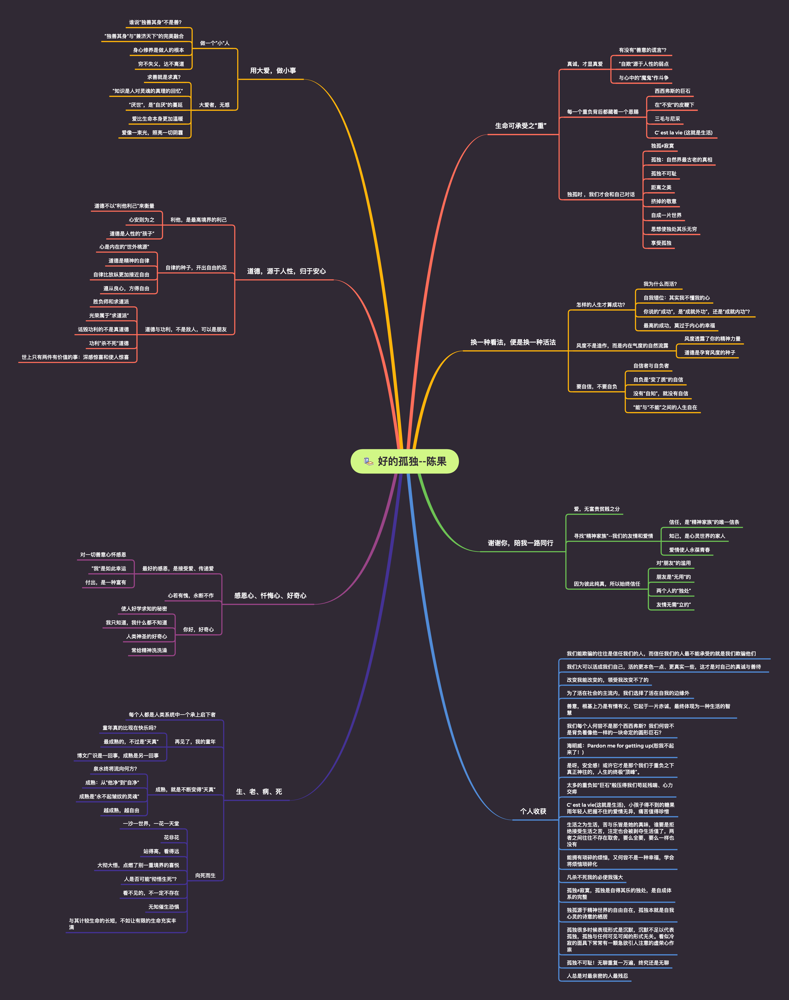
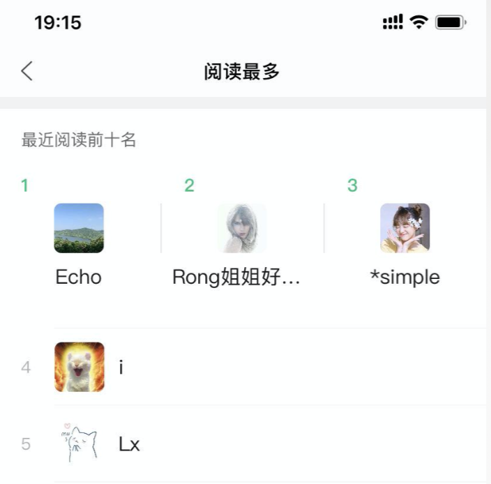
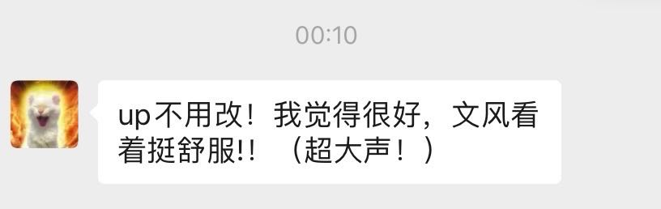

<!--
 * @Description:  朋友是无用的
 * @Version: Beata1.0
 * @Autor: 【B站&公众号】Rong姐姐好可爱
 * @Date: 2020-09-06 20:15:59
 * @LastEditors: 【B站&公众号】Rong姐姐好可爱
 * @LastEditTime: 2020-09-06 21:43:11
-->

### 写在最前面
可能是最近感觉有些忙，但又觉得不知道每天忙的重点在那种，所以身心很疲倦，早上9点多睡醒后，翻起了窗口的那本果果的书《好的孤独》，这是一本从我去年只身前往广州实习就陪伴我的书，也是来自我很喜欢的复旦大学教授陈果的著作，当然这也是Rong买来邮给我我的；我不记得当初在广州怎么就想看书，怎么就想让Rong给我买。当时至今日，我仍然记得，这本书的点滴内容；

> ps: 网上有人喷果果的哲学思想太过理性化了，这里真的就不想说什么了；总之她，我很喜欢，至少从我个人的现状上，我觉得这本书的很多内容，对我是很有帮助了，如果你非要去理会网上很多“刚下火星， 清华在读”的评论家的话，我也没有办法；对于有争议的果果，见仁见智吧；

### 好的孤独
《好的孤独》这本书，这一年多来，尤其是我在广州的时候，翻看过很多遍，离开广州的时候也没舍得扔， 一直在我桌上，感觉想不通、看不透、比不过的时候，就会翻一翻， 也因此做个思维导图

书中的内容丰富，但今天我不想做过多的赘述，因为我觉得读者如果没有跟作者产生共鸣， 很容易先入为主，觉得写得好，亦或是写的不好。这里，我只想谈谈陈果书中所有的：

> 朋友是“无用”的

之所以谈这个，主要是我觉得大学毕业以后，尤其是工作了，跟原来在学校的时候很不一样，我自身是一个慢热的人，甚至有点冷，冷到Rong在15年的时候，觉得我不好沟通，冷到实习的时候，来自湖南的前端小刘觉得我高冷，虽然现在前端小刘跟我在朋友圈谈笑风生，虽然Rong也成了我的对象；但这些并没有妨碍我在毕业后，跟以前的同学、朋友一天天的生疏，甚至没了交流；这也就导致了，为什么我现在微信里面的人越来越少了....因为没有交集、因为我被删了、因为我觉得可能不是一路人了

### 人走茶凉
我在公司经常跟前端付老板说，**我这一辈子，最怕被人瞧不起**（hhhh），尽管没有言辞酌句这般严重，但也能侧面反应的心理的阴暗~~~ (噗呲)

唐诗有：“春风得意马蹄急，一日看尽长安花”，就我周围曾经认识的、有过交集的，现在很多都断了联络；原因有很多的：

- 有考上研究生，不跟我聊天的，当然我也不找，除非你关注我（hhhh）
- 有去了不同城市，谈不到一个话题的..
- 有从事不同的行业，觉得我瞧不起他、他瞧不起我的

当然，也有我收敛不去主动联络的（家庭弟位问题），总之，是越来越少的呢；这里列举只是举个例子，就我自己而言，我也有很多问题，毕竟我心理还是很阴暗（2333）  

我非常庆幸的是，不论在上学还是工作了，即使平常吹牛皮、谈人生的人渐渐少了，但是Rong一直在陪着我，不会像别的女孩子那样喋喋不休，给我压力，在很多事情上总是能够用轻描淡写的一句话或者一个字，给我阴暗的心理留下浓墨重彩的一笔，让我恍然大悟、豁然开朗，在看待问题、遇上抉择摇摆不定的时候，总是支持我、相信我...谈到这里，回想起她在我身后这默默的五年，很是感慨；

就好像今天为什么会突然谈到这，因为我发现，当我偷偷注册公众号，每天写着一些没人看的技术文章和水文，她默默的关注了我（要知道，我连开公众号，都没有跟她说）、看我发的图文；特别是今天中午在吃饭的时候，本来我还觉得口水鸡不好吃，在感慨就我目前这个状态，怎么才能让生活好一点，怎么才能让自己每天不想那么多的时候，我看到了这个：

中午那个不怎么好吃的口水鸡，瞬间就有那么一点点的香了，即便可能是自己想太多，心理作用；

这里，我简单介绍一下，我那为数不多的公众号关注者的2、3、4、5个“铁粉”吧

- **Rong姐姐好可爱**  这给关注了我的应该都知道，这个就是我本人，至于为什么我排第二，那自然是：自己写的文章自己都不捧场，是不是自己都看不下去了哈哈哈

- **simple**  一个简单到不能再简单的昵称，Rong用了三四年了，不错，她就是我在很多文章场合提到过的，那个陪了我五年的Rong（此处省略一百万字....）
- **i** 这个头像我记得，虽然我到现在不知道他是男是女，也不记得是什么时候开始关注我的，目前影响最深的就是半夜跟我发鼓励的话：

令我到现在都不能释怀的时，我回他的消息，到现在都没有回我........(我心理又要开始阴暗了)

- **Lx**  这个不多说，本UP赞助最多的观众，没有之一，一句话：bug但凡我能改的，包了（233333），fix

#### 奢侈品
说了这么多，其实就是今天吃饭的一个小插曲，还是回归正题——朋友是“无用”的, 在《好的孤独》这本书也有另外的一句话用来描述朋友之间的状态

>你知道我，正如我知道你知道我，无需太多解释，因为你懂

是的，这是一个理想状态，就我而言，我还没有遇到这样的朋友（Rong除外）；友情和爱情是十分相似的，纯洁、美丽、近乎神圣

> 朋友不是实用之物，而是奢侈品

所以我就常常不明白，为什么我微信里面的人越来越少，到底谁不是谁的奢侈品呢？？？？

这个问题，我问问我，你也问问你..曾经在我列表里面、曾经与我谈笑风生的，为什么消失了、不见了，为什么会渐行渐远....

#### 小有感慨

成长的路上，会有收获，也容易失去很多；曾经想着改变世界， 到现在只是期望着不要被世界所改变；生活中，有很多因为方向、地位、学识而缘尽的人或事，谁也不要瞧不起谁，就算你瞧不起我，也请你放在心理 ，不要表现出来，这对于心理阴暗的我来说，是极其残忍的，特别是像我们这种没有上研究生、苦于打工的社畜 ，怎么比都是输，怎么比都会被降维打击，怎么比，优越的人终究优越，差距总是在不经意就拉开了；

说了这么多，我内心感慨，除了对自己未来的无知，更多的是恐惧周遭的人因为小有成功而浑身优越，虽然这样你可能在新的环境里面认识到更多优越的人，但我终究会对无感，甚至厌恶，谁让只是个普通的社畜；生活的逃避可能是一种错误，但这不影响我们去向往更好的生活，朋友是“无用”的，不要掺杂太多的利害关系，如果你有足够的个人魅力，我想别人也不会过多的疏远你；如果你足够自信，别人也不会因为阶级、优越感等而删掉你；所以，反省自己、反省交友；很多东西不是越多越好，物极必反；

### 工具人
当你看到这里的时候， 我非常感激你的耐心；在朋友相处这件事上，我做的并不是很好，我发现周围的人都好优秀，我有时候感到压抑，融入不了她们的圈子，上面那些莫名其妙的词句终究还是我“心理阴暗”的体现；希望大家在朋友相处中，都能遇良人、善始终；  好了，我就是那个一心想扔掉程序员Title的”工具人“，以陈果的一句话结尾吧！

> 啊！ 喧闹任其喧闹，自有我自为之，我自风情千万种，与世无争