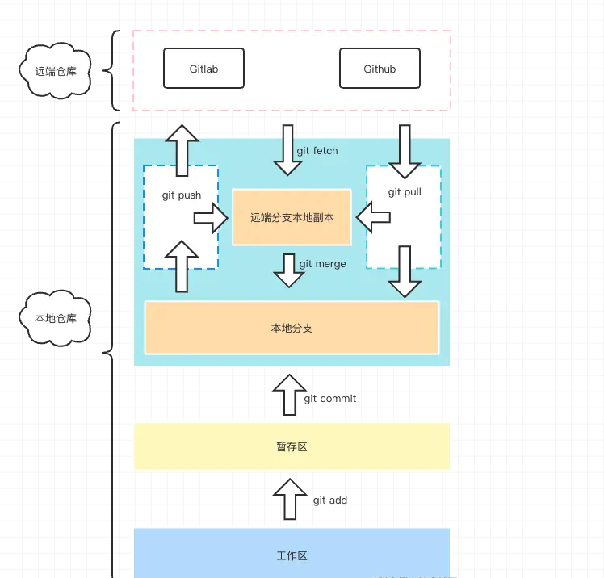

# Git的使用

**到目前为止，当今世界上使用最广泛的现代版本控制系统是 Git**。Git 是一个成熟的、积极维护的开源项目，最初由 Linux 操作系统内核的著名创建者 Linus Torvalds 于 2005 年开发。
有海量软件项目依赖 Git 进行版本控制，包括商业项目和开源项目。使用过 Git 的开发人员在可用的软件开发人才库中占有很好的比例，它在各种操作系统和 IDE（集成开发环境）上都能很好地运行。

Git 采用分布式架构，是 DVCS（分布式版本控制系统）的示例。在 Git 中，每个开发人员的代码工作副本也是一个可以包含所有变更完整历史记录的存储库，
而不是像曾经流行的 CVS 或 Subversion（也称为 SVN）等版本控制系统那样，只有一个地方存放软件的完整版本历史记录。

除了分布式外，Git 的设计还考虑了`性能`、`安全性`和`灵活性`。

## 版本控制

版本控制，也称为源代码控制，是一种跟踪和管理软件代码变更的实践。版本控制系统是软件工具，可帮助软件团队管理源代码随时间推移而发生的变更。
随着开发环境的加速，版本控制系统可以帮助软件团队更快、更智能地工作。它们对于 DevOps 团队特别有用，因为它们可以帮助该团队缩短开发时间并提高部署成功率。

**版本控制软件在特殊类型的数据库中跟踪对代码的每一次修改。如果犯了错误，开发人员可以回退并比较代码的早期版本，以帮助修复错误，同时最大限度地减少对所有团队成员的干扰。**



Git 区域理解:

- `远程仓库区`：也就是我们代码最终提交的归宿，没啥好说的。

- `远端分支本地副本`：这个其实主要储存了远程仓库各分支数据在本地的一个副本，
  你可以打开你 Git 项目下的 `.git` 文件，里面有个 `refs/remotes`，这里就主要存的就是远程仓库的分支信息，一般你执行 push 或者 pull、fetch 都会往这里进行更新。

- `本地分支`：这里就是我们经常会打交道的区域，你在执行 commit 之后，本质上就是提交到了这个区域，你可以查看你的 `.git` 目录下的 `refs/heads` 目录，里面存的就是我们本地的分支代码信息。

- `暂存区`：这个区域就是我们每次执行`git add`之后会存到的区域，用来与本地仓库之间做一个缓存，同时也是 Git 底层设计上来说也算是比较重要的一个区域，它能帮助 Git 在做diff的时候提高查找性能。

- `工作区`：这个一般就是我们写代码的地方

## 安装Git

### Mac OS X 系统

#### 利用官方镜像

下载最新的[Git for Mac 安装程序](https://sourceforge.net/projects/git-osx-installer/files/)，按照提示安装即可。

#### 利用Homebrew

```bash
##  Homebrew安装Git
brew install git

## 查看版本，检查是否安装成功
git --version
```

### Windows系统

利用官方安装包，下载最新的[Git for Windows 安装程序](https://gitforwindows.org/)，按照提示安装即可。

### Linux系统

#### Debian/Ubuntu (apt-get)

Git 软件包可通过 `apt` 获得

```bash
## 安装包更新
sudo apt-get update

## 安装Git
sudo apt-get install git
```

#### Fedora (dnf/yum)

Git 软件包可以通过 `yum` 和 `dnf` 获得：

```bash
## dnf安装git
sudo dnf install git

## yum安装git
sudo yum install git
```

## 常用命令

### git init

将目录进行git仓库初始化

### git clone

```bash
## 一般我们直接 clone 下来不带参数的话，它会默认停留在 master
git clone xxx.git

## 克隆特定分支
git clone xxx.git -b branch1
```

### git stash

```bash
## 暂存变更
git stash
git stash save 'xxx':

## 查看暂存区所有提交列表
git stash list

## 弹出并应用最近的一次暂存区的代码提交
git stash pop

## 删除某次暂存记录
git stash drop stash@{n}

## 查看暂存内容变更
git stash show

## 清楚所有 stash 信息
git stash clear

```

### git remote

```bash
# 添加一个远程版本库关联
git remote add origin xxx.git

##  删除某个远程版本库关联
git remote rm origin

## 表示把当前仓库的 master 分支和远端仓库的 master 分支关联起来，后面我们执行 push 或者 pull 都可以非常方便的进行操作了。
git push -u origin master
```

### git checkout

```bash
## 创建并切换到指定新分支
git checkout -b branch1
```

### git add

```bash
# 添加某个文件到暂存区，后面可以跟多个文件，以空格区分
git add xxx

# 添加当前更改的所有文件到暂存区。
git add .
```

### git commit

```bash
# 提交暂存的更改，会新开编辑器进行编辑
git commit

# 提交暂存的更改，并记录下备注
git commit -m "just coding"

# 等同于 git add . && git commit -m
git commit -am

# 对最近一次的提交的信息进行修改,此操作会修改commit的hash值
git commit --amend
```

### git pull

```bash
# 从远程仓库拉取代码并合并到本地，可简写为 git pull 等同于 git fetch && git merge
git pull <远程主机名> <远程分支名>:<本地分支名>

# 使用rebase的模式进行合并
git pull --rebase <远程主机名> <远程分支名>:<本地分支名>
```

### git fetch

与 git pull 不同的是 git fetch 操作仅仅只会拉取远程的更改，不会自动进行 merge 操作。对你当前的代码没有影响

```bash
# 获取远程仓库特定分支的更新
git fetch <远程主机名> <分支名>

# 获取远程仓库所有分支的更新
git fetch --all
```

### git branch

```bash
# 新建本地分支，但不切换
git branch <branch-name>

# 查看本地分支
git branch

# 查看远程分支
git branch -r

# 查看本地和远程分支
git branch -a

# 删除本地分支
git branch -D <branch-nane>

# 重新命名分支
git branch -m <old-branch-name> <new-branch-name>
```

## 分支规范

### 分支命名

- 功能迭代：`feat/xxx`
- 提测bugfix：`fix/xxx`
- 线上问题紧急修复：`hotfix/xxx`

### 上游优先

- `master` 作为主分支 一般稳定版本
- 其他分支皆从 `master` 分支`衍生`
- 注意与传统分支策略区别

### 多环境长线分支

- `master`：开发稳定分支
- `test`：测试测试环境，一般对应测试服，可以详细分为测试--->预发
- `prod`：线上环境，一般对应正式服【重要】

### 分支类型

- 功能迭代分支：`feat`
- 提测后bugfix分支：`bugfix`
- 线上问题紧急修复：`hotfix`
- 所有开发动作在短期分支上完成

**长线分支只允许MR、禁止push、feature、bugfix 从 `master` 分支拉取，hotfix 从 `master`(线上稳定分支) 拉取。** 分支目的完成后及时删除

## 提交规范

- `type`： commit 的类型
- `feat`： 新特性
- `fix`： 修改问题
- `refactor`： 代码重构
- `docs`： 文档修改
- `style`： 代码格式修改, 注意不是 css 修改
- `test`： 测试用例修改
- `chore`： 其他修改, 比如构建流程, 依赖管理.
- `scope`： commit 影响的范围, 比如: route, component, utils, build...
- `subject`： commit 的概述, 建议符合 50/72 formatting
- `body`： commit 具体修改内容, 可以分为多行, 建议符合 50/72 formatting
- `footer`： 一些备注, 通常是 BREAKING CHANGE 或修复的 bug 的链接.

每次提交，Commit message 都包括三个部分：Header，Body 和 Footer。

```text
<type>(<scope>): <subject>
// 空一行
<body>
// 空一行
<footer>
```

其中，**Header 是必需的，Body 和 Footer 可以省略**

Header部分只有一行，包括三个字段：type（必需）、scope（可选）和subject（必需）

- **feat：新功能**
- **fix：修补bug**
- **docs：修改文档**
- **style： 格式化代码结构（不影响代码运行的变动）**
- **refactor：重构（即不是新增功能，也不是修改bug的代码变动，比如重命名变量 ）**
- **chore：构建过程或辅助工具的变动（不会影响代码运行）**

**scope**
scope用于定义type影响的范围，比如数据层、控制层、视图层等等，视项目不同而不同
**subject**
subject是 commit 目的的简短描述，不超过50个字符。

- 以动词开头，使用第一人称现在时，比如change，而不是changed或changes
- 第一个字母小写
- 结尾不加句号（.）

Body 部分是对本次 commit 的详细描述，可以分成多行，每行尽量不超过72个字符。例如：

```text
More detailed explanatory text, if necessary.  Wrap it to
about 72 characters or so.

Further paragraphs come after blank lines.

- Bullet points are okay, too
- Use a hanging indent
```

**关闭 Issue**
如果当前 commit 针对某个issue，那么可以在 Footer 部分关闭这个 issue

```text
Closes #234
```

也可以一次关闭多个 issue 。

```text
Closes #123, #245, #992
```

## 版本格式X.Y.Z

- **修订版号 Z**（x.y.Z | x > 0）向下兼容的修正时才递增，线上bug修复。
- **次版本号 Y**（x.Y.z | x > 0）向下兼容的新功能出现时递增，日常迭代。
- **主版本号 X**（X.y.z | X > 0）不兼容的修改被加入公共 API 时递增，大版本更新。

## 配置用户名和邮箱

```shell
## 项目级配置
git config  user.name "142vip"
git config  user.email "fairy_vip@2925.com"

## 全局配置
git config --global user.name "142vip"
git config --global user.email "fairy_vip@2925.com"

## 查看配置效果
git config --list
```

## 修改历史提交信息

### 查看提交日志

```bash
git log
```

### rebase到指定结点

```bash
git rebase -i xxx

## 或者按相对位置rebase
git rebase -i HEAD~1
```

### 进入编辑界面，记录着commit的信息

pick---->edit

并保存，即使用`wq`退出

### 重新设置用户名和邮箱

```bash
## 用户信息
git commit --amend --author="chufan <fariy_vip@2925.com>"
```

### 结束rebase

```bash
git rebase --continue
```

### 强制推送到目标分支

```bash
git push -f
```

## 同步Tag标记

```bash
## 删除本地多少标记
git tag -l | xargs git tag -d #删除所有本地分支

## 从远程拉取所有信息
git fetch origin --prune

## 将本地所有Tag推到远程
git push origin --tags

#推送指定本地tag到远程
git push origin
```

## 参考资料

- 官网：<https://git-scm.com/docs>
- <https://www.atlassian.com/zh/git>
