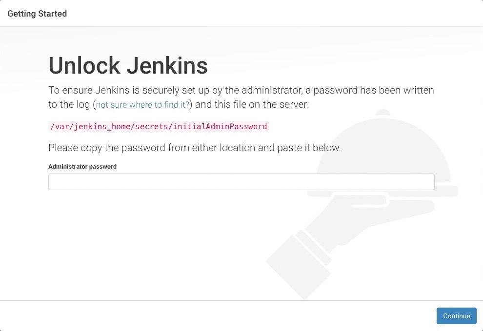
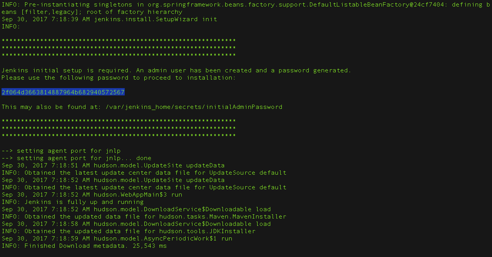

# Jenkins

## 安装

Jenkins支持多种安装方式，不限于Mac系统、Linux系统，由于Docker容器技术的普及，这里更加推荐使用容器安装。
具体可以参考[官网安装说明](https://www.jenkins.io/doc/book/installing/)

### Mac系统

在Mac系统中，Jenkins的安装可以借助`brew`工具，例如：

```bash
## 安装
brew install jenkins-lts
## M1芯片添加arch -arm64 安装
arch -arm64 brew install jenkins-lts

## 启动
brew services start jenkins-lts
## 重启
brew services restart jenkins-lts
## 手动更新
brew upgrade jenkins-lts
```

### Linux系统

基于apt-get进行安装，`LTS`（长期支持）版本 每 12 周从常规版本流中选择一次作为该时间的稳定版本时期

```bash
sudo wget -O /usr/share/keyrings/jenkins-keyring.asc \
  https://pkg.jenkins.io/debian-stable/jenkins.io-2023.key
echo deb [signed-by=/usr/share/keyrings/jenkins-keyring.asc] \
  https://pkg.jenkins.io/debian-stable binary/ | sudo tee \
  /etc/apt/sources.list.d/jenkins.list > /dev/null

## 软件更新
sudo apt-get update
## 安装jenkins
sudo apt-get install jenkins
```

基于yum进行安装，安装`LTS`（长期支持）版本 ，每 12 周从常规版本流中选择一次作为该时间的稳定版本时期

```bash
sudo wget -O /etc/yum.repos.d/jenkins.repo \
    https://pkg.jenkins.io/redhat-stable/jenkins.repo
sudo rpm --import https://pkg.jenkins.io/redhat-stable/jenkins.io-2023.key

## 软件更新
sudo yum upgrade
## 安装jenkins需要的jdk
sudo yum install fontconfig java-17-openjdk
## 安装jenkins
sudo yum install jenkins
## 重新加载配置
sudo systemctl daemon-reload
```

在Linux系统中安装完成后，可以对jenkins服务进行管理，设置开机提供、维护服务状态等，例如：

```bash
## 设置开机重启
sudo systemctl enable jenkins
## 启动
sudo systemctl start jenkins
## 暂停
sudo systemctl stop jenkins
## 重启
sudo systemctl restart jenkins
## 查看服务状态
sudo systemctl status jenkins
```

### 容器安装

使用Docker安装，注意文件映射，执行命令：

@[code sh](@code/docker/jenkins/docker.sh)

使用Docker-Compose安装，配置如下：

@[code yaml](@code/docker/jenkins/docker-compose.yaml)

不论使用Docker还是Docker-Compose安装Jenkins服务，都会启动Jenkins容器服务，对于容器可以使用一些常用的命令进行管理，例如：

```bash
## 启动
docker start jenkins
## 停止
docker stop jenkins
## 重启
docker restart jenkins
## 查看容器信息
docker inspect jenkins
## 查看容器日志
docker logs jenkins

## 集群管理
docker-compose up -d
docker-compose down
docker-compose start jenkins
```

除了使用官方提供的jenkins镜像，还可以自定义镜像，这个在jenkins官网有详细说明，
这里基于jenkins镜像构建的核心功能提供对应的`Dockerfile`配置。 自定义jenkins镜像可以基于此来拓展，参考：

@[code dockerfile](@code/docker/jenkins/Dockerfile)

配置完成后，可以使用`docker build`命令构建，例如：

@[code sh](@code/docker/jenkins/build.sh)

## 使用

当Jenkins服务正常启动后，Jenkins默认暴露`8080`和`50000`两个端口，在浏览器中访问<http://127.0.0.1:8080即可Jenkins网站>
> 这里需要明白，Jenkins的端口也可以自定义或者进行端口映射



按照提示到目标路径下，找对对应的初始化密码，粘贴到输入框中就可以顺利使用Jenkins啦



如果是本机部署，在终端中执行命令，打印密码

```shell
## 对应
sudo cat /var/lib/jenkins/secrets/initialAdminPassword
```

如果是Docker容器部署，需要进入容器找到对应文件，打印密码。例如：

```shell
## 进入容器
docker exec -it jenkins sh
## 打印密码
cat /var/jenkins_home/secrets/initialAdminPassword
## 退出容器
exit
```

上面的命令也可以精简为：

```sh
sudo docker exec jenkins cat /var/jenkins_home/secrets/initialAdminPassword
```
