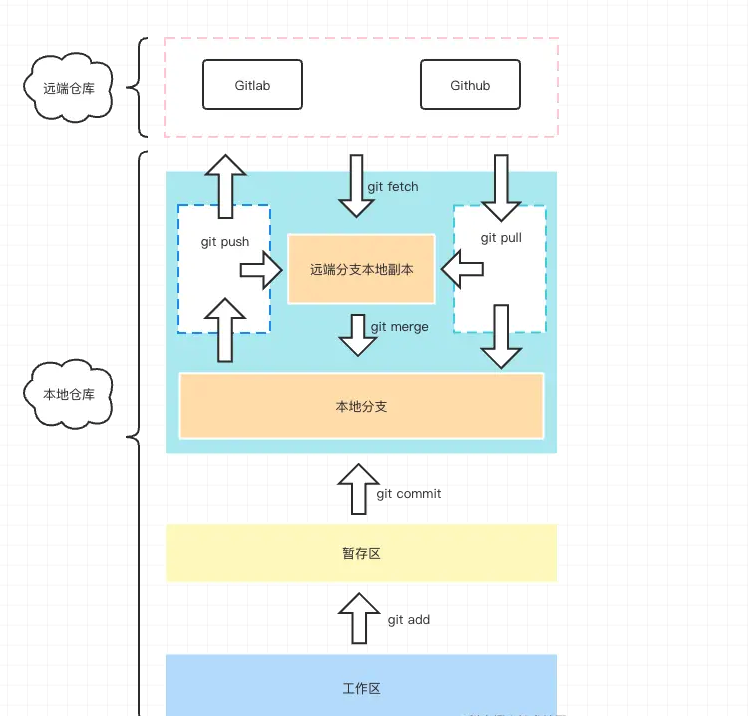

## Git的使用

- 官网: https://git-scm.com/docs




Git 区域理解

- 远程仓库区：也就是我们代码最终提交的归宿，没啥好说的。
- 远端分支本地副本：这个其实主要储存了远程仓库各分支数据在本地的一个副本，你可以打开你 Git 项目下的 .git 文件，里面有个 refs/remotes，这里就主要存的就是远程仓库的分支信息，一般你执行 push 或者 pull、fetch 都会往这里进行更新。
- 本地分支：这里就是我们经常会打交道的区域，你在执行 commit 之后，本质上就是提交到了这个区域，你可以查看你的 .git 目录下的 refs/heads 目录，里面存的就是我们本地的分支代码信息。
- 暂存区：这个区域就是我们每次执行 git add 之后会存到的区域，用来与本地仓库之间做一个缓存，同时也是 Git 底层设计上来说也算是比较重要的一个区域，它能帮助 Git 在做 diff 的时候提高查找性能。
- 工作区：这个一般就是我们写代码的地方，比如你的 vscode 打开的项目，你可以进行代码编辑的地方。


### 配置用户名和邮箱

```bash
## 项目级配置
git config  user.name "chufan"
git config  user.email "chufan@dtstack.com"

## 全局配置
git config --global user.name "chufan"
git config --global user.email "chufan@dtstack.com"


## 查看配置效果
git config --list
```

### git stash

```bash
## 储存变更
git stash
git stash save 'xxx':

## 查看储存区所有提交列表
git stash list

## 弹出并应用最近的一次储存区的代码提交
git stash pop

## 删除某次储存记录
git stash drop stash@{n}

## 清楚所有 stash 信息
git stash clear

```

### git clone

```bash

## 一般我们直接 clone 下来不带参数的话，它会默认停留在 master
git clone xxx.git

## 克隆特定分支
git clone xxx.git -b branch1

```

### git init

将目录进行git仓库初始化


### git remote

```bash
# 添加一个远程版本库关联
git remote add origin xxx.git

##  删除某个远程版本库关联
git remote rm origin

## 表示把当前仓库的 master 分支和远端仓库的 master 分支关联起来，后面我们执行 push 或者 pull 都可以非常方便的进行操作了。
git push -u origin master

```

### git checkout

```bash
## 创建并切换到指定新分支
git checkout -b branch1
```

### git add

```bash
# 添加某个文件到暂存区，后面可以跟多个文件，以空格区分
git add xxx

# 添加当前更改的所有文件到暂存区。
git add .

```

### git commit

```bash
# 提交暂存的更改，会新开编辑器进行编辑
git commit 

# 提交暂存的更改，并记录下备注
git commit -m "just coding"

# 等同于 git add . && git commit -m
git commit -am

# 对最近一次的提交的信息进行修改,此操作会修改commit的hash值
git commit --amend
```

### git pull

```bash
# 从远程仓库拉取代码并合并到本地，可简写为 git pull 等同于 git fetch && git merge 
git pull <远程主机名> <远程分支名>:<本地分支名>


# 使用rebase的模式进行合并
git pull --rebase <远程主机名> <远程分支名>:<本地分支名>
```

### git fetch
与 git pull 不同的是 git fetch 操作仅仅只会拉取远程的更改，不会自动进行 merge 操作。对你当前的代码没有影响

```bash
# 获取远程仓库特定分支的更新
git fetch <远程主机名> <分支名>

# 获取远程仓库所有分支的更新
git fetch --all
```

### git branch

```bash
# 新建本地分支，但不切换
git branch <branch-name> 

# 查看本地分支
git branch

# 查看远程分支
git branch -r

# 查看本地和远程分支
git branch -a

# 删除本地分支
git branch -D <branch-nane>

# 重新命名分支
git branch -m <old-branch-name> <new-branch-name>
```