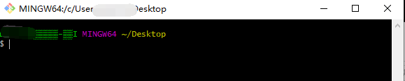
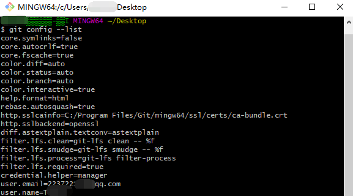
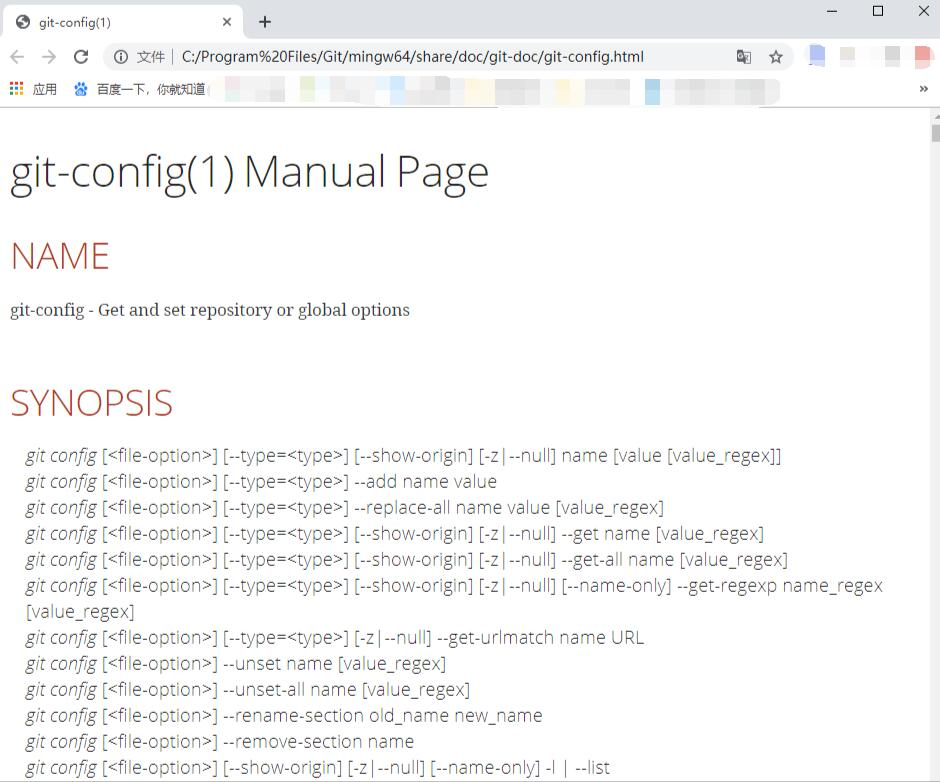

# 1.2 基本配置

####基本配置信息

​	安装完Git后在系统的任意界面右键单击，选择Git Bash菜单栏运行Git



使用DNS命令`git config --list`查看全局的Git配置参数



当然也可以输入具体的配置名称来检测该配置是否是你预想的配置信息

```bash
# 检测配置信息中的用户名
git config user.name
```

当你在配置Git的信息的时候，以往Git指令，可以直接使用`git help config`来获取所有的config配置指令，浏览器就会出现如下的指令网页教程



#### 配置个人信息

​	众所周知，Git和SVN一样都是优秀的版本控制工具，在多人的项目开发中，提供了很好的团队合作的协作方案。每个人都能够通过版本控制工具Git或者SVN来上传、检出项目代码，因此对于提交的信息，Git的开发人员在早期为了方便联系代码的提交/开发人员，因此在使用Git提交代码的时候需要在config里面配置个人信息

```bash
# 个人邮箱
git config --global user.email 'Taylor'
# 开发人员的用户名信息
git config --global user.name '2237221210@qq.com'
```

注意： 在配置个人信息的时候，最后使用`--global`进行Git信息的全局配置，避免因为局部配置导致每次在使用Git提交代码的时候，都要重新配置`user.name `和`user.email`信息

