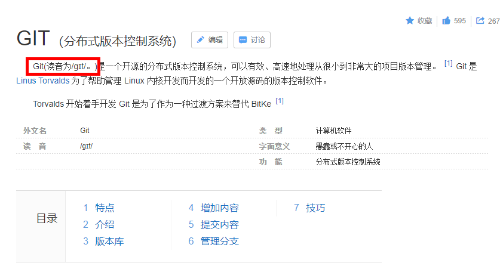
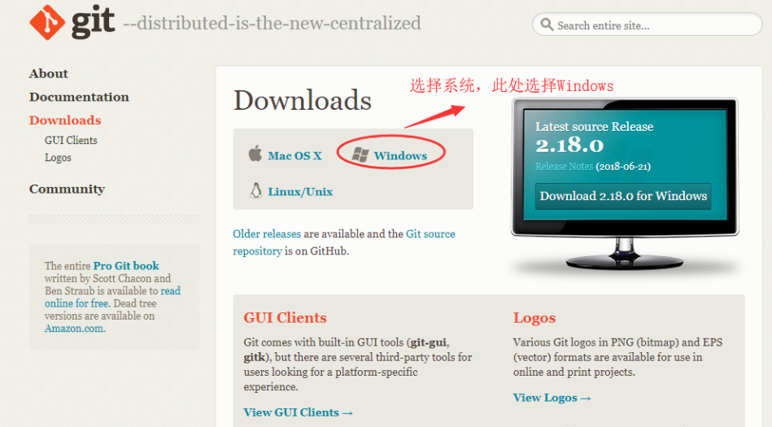
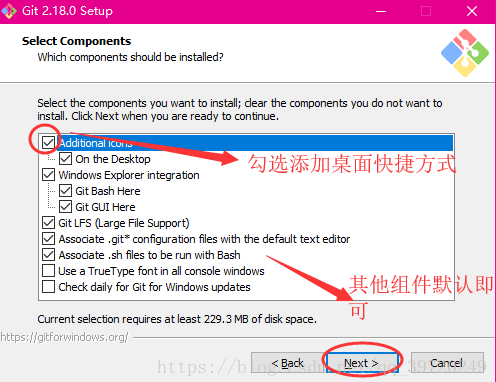
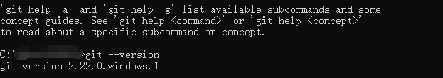

# 1.1 下载和安装

#### 简介

​	先百度百科简介，对于Git工具的介绍可以帮助我们了解Git，特别是Git的基础读音；

#### 下载

​	进入[Git官网](https://git-scm.com/)，可以快速的下载Git工具包

​	点击右下角的DownLoad下载最新版本2.24安装包；

#### 安装

​	下载完成后，直接双击下载好的exe文件进行安装，具体步骤如下：

1. 安装git时，要选择自定义安装路径
2. 勾选生成git的桌面快捷方式。
3. 其他全部默认选项安装。

    

​   
   可以看到上面有很多的组件，建议直接Next。
​	Git的安装基本都是傻瓜式的，不涉及到任何稍显复杂的技术，可能有些人在安装软件的时候会可以避免安装在系统盘，**笔者测试过Git安装在非系统盘的效果，使用起来非常的不流畅(也有可能是笔者的笔记本不太好)**；总之Git的安装建议直接放在系统盘，本身Git整个软件包也不是很大..

​	Git默认安装完成后，可以通过鼠标右键查看是否有Git Bash菜单栏或者桌面是否有Git图标来判断；或者直接在命令行界面来运行`git --version`来查看Git的版本，从而判断是否安装成功，效果如下：

​	至此，Git成功安装，下一节开始基础的Git配置和简单使用