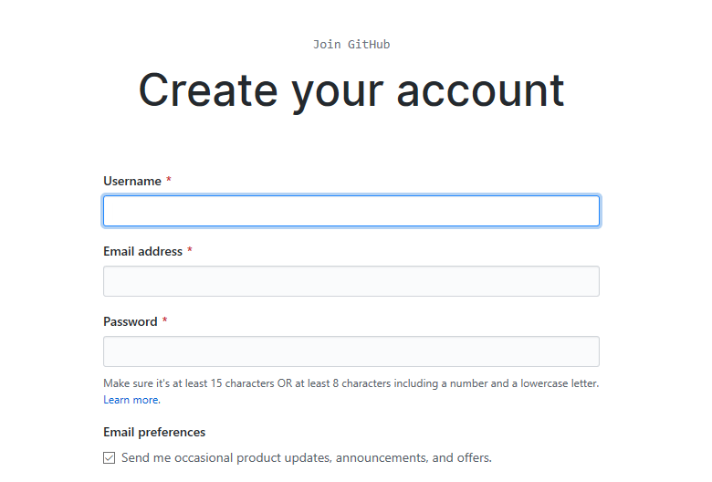
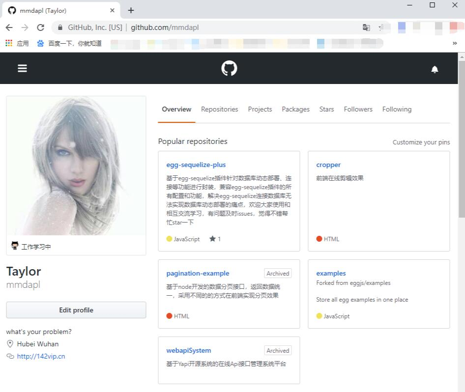
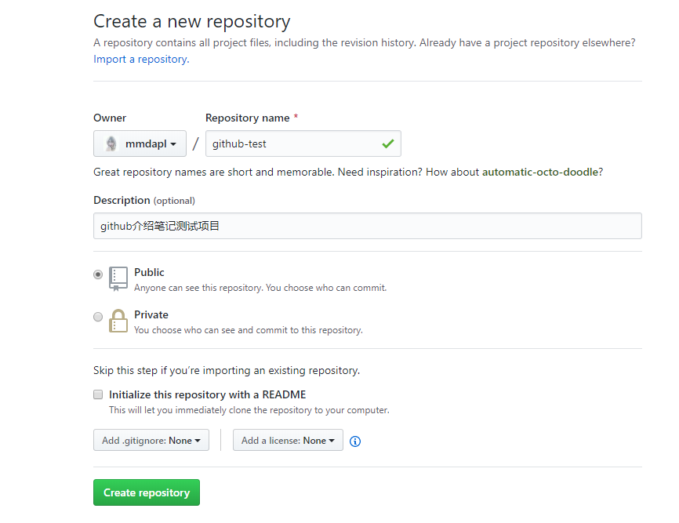
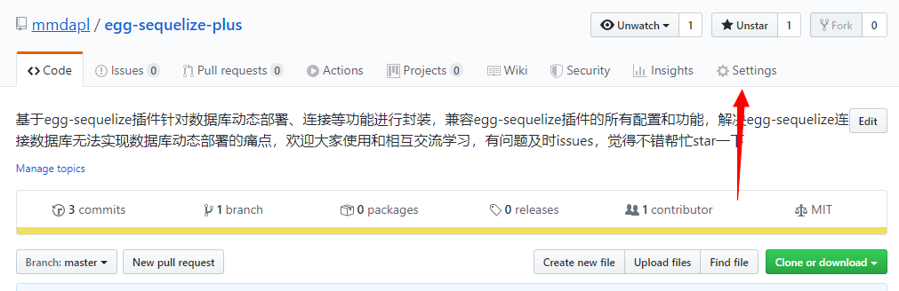
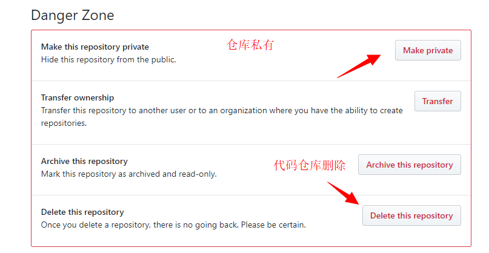

# 1.4 GitHub简单使用

#### 初次遇见

​	当你第一次使用Github平台的时候，可以直接方位[官方地址](https://github.com/),该站点不在中国，目前国内可能只做了部分代理，因此站点访问可能会比较慢，懂得科学上网的，就可以很优雅和流畅的玩转Github，在Github上进行网上冲浪了。


​	对于未登录或者暂时没有Github账号的，可以在官网进行简单的预览学习和基础的搜索开源项目等功能，人性化的Github站点可能还会提醒你注册账号，更好的在该平台上进行代码交流；

#### 注册/登录

​	废话不多说，点击官网上右上角的`Sign up`按钮，进行账号注册



​	老老实实的完成账号注册，并进行账号登录。目前笔者的Github主页如下



#### 创建仓库

​	完成基本的账号注册和登录后，如果你需要将本地的项目代码提交的Github上方便管理，你首先是需要创建一个仓库repository。登录后直接点击右上角的`+`符号，选择`New repository`来创建代码仓库



​	当然，除了完成基础的项目仓库的信息填写，你还可以选择，你的仓库repository是公开；选择public的时候，意味着你的仓库代码全世界的每一个访问Github站点的用户都能看到你的代码提交记录，并且任意的`pull`或者`issues`，方便的项目更好的发展；选择`private`选项，顾名思义，你可以把你的代码仓库repository私有化，只有你登录后才能查看。

#### 仓库设置





#### 代码拉取

​	如果你在GitHub上发现比较好的开源项目或者想把自己的项目代码从GitHub上拉取下来，可以用`git clone`指令来获取；首先选取http或者ssl地址链接


​	在任意界面打开Git界面或者cmd界面，是使用如下命令

```bash
# 克隆远程项目
$ git clone XXXXXXXXXX.git(repository的https或者ssl地址)
```

#### 代码提交

​	当前项目开发完成后，需要将本地的代码远程到github上，可以通过基本的Git指令来完成,具体步骤如下：

1. 确保远程remote能够正常连接

```bash
# 连接远程地址
git remote add origin xxxxxx.git
# 当仓库私有化的时候，只要确保的远程地址没有错误，在执行完上面的命令后，Git会自动调出Github的登录页面，只需要输入正确的登录口令(账号/密码)来确认身份即可；

# 查看已连接的远程分支
git remote
```
2. 初始化本地仓库

```bash
# 仓库初始化
git init
# 提交文件
git add fileName..
# 对本次提交添加注释，并且提交到仓库回环中
git commit -m 'xxxxxxxxxxxxxx'
```
3. 推送到远程仓库

```bash
# 推送到主分支master
$ git push -u origin master
```

4. 推送完成

当推送完成后，即可上Github官网个人主页仓库查看已推送的项目代码，可能项目在初始化的时候，会有ignore文件夹，因此Github可能有部分忽略的文件没有跟本地同步(往往是不重要的文件信息)


#### 享受开源

​      学习到这里，你会可能刚开始第一次接触会比较陌生，笔者清楚的记得自己的大学毕业后第一次接触到Git，对于大部分的指令操作是不太适应的，但是当你使用主键熟练，你就会推翻自己之前的想法；可能这也就是接触新事物后的成长和收获吧，愿你能够很好的利用Github，类似的第三方代码管理工具还有开源中国、gitee等等。有空可以很好的了解下；

​		关于Github的高级操作可以学习笔者前部分总结的Git指令，虽然不能细化到每一个知识角落，但是希望能过够帮助到你，更好的进行有效率的代码开发与项目实战；	