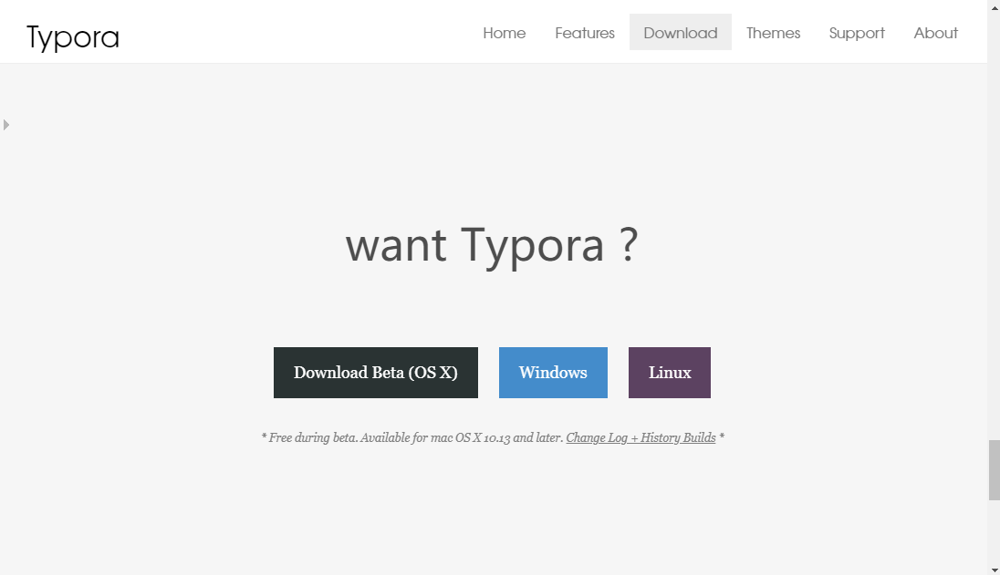
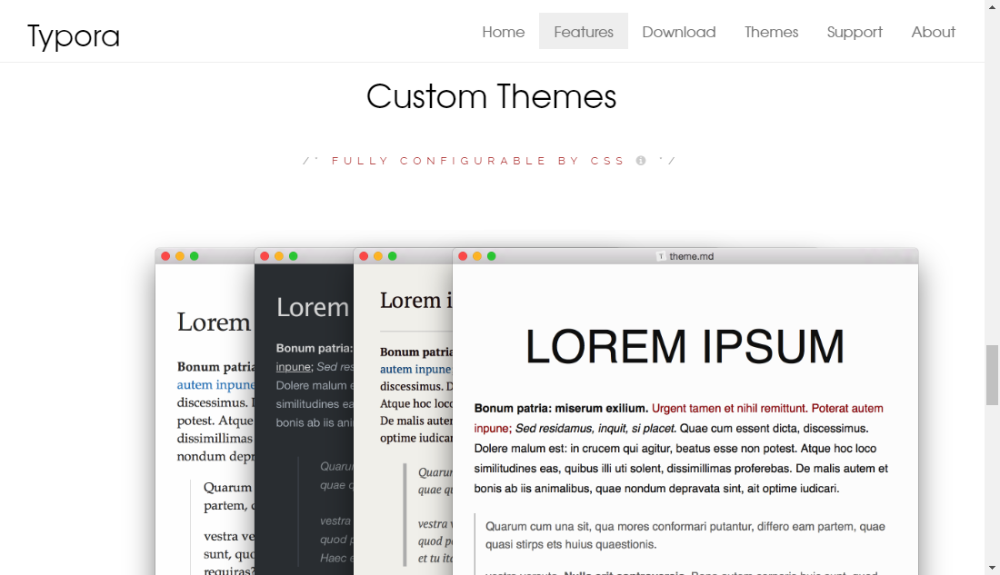
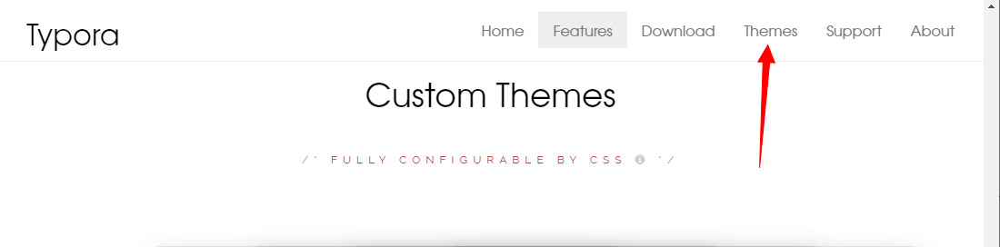
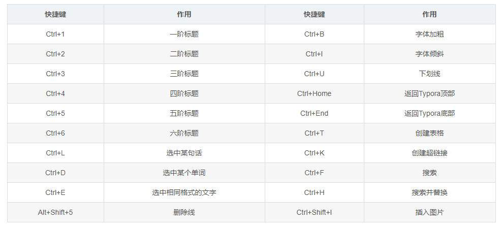
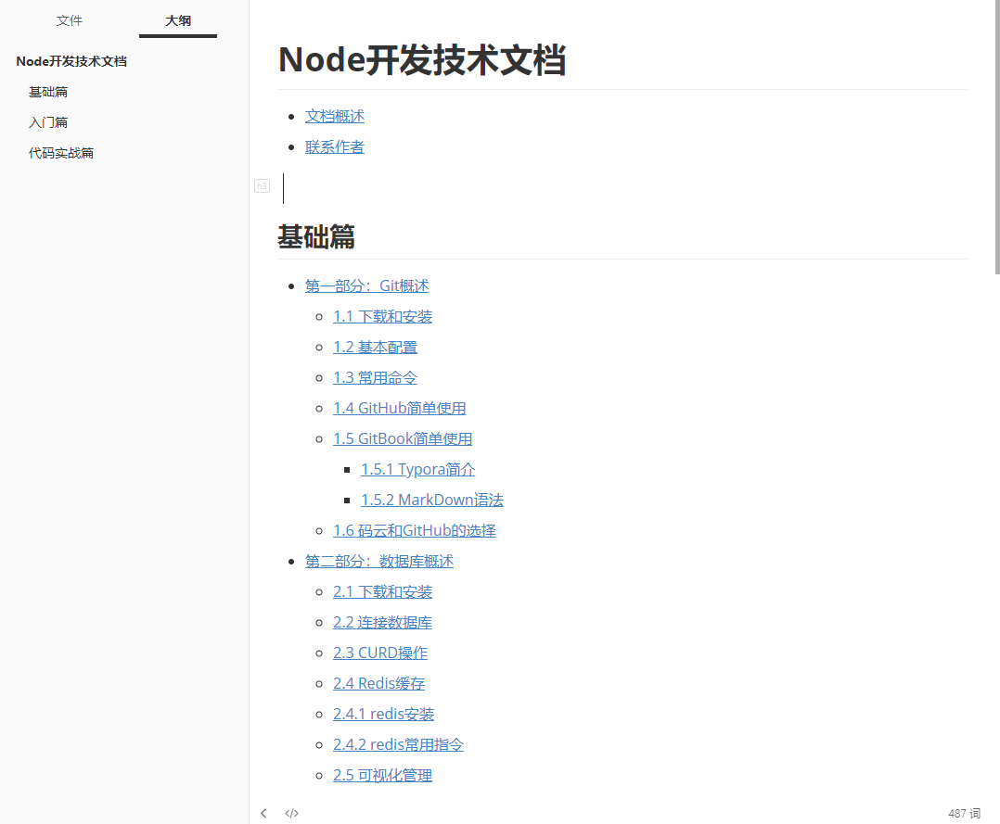

# 1.5.1 Typora简介

Typora是一款轻便简洁的Markdown编辑器，支持即时渲染技术，这也是与其他Markdown编辑器最显著的区别。即时渲染使得你写Markdown就想是写Word文档一样流畅自如，不像其他编辑器的有编辑栏和显示栏。		  Typora 一直是我认为桌面端笔记应用应有的终极形态。用我之前 一篇文章 中的话来说就是，「它的**功能之强大、设计之冷静、体验之美妙、理念之先进**，我认为值得所有笔记应用厂商学习。」

但一件很尴尬的事情是，由于它极简的设计理念，有许多使用者并没能完全地了解到 Typora 的全部强大功能。我想在这篇文章中由浅入深地介绍 Typora 的功能亮点。无论你从未用过 Typora，还是已经体验了很久，我相信你都能在这篇文章中发现 Typora 新的惊喜。

### Typora 是什么

Typora 是一款**支持实时预览的 Markdown 文本编辑器**。它有 OS X、Windows、Linux 三个平台的版本，并且由于仍在测试中，是**完全免费**的。

### 下载和安装

​		如果此时你已经有了使用Typora的冲动，那就一起来[Typora官网](https://www.typora.io/)进行学习、了解和使用吧。

​	在Typora官网进入DownLoad页面进行下载，安装包下载完成后就是简单的傻瓜式安装了。我想这部分应该都没有什么压力；

### 基本配置

​	软件安装完成后，就可以双击打开Typora软件进行使用了，在我对于Typora的使用感觉里，Typora有提供一些软件的基础设置，可以更好的使用软件进行笔记整理

- 外观

  - 提供窗口样式、字体大小、状态栏、阅读速度、侧边栏以及软件主题设置；

- 编辑器

  - 默认缩进、成对符号、即时渲染、复制行为等常规编辑设置

- 图像

  - 这个设置我觉得非常重要，我之前写博客或者做笔记的时候难免需要使用到图片进行记录，Typora提供将图片放在指定的位置进行存储，可以有效的防止图片丢失或者显示不出来的问题，用户也可以很友好的进行笔记分享

    

- Markdown

  - 主要提供一些markdown的语法设置，关于[markdown语法](git-markdown.md)下一篇将着重介绍

### 主题设置

​		Typora软件默认使用的是Github主题，如果你觉得不够友好可以在软件的左上方菜单栏里点击`主题`进行修改，大概有`Github`、`Newsprint`、`Night`、`Pixyll`、`Whitey`五个主题选择，对于大多数程序员简单的Github主题就已经够用，如果确实是不喜欢这些略显单调的主题，也可以在Typora官网进行主题下载，例如：

按照官网提示下载对应的主题包，进行使用；

### 快捷键使用

### 实际效果

