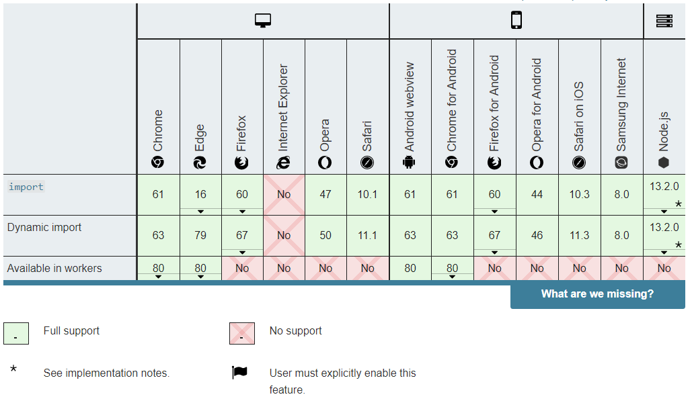
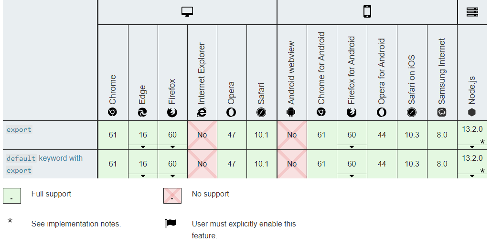

### 模块化的背景

Javascript 程序本来很小——在早期，Javascript大多被用来执行独立的脚本任务，在你的 web 页面需要的地方提供一定交互，所以一般不需要多大的脚本。过了几年，我们现在有了运行大量 Javascript 脚本的复杂程序，还有一些被用在其他环境（例如 [Node.js](https://developer.mozilla.org/en-US/docs/Glossary/Node.js)）。

因此，有必要开始考虑提供一种将 JavaScript 程序拆分为可按需导入的单独模块的机制。Node.js 已经提供这个能力很长时间了，还有很多的 Javascript 库和框架 已经开始了模块的使用；

网页越来越像桌面程序，需要一个团队分工协作、进度管理、单元测试等等......开发者不得不使用软件工程的方法，管理网页的业务逻辑。

Javascript模块化编程，已经成为一个迫切的需求。理想情况下，开发者只需要实现核心的业务逻辑，其他都可以加载别人已经写好的模块。

### 浏览器支持

使用JavaScript 模块依赖于`import`和 `export`

- import



- export



### 原始写法

模块就是实现特定功能的一组方法。

只要把不同的函数（以及记录状态的变量）简单地放在一起，就算是一个模块。

```js
function m1(){
　　//...
}

function m2(){
　　//...
}
```

上面的函数m1()和m2()，组成一个模块。使用的时候，直接调用就行了。

这种做法的缺点很明显："污染"了全局变量，无法保证不与其他模块发生变量名冲突，而且模块成员之间看不出直接关系。

### 对象写法

为了解决上面的缺点，可以把模块写成一个对象，所有的模块成员都放到这个对象里面。

```js
var module1 = new Object({

    _count : 0,

    m1 : function (){
        //...
    },

    m2 : function (){
        //...
    }

});
```

上面的函数m1()和m2(），都封装在module1对象里。使用的时候，就是调用这个对象的属性。

```js
module1.m1();
```

但是，这样的写法会暴露所有模块成员，内部状态可以被外部改写。比如，外部代码可以直接改变内部计数器的值。

```js
module1._count = 5;
```

### 立即执行函数写法

使用"[立即执行函数](http://benalman.com/news/2010/11/immediately-invoked-function-expression/)"（Immediately-Invoked Function Expression，IIFE），可以达到不暴露私有成员的目的。

```js
var module1 = (function(){

    var _count = 0;

    var m1 = function(){
        //...
    };

    var m2 = function(){
        //...
    };

    return {
        m1 : m1,
        m2 : m2
    };

})();
```

使用上面的写法，外部代码无法读取内部的_count变量。

```js
//undefined　
console.info(module1._count); 
```

module1就是Javascript模块的基本写法。下面，再对这种写法进行加工。

### 放大模式

如果一个模块很大，必须分成几个部分，或者一个模块需要继承另一个模块，这时就有必要采用"放大模式"（augmentation）。

```js
var module1 = (function (mod){

    mod.m3 = function () {
        //...
    };

    return mod;

})(module1);
```


上面的代码为module1模块添加了一个新方法m3()，然后返回新的module1模块。

### 宽放大模式

在浏览器环境中，模块的各个部分通常都是从网上获取的，有时无法知道哪个部分会先加载。如果采用上一节的写法，第一个执行的部分有可能加载一个不存在空对象，这时就要采用"宽放大模式"。

```js
var module1 = ( function (mod){

//...

return mod;

})(window.module1 || {});
```

与"放大模式"相比，＂宽放大模式＂就是"立即执行函数"的参数可以是空对象。

### 输入全局变量

独立性是模块的重要特点，模块内部最好不与程序的其他部分直接交互。

为了在模块内部调用全局变量，必须显式地将其他变量输入模块。

```js
var module1 = (function ($, YAHOO) {

    //...

})(jQuery, YAHOO);
```

### 导出模块功能

为了获得模块的功能要做的第一件事是把它们导出来。使用 `export` 语句来完成。

```js
// 最简单的方法是把它（指上面的export语句）放到你想要导出的项前面
export const name = 'square';

export function draw(ctx, length, x, y, color) {
    ctx.fillStyle = color;
    ctx.fillRect(x, y, length, length);
    return {
        length: length,
        x: x,
        y: y,
        color: color
    };
}
```

能够导出函数，`var`，`let`，`const`, 和等会会看到的类。export要放在最外层；**不能够在函数内使用`export`**。

一个更方便的方法导出所有你想要导出的模块的方法是在模块文件的末尾使用一个export 语句， 语句是用花括号括起来的用逗号分割的列表。

```js
export { 
	name, 
    draw, 
    reportArea, 
    reportPerimeter
};
```

### 导入模块功能

你想在模块外面使用一些功能，那你就需要导入他们才能使用。最简单的就像下面这样的：

```js
import { name, draw, reportArea, reportPerimeter } from '/js-examples/modules/basic-modules/modules/square.mjs';
```

使用 `import` 语句，然后你被花括号包围的用逗号分隔的你想导入的功能列表，然后是关键字from，然后是模块文件的路径。模块文件的路径是相对于站点根目录的相对路径，对于我们的`basic-modules` 应该是` /js-examples/modules/basic-modules`。

### 常用exports的区别

**首先我们要明白一个前提，CommonJS模块规范和ES6模块规范完全是两种不同的概念。**

#### CommonJS模块规范

**Node**应用由模块组成，采用CommonJS模块规范。

根据这个规范，每个文件就是一个模块，有自己的作用域。在一个文件里面定义的变量、函数、类，都是私有的，对其他文件不可见。

CommonJS规范规定，每个模块内部，module变量代表当前模块。这个变量是一个对象，它的exports属性（即module.exports）是对外的接口。加载某个模块，其实是加载该模块的module.exports属性。

```js
var x = 5;
// 函数+5 
var addX = function (value) {
    return value + x;
};
module.exports.x = x;
module.exports.addX = addX;
```

上面代码通过module.exports输出变量x和函数addX。

require方法用于加载模块。

```js
var example = require('./example.js');
// 输出5
console.log(example.x); 
// 输出6
console.log(example.addX(1)); 
```

#### exports 与 module.exports

为了方便，Node为每个模块提供一个exports变量，指向module.exports。这等同在每个模块头部，有一行这样的命令。

```js
var exports = module.exports;
```

于是我们可以直接在 exports 对象上添加方法，表示对外输出的接口，如同在module.exports上添加一样。注意，不能直接将exports变量指向一个值，因为这样等于切断了exports与module.exports的联系。

### ES6模块规范

不同于CommonJS，ES6使用 export 和 import 来导出、导入模块。

```js
// profile.js
var firstName = 'Michael';
var lastName = 'Jackson';
var year = 1958;

export {firstName, lastName, year};
```

需要特别注意的是，export命令规定的是对外的接口，必须与模块内部的变量建立一一对应关系。

```js
// 写法一
export var m = 1;

// 写法二
var m = 1;
export {m};

// 写法三
var n = 1;
export {n as m};
```

#### export default 命令

使用export default命令，为模块指定默认输出。

```js
// export-default.js
export default function () {
    console.log('foo');
}
```