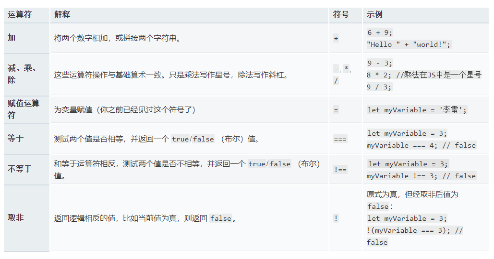

## 快速入门

### 基本语法

#### 语法

JavaScript的语法和Java语言类似，每个语句以`;`结束，语句块用`{...}`。但是，JavaScript并不强制要求在每个语句的结尾加`;`，浏览器中负责执行JavaScript代码的引擎会自动在每个语句的结尾补上`;`例如：

```javascript
// 简单if
if (2 > 1) {
    x = 1;
    y = 2;
    z = 3;
}
```

注意花括号`{...}`内的语句具有缩进，通常是4个空格。缩进不是JavaScript语法要求必须的，但缩进有助于我们理解代码的层次，所以编写代码时要遵守缩进规则。

#### 注释

- 单行注释

  以`//`开头直到行末的字符被视为行注释，注释是给开发人员看到，JavaScript引擎会自动忽略：

- 多行注释

  另一种块注释是用`/*...*/`把多行字符包裹起来，把一大“块”视为一个注释

### 数据类型和变量

#### 变量

变量的概念基本上和初中代数的方程变量是一致的，只是在计算机程序中，变量不仅可以是数字，还可以是任意数据类型。

变量在JavaScript中就是用一个变量名表示，变量名是大小写英文、数字、`$`和`_`的组合，且不能用数字开头。变量名也不能是JavaScript的关键字，如`if`、`while`等。要声明一个变量，先输入关键字 `let` 或 `var`，然后输入合适的名称：

```javascript
// let定义变量
let myVariable = '李雷';
// var定义变量
var test = '韩梅梅
// var let定义的变量，都是可以修改的
```

**在ES6中还有const可以来定义变量，但是const定义的数据后续不能更改，即：常量**

注意变量可以有不同的 [数据类型](https://developer.mozilla.org/zh-CN/docs/Web/JavaScript/Data_structures) ：


#### 数据类型

计算机顾名思义就是可以做数学计算的机器，因此，计算机程序理所当然地可以处理各种数值。但是，计算机能处理的远不止数值，还可以处理文本、图形、音频、视频、网页等各种各样的数据，不同的数据，需要定义不同的数据类型。在JavaScript中定义了以下几种数据类型：

##### Number

JavaScript不区分整数和浮点数，统一用Number表示，以下都是合法的Number类型：

```javascript
// 整数123
123; 
// 浮点数0.456
0.456; 
// 科学计数法表示1.2345x1000，等同于1234.5
1.2345e3; 
// 负数
-99; 
// NaN表示Not a Number，当无法计算结果时用NaN表示
NaN; 
// Infinity表示无限大，当数值超过了JavaScript的Number所能表示的最大值时，就表示为Infinity
Infinity; 
```

Number可以直接做四则运算，规则和数学一致,**注意`%`是求余运算**。




##### 布尔值

布尔值和布尔代数的表示完全一致，一个布尔值只有true、false两种值，要么是true，要么是false，可以直接用true、false表示布尔值，也可以通过布尔运算计算出来

```javascript
// 这是一个true值
true; 
// 这是一个false值
false; 
// 这是一个true值
2 > 1;
// 这是一个false值
2 >= 3;
```

**`&&`运算是与运算，只有所有都为`true`，`&&`运算结果才是`true`：**

**`||`运算是或运算，只要其中有一个为`true`，`||`运算结果就是`true`：**

**`!`运算是非运算，它是一个单目运算符，把`true`变成`false`，`false`变成`true`：**

##### 字符串

JavaScript的字符串就是用`''`或`""`括起来的字符表示。

字符串是以单引号'或双引号"括起来的任意文本，比如`'abc'`，`"xyz"`等等。请注意，`''`或`""`本身只是一种表示方式，不是字符串的一部分，因此，字符串`'abc'`只有`a`，`b`，`c`这3个字符。

如果`'`本身也是一个字符，那就可以用`""`括起来，比如`"I'm OK"`包含的字符是`I`，`'`，`m`，空格，`O`，`K`这6个字符。

操作字符串方法：

###### toUpperCase

`toUpperCase()`把一个字符串全部变为大写：

###### toLowerCase

`toLowerCase()`把一个字符串全部变为小写：

###### indexOf

`indexOf()`会搜索指定字符串出现的位置：

###### substring

`substring()`返回指定索引区间的子串：

##### 数组

JavaScript的`Array`可以包含任意数据类型，并通过索引来访问每个元素。

- 要取得`Array`的长度，直接访问`length`属性；

- 直接给`Array`的`length`赋一个新的值会导致`Array`大小的变化；

- `Array`可以通过索引把对应的元素修改为新的值，因此，对`Array`的索引进行赋值会直接修改这个`Array`；

- -如果通过索引赋值时，索引超过了范围，同样会引起`Array`大小的变化；

常用方法：

###### indexOf

与String类似，`Array`也可以通过`indexOf()`来搜索一个指定的元素的位置：

- ###### slice

`slice()`就是对应String的`substring()`版本，它截取`Array`的部分元素，然后返回一个新的`Array`：

注意到`slice()`的起止参数包括开始索引，不包括结束索引。

如果不给`slice()`传递任何参数，它就会从头到尾截取所有元素。利用这一点，我们可以很容易地复制一个`Array`；
###### push和pop

`push()`向`Array`的末尾添加若干元素，`pop()`则把`Array`的最后一个元素删除掉：

###### unshift和shift

如果要往`Array`的头部添加若干元素，使用`unshift()`方法，`shift()`方法则把`Array`的第一个元素删掉：

###### sort

`sort()`可以对当前`Array`进行排序，它会直接修改当前`Array`的元素位置，直接调用时，按照默认顺序排序；

###### reverse

`reverse()`把整个`Array`的元素给掉个个，也就是反转：

###### splice

`splice()`方法是修改`Array`的“万能方法”，它可以从指定的索引开始删除若干元素，然后再从该位置添加若干元素：

###### concat

`concat()`方法把当前的`Array`和另一个`Array`连接起来，并返回一个新的`Array`：
`concat()`方法并没有修改当前`Array`，而是返回了一个新的`Array`。
实际上，`concat()`方法可以接收任意个元素和`Array`，并且自动把`Array`拆开，然后全部添加到新的`Array`里：

###### **join**

`join()`方法是一个非常实用的方法，它把当前`Array`的每个元素都用指定的字符串连接起来，然后返回连接后的字符串：
如果`Array`的元素不是字符串，将自动转换为字符串后再连

##### 对象

JavaScript的对象是一种无序的集合数据类型，它由若干键值对组成。

JavaScript的对象用于描述现实世界中的某个对象

```javascript
// 简单定义 对象属性
const person = {
    name: 'demo',
    birth: 1990,
    height: 1.70,
    weight: 65,
};
```

#### 条件判断

JavaScript使用`if () { ... } else { ... }`来进行条件判断。例如，根据年龄显示不同内容，可以用`if`语句实现如下：

```javascript
// 根据条件进行判断
if(){
	// 满足条件执行的语句
}else{
	// 不满足条件执行的语句
}
```

多行条件判断

如果还要更细致地判断条件，可以使用多个`if...else...`的组合：

但是我们通常把`else if`连写在一起，来增加可读性。这里的`else`略掉了`{}`是没有问题的，因为它只包含一个`if`语句。注意最后一个单独的`else`不要略掉`{}`。

```javascript
if(){
   
}else if(){
   // 多个else if 
}else if(){
         
}else if(){
    
}else{
    
}
```

***请注意*，`if...else...`语句的执行特点是二选一，在多个`if...else...`语句中，如果某个条件成立，则后续就不再继续判断了。**

#### 循环

- for

`for`循环最常用的地方是利用索引来遍历数组;`for`循环的3个条件都是可以省略的，如果没有退出循环的判断条件，就必须使用`break`语句退出循环，否则就是死循环;

```javascript
let x = 0;
for (let i=1; i<=10000; i++) {
    x = x + i;
}
x; // 50005000
```

- while

`for`循环在已知循环的初始和结束条件时非常有用。而上述忽略了条件的`for`循环容易让人看不清循环的逻辑，此时用`while`循环更佳。

```javascript
let x=0;
let i=1;
while(i<=10000){
    x+=i++;
    // i++ 先用i的值 ，再实现i++的功能
    // ++i 先进行++的自增操作，再用i的值，也就是用的值其实是自增后的值；
}
```

`while`循环只有一个判断条件，条件满足，就不断循环，条件不满足时则退出循环。比如我们要计算100以内所有奇数之和，可以用while循环实现

- do... while

`do { ... } while()`循环，它和`while`循环的唯一区别在于，不是在每次循环开始的时候判断条件，而是在每次循环完成的时候判断条件;

**用`do { ... } while()`循环要小心，循环体会至少执行1次，而`for`和`while`循环则可能一次都不执行。**

