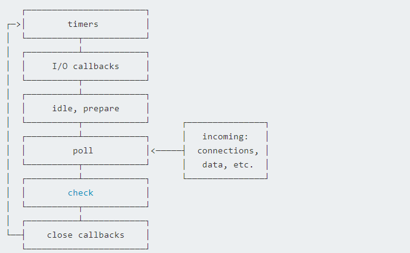
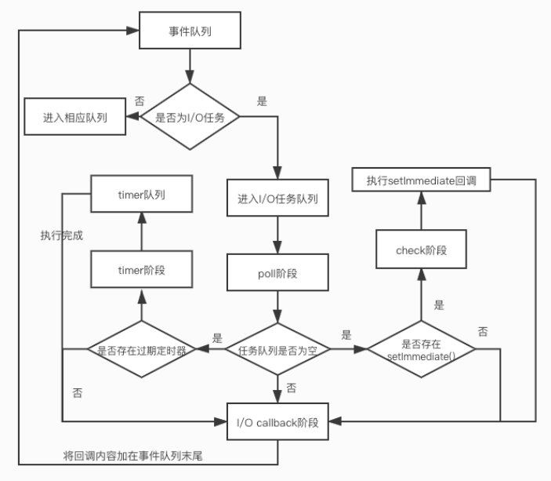

# Node面试

**同步和异步关注的是消息通信机制。**

- `同步`：在发起一个调用后，在没有得到结果前，该调用不返回，直到调用返回，才往下执行，**调用者等待被调用方返回结果**。
- `异步`：在发起一个调用后，调用就直接返回，不等待结果，继续往下执行，而执行的结果是由被调用方通过状态、通知等方式告知调用方，流程不阻塞

**阻塞和非阻塞，关注的是在等待结果时，线程的状态。**

- `阻塞`：在等待调用结果时，线程挂起了，不往下执行
- `非阻塞`：在等待调用结果时，当前线程继续往下执行



`Nodejs`事件循环中细分为这六个阶段，依次如下：

- `Timers`： 定时器 `Interval TimeOut` 回调事件，将依次执行定时器回调函数
- `I/O回调`： 一些系统级回调将会在此阶段执行
- Idle,prepare： 此阶段"仅供内部使用"
- `Poll`： IO回调函数，这个阶段较为重要、也复杂些
- `Check`： 执行 `setImmediate()` 的回调
- `Close`： 执行 `socket` 的 `close` 事件回调

**关于`process.nextTick`，这个事件的优先级要高于其他微队列的事件，
对于需要立即执行的回调事件可以通过该方法将事件放置到微队列的起始位置。** 例如：

```js
Promise.resolve().then(function () {
  console.log('promise1')
})
process.nextTick(() => {
  console.log('nextTick')
  process.nextTick(() => {
    console.log('nextTick')
    process.nextTick(() => {
      console.log('nextTick')
      process.nextTick(() => {
        console.log('nextTick')
      })
    })
  })
})

// 执行结果
// nextTick=>nextTick=>nextTick=>timer1=>promise1
```



开发需要关系的阶段
与我们开发相关的三个阶段分别是 Timers Poll Check

- `Timers` ：执行定时器的回调，注意：
  **在 Node 11 前，连续的几个定时器回调会连续地执行，而不是像浏览器那样，执行完一个宏任务立即执行微任务。**
- `Check` ：这个阶段执行 setImmediate() 的回调，这个事件只在 nodejs 中存在。
- `Poll` ：上面两个阶段的触发，其实是在 poll 阶段触发的，poll 阶段的执行顺序是这样的。

> 先查看 check 阶段是否有事件，有的话执行
> 执行完 check 阶段后，检查 poll 阶段的队列是否有事件，若有则执行
> poll 的队列执行完成后，执行 check 阶段的事件

在 `Node.js` 中也是有宏任务和微任务的， `Node.js` 中除了多了 `process.nextTick` ，宏任务、微任务的分类都是一致的。

## Node 跟 Chrome 有什么区别？

- 架构一样，都是基于事件驱动的异步架构！
- 浏览器主要是通过事件驱动来服务页面交互。
- `Node.js` 主要是通过事件驱动来服务 I/O
- `Node.js` 没有HTML、WebKit和显卡等等的UI技术支持

## Cookies如何防范XSS攻击？

XSS(Cross-Site Scripting，跨站脚本攻击)是指攻击者在返回的HTML中插入JavaScript脚本。
为了减轻这些攻击，需要在HTTP头部配置`set-cookie`参数，例如：

- `HttpOnly` ： 可以防止cross-site scripting，因为它会禁止Javascript脚本访问cookie。
- `secure` ： 表明浏览器仅在请求为`HTTPS`时发送`Cookie`信息。

结果应该是这样的：

`Set-Cookie: sid=; HttpOnly` 使用`Express`框架的话，`cookie-session`默认配置好了。

## 常考问题

### 1. 图片懒加载是如何实现的？（字节跳动）

将图片的所有src均指向一个小图片或者设为空 真正的src放在data-src中，监听滚动事件，用户浏览到该图片时
将src真实值从data-src中拷贝到src中去

> 可以结合cdn去做，一张图片在服务端存两种大小

用户频繁滚动页面 ----> 节流(允许用户在n秒内触发一次懒加载)

对应的经常一起出现的有---->防抖(触发的时间与上次触发的时间只差不到1s，都不执行--->
间隔时间要大于1s再执行) [参考](https://www.jianshu.com/p/dd0e90a2c440)

先说，防抖怎么防？

> 防抖函数可以通过闭包 + 定时器实现。

```js
/**
 * 防抖函数
 */
function debounce(func, wait) {
  let timeout = null
  return function () {
    // 确定  终止那个setTimeOut()方法
    clearTimeout(timeout)

    timeout = setTimeout(function () {
      func()
      // 高级【推荐】
      func.apply(this, arguments)
    }, wait)
  }
}

// 实际执行的方法
function getData() {
  // ... ajax
}

// 调用
documentElement.addEventListener('keyup', debounce(getData, 1000))
```

> setTimeout()方法的返回值是一个唯一的数值，这个数值有什么用呢？
> 如果你想要终止setTimeout()方法的执行，那就必须使用 clearTimeout()
> 方法来终止，而使用这个方法的时候，系统必须知道你到底要终止的是哪一个setTimeout()方法(因为你可能同时调用了好几个
> setTimeout()方法)，这样clearTimeout()方法就需要一个参数，这个参数就是setTimeout()方法的返回值(数值)
> ，用这个数值来唯一确定结束哪一个setTimeout()方法。

说白了，就是利用全局变量做标记，然后延时处理。[参考lodash的实现](https://www.lodashjs.com/docs/lodash.debounce)

再来说说节流（一段时间内只触发一次请求加载），两种实现方式：

- 定时器
- 时间差

```js
/**
 * 基于定时器实现
 */
function throttle(func, wait) {
  let timeout

  return function () {
    if (!timeout) {
      timeout = setTimeout(() => {
        timeout = null
        func.call(this, arguments)
      }, wait)
    }
  }
}

/**
 * 基于时间差实现
 */
function throttle(func, wait) {
  let previous = 0

  // 函数闭包
  return function () {
    let now = +new Date()
    // 剩余时间=理论等待时间-实际等待时间
    let remain = wait - (now - previous)

    if (remain < 0) {
      previous = now
      func.call(this, arguments)
    }
  }
}
```

看完后，我觉得有点单例模式的感觉... [参考lodash节流函数](https://www.lodashjs.com/docs/lodash.throttle)

闭包有三个特性：

- 函数嵌套函数
- 函数内部可以引用外部的参数和变量
- 参数和变量不会被垃圾回收机制回收

闭包的好处：

- 希望一个变量长期驻扎在内存中
- 避免全局变量的污染
- 私有成员的存在

参考：<https://segmentfault.com/a/1190000000652891>

### 2.了解TS吗

- 有清晰的函数参数和接口类型，便于修改
- 会有静态检查
- 会生成API文档
- 配和编译器，提示充分
- 社区活跃

### 3.简单介绍下koa

`Koa`本质上是调用一系列的中间件，来处理对应的请求，并决定是否传递到下一个中间件去处理

> compose 是一个工具函数，Koa.js 的中间件通过这个工具函数组合后，按 app.use() 的顺序同步执行，也就是形成了 洋葱圈 式的调用。
> 参考：<https://github.com/koajs/compose/blob/master/index.js>

- 初始化`Koa`实例后，我们会用use方法来加载中间件(middleware)，**会有一个数组来存储中间件**，use调用顺序会决定中间件的执行顺序。
- 每个中间件都是一个函数(不是函数将报错)，接收两个参数，第一个是ctx上下文对象，另一个是next函数(由koa-compose定义)
- 在建立好http服务器后，会调用**koa-compose模块**对middleware中间件数组进行处理。

> 原理就是：会从middleware数组中取第一个函数开始执行，中间件函数中调用next方法就会去取下一个中间件函数继续执行。
> 每个中间件函数执行完毕后都会返回一个promise对象。
(ps:调用next方法并不是表示当前中间件函数执行完毕了，调用next之后仍可以继续执行其他代码)

参考：<https://zhuanlan.zhihu.com/p/29455788>

`Compose` 是一种基于 `Promise` 的流程控制方式，可以通过这种方式对异步流程同步化，解决之前的嵌套回调和 `Promise` 链式耦合。

### 4.node多线程怎么管理

**`Node.js` 只支持单线程**。但是可以开启多进程充分利用多核 `CPU`，
单个 `Node.js` 实例运行在单个线程中。 为了充分利用多核系统，有时需要启用一组 `Node.js`
进程去处理负载任务。可以使用`Node.js`原生的`cluster`（集群）模块创建共享服务器端口的子进程，`cluster` 模块支持两种分发连接的方法。

- 第一种方法：（也是除 Windows 外所有平台的默认方法）循环法，由主进程负责监听端口，接收新连接后再将连接循环分发给工作进程，
  在分发中使用了一些内置技巧防止工作进程任务过载。

- 第二种方法是：主进程创建监听 socket 后发送给感兴趣的工作进程，由工作进程负责直接接收连接。

理论上第二种方法应该是效率最佳的。 但在实际情况下，由于操作系统调度机制的难以捉摸，会使分发变得不稳定。 可能会出现八个进程中有两个分担了
70% 的负载。

**潜在问题： 因为每个进程的内存都是独立的，为了在多进程中共享数据，原来可能存储在内存中的数据，例如 token 等不能再存储在内存中，应该存储在
redis 等缓存中，以便保证不同的进程都可以访问该数据；**

### 4.node路由是什么

`Node.js`中的路由由自己的框架处理，通过分析url路径分发到相应控制器中，一个路由对应的是一个或多个负责请求调用的js文件，里面包括业务逻辑（拦截、捕获、处理）

路由是一组映射关系，分析URL将访问的内容映射到实际的`Action`或者`Controller`上。

### 5.Node的Event Loop 【重要】

### 6.介绍一下Node中间件

中间件就是请求`req`和响应`res`之间的一个函数应用。

请求浏览器向服务器发送一个请求后，服务器直接通过request定位属性的方式得到通过request携带过去的数据，就是用户输入的数据和浏览器本身的数据信息，
这中间就一定有一个函数将这些数据分类做了处理，最后让request对象调用使用，这个处理函数就是我们所所得中间插件。

例如，生活中的租客和房主，中间需要一个中介来搭桥，这个中介就类似于中间件。一般来说，中间件用来封装底层细节，组织基础功能，分离基础设施和业务逻辑

### 7.数组去重的方法有哪些

- 遍历数组，`indexof()`方法过滤，再`push()`方法
- `reduce()`方法
- `filter()`方法
- 利用集合`Set`元素不能重合，定义集合、解构后成新数组

```js
let arr = [1, 1, 2, 3, 4, 5, 5, 6];

// 1. indexOf
function newArr(array) {
  //一个新的数组 
  var ar = [];
  //遍历当前数组 
  for (var i = 0; i < array.length; i++) {
    //如果临时数组里没有当前数组的当前值，则把当前值push到新数组里面 
    // 判断是否包含，返回角标
    if (ar.indexOf(array[i]) == -1) {
      ar.push(array[i])
    }
  }
  return ar;
}

let arr2 = newArr(arr);
// 2. reduce 参考：https://www.runoob.com/jsref/jsref-reduce.html
let arr2 = arr.reduce(function (ar, cur) {
  // includes数组是否包含 true|false
  if (!ar.includes(cur)) {
    ar.push(cur)
  }

  return ar
}, [])
// 3. filter
let arr2 = arr.filter(function (item, index) {
  // indexOf() 方法可返回某个指定的 字符串值 在字符串中首次出现的位置
  return arr.indexOf(item) === index
})
// 4. Set
let arr2 = [...new Set(arr)]
```

### 8.判断类型有哪些方法

- `typeof`：可以判断出`string`,`number`,`boolean`,`undefined`,`symbol`
  但判断 typeof(null) 时值为 `object`; 判断数组和对象时值均为 `object`
- `instanceof`：原理是 构造函数的 `prototype` 属性是否出现在对象的原型链中的任何位置
- `Object.prototype.toString.call()`：常用于判断浏览器内置对象,对于所有基本的数据类型都能进行判断
- `Array.isArray()`：只能用于判断是否为数组
- `constructor`构造函数

## 参考

- <https://juejin.cn/post/6844904071501971469#heading-0>
- <https://juejin.cn/post/6844903968292749319>
- <https://www.jb51.net/article/190286.htm>
