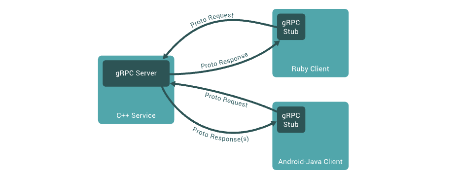

# gRPC

**gRPC 是一种可扩展、松耦合且类型安全的解决方案，与传统的基于 REST/HTTP 的通信相比，它实现了更高效的进程间通信。允许你像本地方法调用一样调用、调试分布式应用程序**

gRPC 是一个现代开源高性能远程过程调用 (RPC) 框架，可以在任何环境中运行。它可以通过对负载平衡、跟踪、健康检查和身份验证的可插拔支持，
有效地连接数据中心内和跨数据中心的服务，基于Protobuf序列化协议开发，且支持众多开发语言。

面向服务端和协议端，基于**http2.0**设计，带来诸如双向流，流控，头部压缩，单TCP连接上的多路复用请求等特性。这些特性使得其在移动设备上表现的更好，更省电和节省空间。

**在gPRC里客户端可以向调用本地对象一样直接调用另一台不同机器上服务端应用的方法，使得您能够更容易地创建分布式应用和服务**

与许多 RPC 系统一样，gRPC 是基于定义服务的想法，指定可以使用其参数和返回类型远程调用的方法。在服务端，服务端实现了这个接口，运行一个gRPC服务端来处理客户端调用。

在客户端，客户端有一个存根（在某些语言中简称为客户端），它提供与服务器相同的方法



## 核心概念

### 服务定义

与许多 RPC 系统一样，gRPC 是基于定义服务的思想，指定可以使用其参数和返回类型远程调用的方法。

默认情况下，gRPC 使用协议缓冲区作为用于描述服务接口和有效负载消息结构的接口定义语言 (IDL)。如果需要，可以使用其他替代方案。

```protobuf
service HelloService {
  rpc SayHello (HelloRequest) returns (HelloResponse);
}

message HelloRequest {
  string greeting = 1;
}

message HelloResponse {
  string reply = 1;
}
```

gRPC 允许您定义四种服务方法：

- 一元 RPC

其中客户端向服务器发送单个请求并返回单个响应，就像正常的函数调用一样。

```protobuf
rpc SayHello(HelloRequest) returns (HelloResponse);
```

- 服务器流式 RPC

其中客户端向服务器发送请求并获取流以读取一系列消息。客户端从返回的流中读取，直到没有更多消息为止。**gRPC 保证单个 RPC 调用中的消息排序**

```protobuf
rpc LotsOfReplies(HelloRequest) returns (stream HelloResponse);
```

- 客户端流式 RPC

其中客户端写入一系列消息并将它们发送到服务器，再次使用提供的流。客户端完成消息写入后，它会等待服务器读取消息并返回响应。gRPC 再次保证单个 RPC 调用中的消息排序。

```protobuf
rpc LotsOfGreetings(stream HelloRequest) returns (HelloResponse);
```

- 双向流式 RPC

双方使用读写流发送一系列消息。这两个流独立运行，因此客户端和服务器可以按照他们喜欢的任何顺序读取和写入：例如，服务器可以在写入响应之前等待接收所有客户端消息，或者它可以交替读取一条消息然后写入一条消息，或其他一些读写组合。保留每个流中消息的顺序。

```protobuf
rpc BidiHello(stream HelloRequest) returns (stream HelloResponse);
```

### 使用 API

从文件中的服务定义开始`.proto`，gRPC 提供生成客户端和服务器端代码的协议缓冲区编译器插件。gRPC 用户通常在客户端调用这些 API，并在服务器端实现相应的 API。

- 在服务器端，服务器实现服务声明的方法，并运行一个 gRPC 服务器来处理客户端调用。gRPC 基础结构解码传入请求、执行服务方法并对服务响应进行编码。
在客户端，客户端有一个称为存根（对于某些语言，首选术语是客户端）的本地对象，它实现与服务相同的方法。
- 客户端然后可以在本地对象上调用这些方法，这些方法将调用的参数包装在适当的协议缓冲区消息类型中，将请求发送到服务器，并返回服务器的协议缓冲区响应。

### 同步与异步

在响应从服务器到达之前阻塞的同步 RPC 调用最接近于 RPC 所追求的过程调用的抽象。**另一方面，网络本质上是异步的，在许多情况下，能够在不阻塞当前线程的情况下启动 RPC 是很有用的**。

## RPC 生命周期

### 一元 RPC

首先考虑最简单的 RPC 类型，其中客户端发送单个请求并返回单个响应。

- 一旦客户端调用了存根方法，服务器就会收到通知，RPC 已被调用，其中包含客户端的元数据 、方法名称和指定的截止日期（如果适用）。
- 然后服务器可以直接发回它自己的初始元数据（必须在任何响应之前发送），或者等待客户端的请求消息。首先发生的是特定于应用程序的。
- 一旦服务器收到客户端的请求消息，它就会执行创建和填充响应所需的任何工作。然后将响应（如果成功）连同状态详细信息（状态代码和可选的状态消息）和可选的尾随元数据一起返回给客户端。
- 如果响应状态为OK，则客户端得到响应，从而完成客户端的调用。

### 服务器流式 RPC

服务器流式 RPC 类似于一元 RPC，不同之处在于服务器返回消息流以响应客户端的请求。发送完所有消息后，服务器的状态详细信息（状态代码和可选的状态消息）和可选的尾随元数据将发送到客户端。这样就完成了服务器端的处理。客户端在收到服务器的所有消息后完成。

### 客户端流式 RPC

客户端流式 RPC 类似于一元 RPC，不同之处在于客户端向服务器发送消息流而不是单个消息。服务器响应一条消息（连同其状态详细信息和可选的尾随元数据），通常但不一定在它收到所有客户端消息之后。

### 双向流式 RPC

在双向流式 RPC 中，调用由客户端调用方法和服务器接收客户端元数据、方法名称和截止日期发起。服务器可以选择发回其初始元数据或等待客户端开始流式传输消息。

客户端和服务器端流处理是特定于应用程序的。由于两个流是独立的，因此客户端和服务器可以按任意顺序读写消息。例如，服务器可以等到收到客户端的所有消息后再写入消息，或者服务器和客户端可以玩“乒乓球”——服务器收到请求，然后发回响应，然后客户端发送基于响应的另一个请求，等等。

## 请求流程

- 客户端(gRPC Stub)调用A方法，发起RPC调用

- 对请求信息使用Protobuf进行`对象序列化压缩（IDL）`

- 服务端（gPRC Server)接收到请求后，`解码请求体`，进行业务逻辑处理并返回。

- 对响应结果使用Protobuf进行对象序列化压缩（IDL）

- 客户端接受到服务端响应，解码请求体。回调被调用的A方法，唤醒正在等待响应（阻塞）的客户端调用并返回响应结果

## 使用场景

建议：

- 微服务：gRPC设计为低延迟和高吞吐量通信，非常适用效率至关重要的轻型微服务
- 点对点实时通信：gRPC可以实时推送消息而无需轮询
- 多语言混合开发环境：支持所有流行开发语言
- 网络受限环境：使用Protobuf(一种轻量级消息格式)序列化gRPC消息。gRPC消息始终小于等效的JSON消息

不建议：

- 浏览器可访问的API（浏览器不支持gRPC，gRPC-Web有局限性，需要服务代理）
- 广播实时通信
- 进程间通信

## 简单比较

### 优势

- **实现的进程间通信方式高效。** gRPC 不使用 JSON 或 XML 等文本格式，而是使用基于二进制协议的protocol buffer与 gRPC 服务、客户端进行通信。此外，gRPC 是在 HTTP/2 之上实现的protocol buffer，这使得进程间通信更快。

- **具有简单、定义良好的服务接口和协议。** 你首先定义服务接口，然后处理实现细节。因此，与用于RESTful服务定义的 OpenAPI/Swagger 和用于 SOAP Web 服务的 WSDL 不同，gRPC 提供了简单但一致、可靠且可扩展的应用程序开发体验。

- **强类型。** protocol buffer清楚地定义了应用程序之间通信的数据类型，这使得分布式应用程序开发更加稳定。因为静态类型有助于减少你在构建跨多个团队和技术的云原生应用程序时遇到的大多数运行时和交互错误。

- **支持多语言。** gRPC被设计成支持多种编程语言。使用protocol buffer的服务定义与语言无关。因此，你可以选择grpc支持的任意语言，并与任何现有的 gRPC 服务或客户端进行通信。

- **支持双向流式传输。** gRPC 对客户端或服务器端流式传输具有原生支持，这使得开发流媒体服务或流媒体客户端变得更加容易。

- **内置多种高级特性。** gRPC 提供对高级特性的内置支持，例如身份验证、加密、元数据交换、压缩、负载平衡、服务发现等。

- **与云原生生态系统高度集成。** gRPC 是 CNCF 的一部分，大多数现代框架和技术都为 gRPC 提供了开箱即用的原生支持。

### 不足

- **可能不适合面向外部的服务。**  当你想将应用程序或服务提供给外部客户端使用时，gRPC 可能不是最合适的协议，因为大多数外部使用者对 gRPC 还很陌生。而且，gRPC 服务的协议驱动、强类型化特性可能会降低你向外部提供的服务的灵活性，因为外部使用者可以控制的东西要少得多。
- **生态系统相对较小。** 与传统的 REST/HTTP 协议相比，gRPC 生态系统仍然相对较小。浏览器和移动应用程序对 gRPC 的支持仍处于初级阶段。

## 参考资料

- 文档：<https://grpc.io>
- 仓库：<https://github.com/grpc/grpc>
