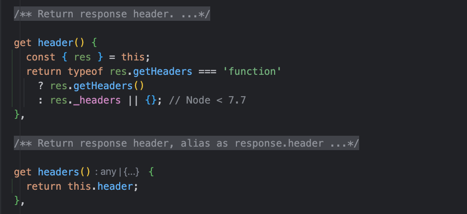
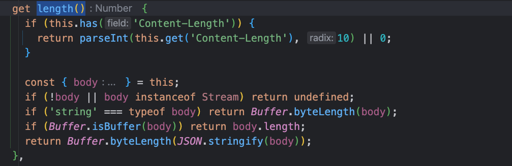
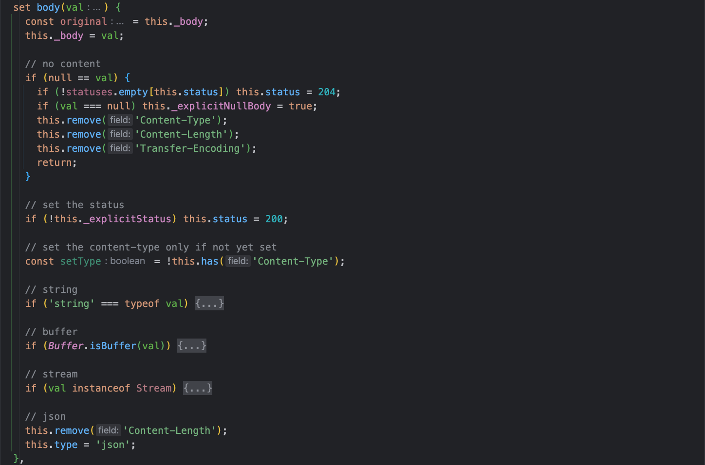

# Response对象

`Koa`框架的 `Response` 对象是对 `Node` 的原生响应对象的进一步封装，提供了很多对 `HTTP` 服务器开发有用的功能、API方法。

## API方法

### response.header

响应头对象，使用`response.headers`和`resposne.header`效果一样。查看源码：



可以看到，`response.headers`的别名是`response.header`，同时对Node@7.7以下的版本做了一些兼容

### response.status

- 设置对客户端响应的状态码
- 获取响应的状态码，默认情况下`response.status`设置为404，这与Node.js的`res.statusCode`的默认值不一样，`res.statusCode`的默认值为200

在设置客户端响应的状态码时，需要了解常用的 `Http` 状态码有哪些，例如：

- `1XX 信息性` 表示服务器收到浏览器发送的HTTP请求，将继续处理。 这是一个临时响应，因此客户端不会遇到此状态代码，因为它不是最终答案。
- `2XX 成功` 表示服务器接收、理解并处理了请求。 随后，浏览器接受预期的信息。
- `3XX 重定向` 表示服务器收到了请求，但是请求的内容被移动到不同的位置，因此客户端将被重定向。
- `4XX 客户端错误` 表示服务器由于客户端错误而无法完成请求，例如页面不可用、语法错误或授权问题。 回复将说明这是暂时性问题还是永久性问题。
- `5XX 服务器错误` 表示服务器遇到错误，无法处理有效请求。 响应将描述情况并确定它是暂时性问题还是永久性问题

详细的状态码信息，可以参考：[常用Http状态码](https://www.runoob.com/http/http-status-codes.html)

在给客户端返回响应时，允许body为空并且设置不同的status区分，例如：

```js
ctx.response.status = 200;

// 其他状态码
ctx.response.status = 500;
```

### response.message

- 将响应的状态消息设置为给定值。
- 获取响应的状态消息. 默认情况下, `response.message` 与 `response.status` 关联.

### response.length

- 将响应的 `Content-Length` 设置为给定值
- 以数字形式返回响应的 `Content-Length`

查看源码：



值的注意的是：

在获取响应信息中`Content-Length`字段值时

- 如果没有发现`Content-length`字段，则会根据响应体的内容分类处理，通过不同类型的body来计算出length值。
- 如果发现`body`内容为空，则会返回`undefined`

### response.body

- 获取响应体信息
- 设置响应体内容，支持多种格式

查看源码：



可以看到在设置响应体时，支持的数据类型有：

- string 字符串 `Content-Type` 默认为 `text/html` 或 `text/plain`, 默认字符集是 `utf-8`
- Buffer `Content-Type` 默认为 `application/octet-stream`
- Stream 管道 `Content-Type` 默认为 `application/octet-stream`
- Object || Array JSON字符串化 `Content-Type` 默认为 `application/json`
- null 无内容响应

**如果 `response.status` 未被设置, `Koa` 将会自动设置状态为 `200` 或 `204`**

### response.type

- 获取响应 `Content-Type`, 不含 `"charset"`等参数。只获取 `mime-type`,
- 设置响应 `Content-Type` 通过 `mime` 字符串或文件扩展名

例如：

```js
ctx.type = 'text/plain; charset=utf-8';
ctx.type = 'image/png';
ctx.type = '.png';
ctx.type = 'png';
```

注意: 在适当的情况下选择 `charset`, 比如 `response.type = 'html'` 将默认是 `utf-8`.
如果想覆盖 `charset`, 使用 `ctx.set('Content-Type', 'text/html')` 将响应头字段设置为想要的类型。

### response.redirect

执行302重定向到指定的URL地址，例如：

```js
ctx.redirect('back');
ctx.redirect('test', '/index.html');
ctx.redirect('/login');
ctx.redirect('https://code.142vip.cn');
```

也可以使用ctx.status修改默认302状态码，在跳转之前指定状态码就行。

值的注意是: `302`状态码表示请求的资源被暂时的移动到了由该`HTTP` 响应的响应头 `Location` 指定的URL 上，即：

- `301`： 强制跳转、永久跳转，浏览器没有返回
- `302`： 临时跳转，可以返回

### 更多

`Response`对象的可用API还是非常多的，具体可以参考：[Response API](https://github.com/koajs/koa/blob/master/lib/response.js)

## 一些实践

@[code js](@code/koa/koa-response.js)
