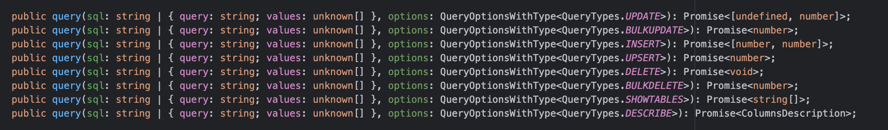
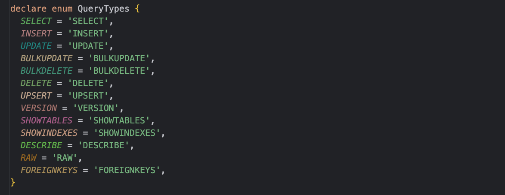

# DB查询

`Sequelize`提供了各种封装好的`API`方法来支持数据库查询操作，在介绍查询操作前，
可以先向表中插入一些数据，例如：

```js
// 向表中插入一行数据
const user = await User.create({
  name: "142vip.cn"
});

// 写入成功后，可以通过user对象，获取主键ID
console.log("userId:", user.id);
```

可以检查数据库表中是否成功写入数据

## 原始查询

`Sequelize`框架本身是ORM框架，是用来管理对象实体和数据库表的关系映射，满足基础的`SQL`语句执行功能，同时还封装了大量查询操作的相关API方法。

这里主要介绍下如何用`Sequelize`框架执行原始`SQL`查询，简单来说就是通过写SQL来处理业务，执行`SQL`来实现业务功能。`sequelize`
框架提供的了`query()`方法来实现这一功能，查看源码：



默认情况下，query()方法返回两个参数：

- 结果数组
- 包含元数据的对象，例如：受影响的行数等

针对不同的数据库类型（这个可以在建立Sequelize连接时通过dialect字段指定），原始的SQL语句会存在一些语法上的出入。

### 简单查询

基于Sequelize.query()方法查询，可以满足一些基础的SQL语句执行。例如：

```js
// 将age等于18的数据对应的age字段改为30
const sql = "UPDATE users SET age = 30 WHERE age = 18"

// 执行SQL
const [results, metadata] = await sequelize.query(sql);
```

上面使用`results`字段来解构`SQL`语句执行后的结果，因为`SQL`语句是执行更新操作，所以`results`字段的值将会是一个`空数组`。

### 格式化结果

根据源码可以知道`sequelize.query()`在执行`SQL`时，还可以传入第二个可选参数`options`对象，可以支持对`SQL`语句结果格式化的配置，
只需要配置`options.type`参数，例如：

```js
const {QueryTypes} = require('sequelize');

const sql = 'select * from users';
// 配置执行query方法的返回结果类型
const users = await sequelize.query(sql, {
  type: QueryTypes.SELECT
});
```

`type`字段用来配置查询类型。查询类型会影响结果在传回之前的格式设置方式，type字段的配置支持多种类型，查看源码：



### 配置模型

对于执行查询`SQL`结果的处理，除了通过`type`字段去配置格式化，`Sequelize`还提供了将查询结果与指定模型的数据映射配置，例如：

```js
const {QueryTypes} = require('sequelize');

const sql = 'select * from users';
// 配置Users模型，将查询结果与模型进行数据映射
const projects = await sequelize.query(sql, {
  model: Users,
  mapToModel: true
});
```

更多使用`query()`方法的配置，
可以查看[QueryOptions的类型声明](https://github.com/sequelize/sequelize/blob/main/packages/core/src/dialects/abstract/query-interface.d.ts)
，提供了丰富的API方法。

### 替换参数

查询中的替换可以通过两种不同的方式完成，

- 如果传递的是数组，`?` 将按照它们在数组中出现的顺序进行替换
- 如果传递了一个对象，`:key`则将替换为该对象中的键。如果对象中的键与key字段不匹配、找不到，会导致异常。

这里通过简单的替换例子来演示，例如：

```js
const {QueryTypes} = require('sequelize');

// 使用 ? 格式来替换，替换值为数组 
await sequelize.query('SELECT * FROM tbl_user WHERE name = ?', {
  replacements: [
    '142vip.cn'
  ],
  type: QueryTypes.SELECT
});

// 使用:key 格式来替换，替换值为对象
await sequelize.query('SELECT * FROM tbl_user WHERE name = :name', {
  replacements: {
    name: '142vip.cn'
  },
  type: QueryTypes.SELECT
});
```

基于数组或者对象的形式实现查询SQL语句替换，类似的可以使用`%`来支持模糊匹配，例如：

```js
const {QueryTypes} = require('sequelize');

// 使用:key 格式来替换，替换值为对象
await sequelize.query('SELECT * FROM tbl_user WHERE name like :name', {
  replacements: {
    name: '142vip.cn%'
  },
  type: QueryTypes.SELECT
});
```

### 绑定参数

执行原始`SQL`语句，绑定参数和替换参数类型，不过绑定参数使用的是`$`标记，规则是：

- 如果传递数组，`$1` 则绑定到数组中的第一个元素，数组角标为0
- 如果传递一个对象，`$key` 则绑定到`object['key']`。**每个键必须以非数字字符开头、满足对象的键规范。**
- 在任何一种情况下`$$`都可以用来转义文字`$`符号。

数组或对象必须包含所有绑定值，绑定参数与待绑定的 `SQL` 语句必须一一匹配，避免 `Sequelize` 因为绑定参数匹配问题出现异常。例如：

```js
const {QueryTypes} = require('sequelize');

// 使用数组形式实现绑定参数
await sequelize.query('SELECT * FROM tbl_user WHERE name = $1', {
  bind: [
    '142vip.cn'
  ],
  type: QueryTypes.SELECT
});

// 使用对象形式实现绑定参数
await sequelize.query('SELECT * FROM tbl_user WHERE name = $name', {
  bind: {
    name: '142vip.cn'
  },
  type: QueryTypes.SELECT
});
```

同样地，在绑定参数中也是支持模糊匹配的，使用好 `%` 标记即可

### 特殊列处理

对于表的列字段带点，虽然从规范上不推荐这么做，但实际总是会有这种可能。例如：`user.name`

```js
const {QueryTypes} = require('sequelize');

const records = await sequelize.query('select 1 as `user.name`', {
  type: QueryTypes.SELECT
});
console.log(JSON.stringify(records[0], null, 2));
```

查询出来的结果是：

```json5
{
  "user.name": 1
}
```

Sequelize框架可以使用 `nest`参数设置，处理这种特殊的列。当设置 `nest: true`时， 可以将生成的对象转化为嵌套对象，例如：

```js
const {QueryTypes} = require('sequelize');

const records = await sequelize.query('select 1 as `user.name`', {
  type: QueryTypes.SELECT
});
console.log(JSON.stringify(records[0], null, 2));
```

配置`nest`参数后，查询出来的结果是：

```json5
// 支持将查询的数据转化为嵌套对象
{
  "user": {
    "name": 1
  }
}
```

## 模型查询

## 查找器查询

## 范围查询

## 子查询
