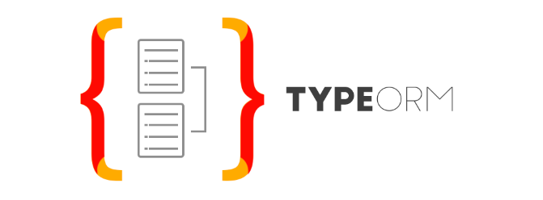

# TypeORM

`TypeORM` 是一个`ORM`框架，可以运行在 `NodeJS`、`Browser`、`Cordova`、`PhoneGap`、`Ionic`、`React Native`、`Expo` 和 `Electron`
平台上，可以与 `TypeScript` 和 `JavaScript`一起使用。

`TypeOrm`目标是始终支持最新的 `JavaScript` 特性并提供额外的特性以帮助开发任何使用数据库的应用程序。

不同于现有的所有其他 `JavaScript ORM`框架，`TypeOrm`可以以最高效的方式编写高质量的、松耦合的、可扩展的、可维护的应用程序。

## 基础教程

## 最佳实践

## 参考
