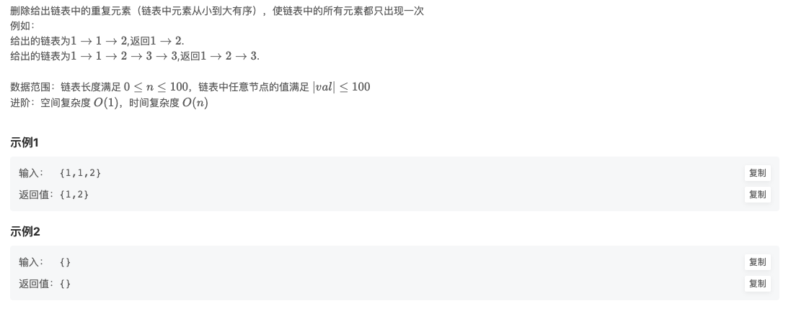

# BM15 删除有序链表中重复的元素-I

## 题目链接

- [牛客网](https://www.nowcoder.com/share/jump/8484115461694841529345)
- [欢迎讨论]()

## 题目描述

## 刷题思路

## 代码实现

@[code js](@code/algorithm/interview-101/deleteDuplicates-1.js)

## 一些建议
