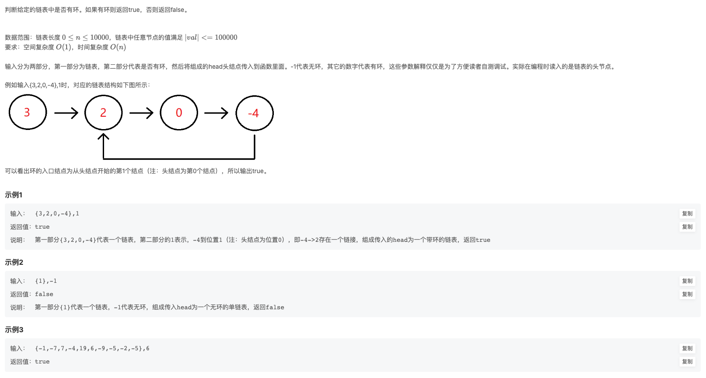

# BM6 判断链表中是否有环

### 题目链接

- [牛客网](https://www.nowcoder.com/share/jump/8484115461694589556195)
- [欢迎讨论]()

### 题目描述

### 思路

### 代码实现

@[code js](@code/algorithm/interview-101/hasCycle.js)

### 一些建议