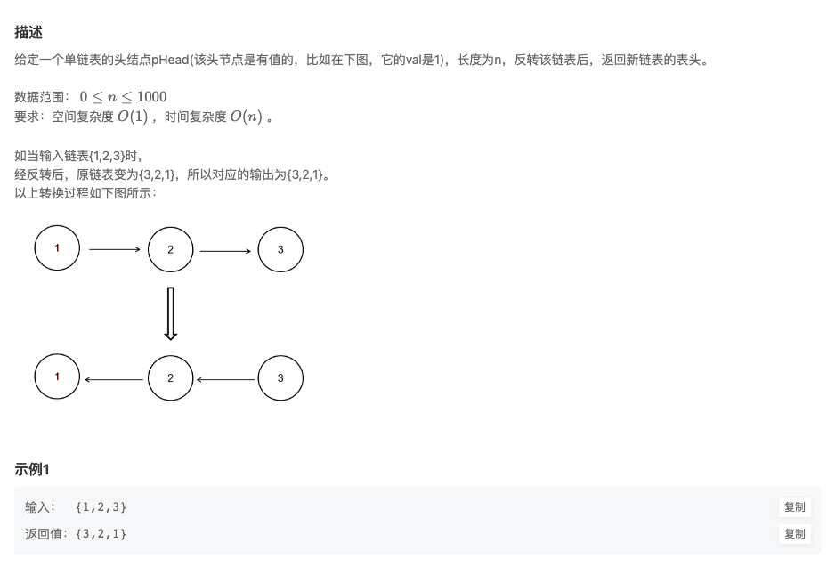

# BM1 反转链表

## 题目链接

- [牛客网](https://www.nowcoder.com/practice/75e878df47f24fdc9dc3e400ec6058ca)
- [欢迎讨论]()

## 题目描述

## 刷题思路

## 代码实现

@[code js](@code/algorithm/interview-101/reverseList.js)

## 一些建议