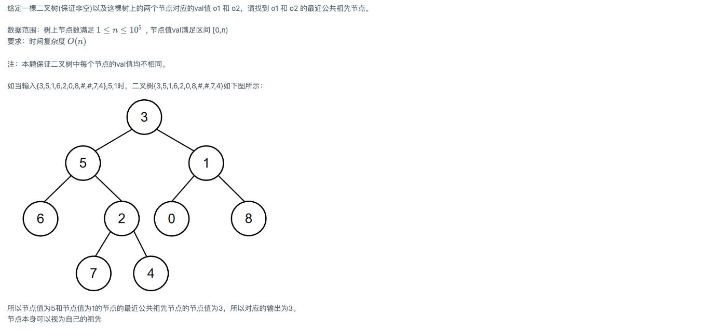

# 在二叉树中找到两个节点的最近公共祖先

## 题目链接

- [牛客网](https://www.nowcoder.com/share/jump/8484115461699857898221)

## 题目描述

## 刷题思路

## 代码实现

@[code js](@algorithm/sword-point/树/lowestCommonAncestorFromNode.js)

## 一些建议
