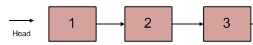

# 从尾到头打印链表

## 题目链接

- [牛客网](https://www.nowcoder.com/practice/d0267f7f55b3412ba93bd35cfa8e8035)

## 题目描述

输入一个链表的头节点，按链表从尾到头的顺序返回每个节点的值（用数组返回）。

如输入{1,2,3}的链表如下图:



返回一个数组为[3,2,1]

0 <= 链表长度 <= 10000

## 刷题思路

单链表比较直接的想法就是：顺讯访问、按照链表结点循环即可，比较好的模型：

```js

while(head!=null){
    // 结点向后
    head=head.next
}
```

## 代码实现

@[code js](@code/algorithm/sword-point/链表/printListFromTailToHead.js)

## 一些建议
