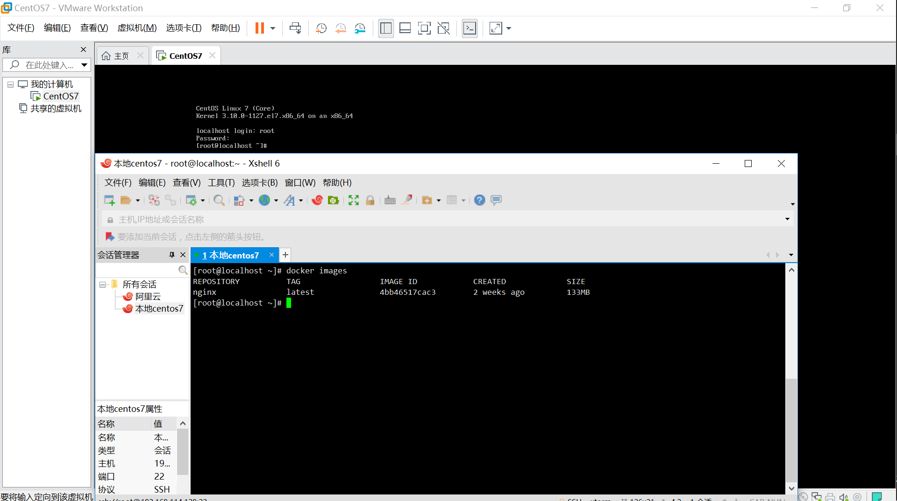

## docker下MySQL的安装部署

> 本文已经收录于个人Github仓库[JavaScriptCollection](https://github.com/mmdapl/JavaScriptCollection),转载请注明原文地址，【B站&微信公众号】：Rong姐姐好可爱

​	最近，我发现自己的电脑特别的卡，所以我就趁着周末有时间，将我用了好几年的笔记本进行系统重装；虽然大学的时候，有学习过怎么样去快速的通过PE工具去安装系统，但是现在毕业很久了，很多实操的东西都忘记了；所以昨晚安装系统的操作搞得有些晚。另外，除了我电脑本身比较卡之外，促使我进行系统重装的大概是csdn上的一个评论吧！


这里本来是句玩笑话，但是我发现在写博客、写文章的时候，总有一些朋友， 没有get到点，甚至容易站在道德的高地来怎么怎么的...所以就有这篇文章；

​	当然，这里会简略的说一些系统安装，重要的是将docker下MySQL的安装部署，毕竟不像是还在上学，老是觉得会点实操就很了不起。你说对吧？

​	先说下昨天晚上，我大概9点多开始准备安装系统，当我插上我的U盘准备进入PE的安装界面，我发；现，我大学时制作的PE启动盘竟然坏了，我手头也没有其他的U盘，所以我不得不重新制作启动盘。过程大概就是：U盘数据备份——格式化——写入启动盘程序——测试启动盘效果。当我启动盘做好准备开始安装系统，发现我这个用了很久的电脑，数据真的很多，特别是代码、笔记、文档什么的，简直一大堆，所以我找出了芋头给我的移动硬盘，进行数据备份，整整20多个G，要是单纯的是压缩包什么的备份起来就很快，但是偏偏里面就是什么类型的文件数据都有，所以整个数据备份大概话了我1个多小时，搞到了11点多，当时还心想着，总算能开始安装了....

​	于是，我就插上新做的PE启动盘，进入笔记本的BIOS界面，设置U盘启动，进入PE工作界面，把笔记本硬盘上的数据全部格式化，自从买了mac之后，这个笔记本就一直很少用，而我对这个笔记本的规划就是后续在写文档、排版上用的比较多，加上我自己网站的服务器配置比较低，所以就想着在这个笔记本上装上centos服务，以后不论是代码开发、服务内测环境上线、本地集群模拟都可以用这台笔记本，而且当我不用的时候，观赏虚拟机就可以当作普通的笔记本使用，平时谢谢文档、排版等，我想应该问题不带；

​	大概到了晚上12点的时候，我的笔记本系统重装的基础工作就完成的，后面的就是安装驱动，下载软件什么的，一直在等安装过程，当我装好驱动、压缩工具、Git、Centos的时候就到了一点多了，幸好是周末，幸好是周六，看着这不争气的电脑，我就觉得差不多的时候，就已经到两点多了...实在是扛不住了，就去睡了....

>  这里的“争气”二字，强烈建议看《中国新说唱》，在很多人都不选Gai的情况下，重庆小伙王齐铭选择了Gai，当时Gai说了一句“争气点.....”,真的就很上头了，川渝人真的浑身都是魅力.. 就拿我们组那个Android,充满了欢乐... 所以争气点呀....

铺垫了这么多，就放一张已经装好docker的centos虚拟机吧，下面主要就是将在docker环境下安装Mysql的事情了...




其实与docker的接触时间并不是很长，至少在我去广州实习，在我去年11月份之前，我应该是不会docker，虽然接触的比较晚，但是用过之后，就会都容器技术、容器编排很喜欢，docker是这样，k8s也是这样，包括istio服务网格也是这样... 所以我觉得计算机技术发展的这么快，学习技能一定要学尽可能新的，当然也不是说旧的知识不重要，但是像什么jsp这种，就完全没有必要学了，因为很多公司都已经不用了，就算用了，也会或者说正在进行新技术重构，就比如说我所在的项目组，web前端开发用的是ejs模板渲染，现在就被完完全全用vue代替了， 如果你说ejs模板开发，不需要考虑SEO的问题呀什么的，我可能会跟你说，我发现了Nuxtjs这个框架，实在vuejs的基础上，完全满足SSR服务端渲染的问题......hhhh,不要喷我！

​	好了， 说说MySQL的安装问题吧，以前我安装MySQL，就包括笔记本之前系统上安装的MySQL都是采用官网提供的安装文件，进行安装，然后配置重启什么的，对于有安装路径洁癖的人来说，还要考虑装在那个盘比较好（如果你是固态硬盘，这个是不用考虑的......）,但是这个其实有很多不好的地方，比如我觉得：

- 官网下载慢，找对应的版本需要去考虑系统适配的问题；
- 本地安装配置多，虽然安装之后可以很清楚的看到文件目录什么的，但是里面的配置，真的理不清
- 后续拓展主从什么的，非常不方便，也不利于查看端口暴露的问题

总之一句话，mysql用docker安装，必须安排....

### docker部署

- 设置yum，安装docker

```bash
##安装docker
$ yum install docker-ce-17.12.1.ce
## centos下可以进行yum更新
$ yum update
## 安装vim
$ yum install vim 
```

- 启动docker服务

```bash
## 启动
$ systemctl start docker
# 对应的还有停止与重启
$ systemctl stop docker
$ systemctl restart docker
```

- 查看是否启动

```bash
# 方法一：查看docker指令是否可用
$ docker ps #显示所有正在运行的容器
$ docker version # 查看docker版本
# docker指令有很多，可以随便选择一个
# 方法二：查看centos系统已经启动的服务
$ systemctl list-units --type=service
# 如果没有的话，建议执行：systmectl restart docker重试
```

- 设置开机启动

因为这毕竟是把docker安装在虚拟机环境下，虽然docker支持安装window和macOS系统上，但是相比来说，windows上的docker安装简直太过于鸡肋的了，加上想在本地模拟云服务器的集群效果，所以我就在虚拟机上安装了，可是，如果笔记本关机了，虚拟机也关了，当你再次打开虚拟机的时候，docker还会运行吗？如果不会，怎么样去让他开机就能运行docker呢？答案是：**设置开机启动**

```bash
# 设置docker开机启动
$ systemctl enable docker
```

设置完成后， 可以用`systemctl restart docker`重启一下；

- 配置镜像加速

进入到`/etc/docker`目录下，先查看是否有dame.json文件，不出意外的话，应该是没有的，所有在配置之前需要创建dame.json文件，这里有很多方式，主要都是基于linux指令，你可以：

```bash
## touch命令
$ touch daemon.json
```

也可以直接用vim编辑文件，当你保存之后，如果没有该文件，就会自动创建

```bash
## vim 指令
$ vim daemon.json 
```

啰嗦一句：如果发现vim commond not found这种错误，可以直接进行yum安装

```bash
## 安装vim
$ yum install vim 
## 事实上，安装其他软件，也是通过yum的，也有直接通过curl下载的，这里不展开
```

通过vim命令进入到daemon.json的编辑中，编辑如下内容：

```bash
{
  "registry-mirrors": ["https://fh9qqa3r.mirror.aliyuncs.com"]
}
```

也可以在没有vim的情况下，用shell命令EOF追加内容

```bash
## 创建目录
sudo mkdir -p /etc/docker
## 追加内容
sudo tee /etc/docker/daemon.json <<-'EOF'
{
  "registry-mirrors": ["https://fh9qqa3r.mirror.aliyuncs.com"]
}
EOF
```

最后保存修改daemon.json文件后，重启docker服务即可

```bash
## dameon文件刷新
sudo systemctl daemon-reload
## docker服务重启
sudo systemctl restart docker
```

### MySQL部署

说了这么多，其实都没有进入到MySQL的重点，前面主要说的是docker环境部署的问题；好了，开始进入MySQL的安装

- 镜像拉取

就我个人我而言，安装MySQL的时候，不论是直接安装还是docker容器安装，我都很喜欢使用5.7这个版本，所以这里从仓库拉取的镜像也是拉取5.7的，当然如果你了解MGR的时候，部署MGR集群可能需要8.0这种高版本的。就目前来看5.7版本非常文档且好用；

```bash
## 拉取mysql5.7
$ docker pull mysql:5.7
## 拉取最新版
$ docker pull mysql:latest
## 查看本地镜像
$ docker images
```

当然，这里如果你直接执行：

```bash
$ docker pull mysql
## 语法格式
$ docker pull <镜像名>：<tag版本号>
```

也是默认拉取最新的；

- 文件映射

当你镜像拉取成功后，如果只是单纯的创建容器，只需要执行`docker run`指令即可创建临时的，我这里由于本机没有安装MySQL的实体服务，希望采用docker容器来部署MySQL，所以就需要做文件映射，确保当容器挂掉之后，可以快速的恢复，对数据来进行很好的备份保护；

```bash
## 切换到web-project目录下，我一般都是用这个目录，路劲为：/web-project
$ cd /web-project
## 创建文件
$ mkdir mysql 
## 进入到mysql目录下，并创建data、config、logs三个目录
$ cd mysql 
$ mkdir {data,config,logs}
[root@localhost mysql]# ll
## 文件日志
总用量 0
drwxr-xr-x. 2 root root 6 8月  30 18:51 config
drwxr-xr-x. 2 root root 6 8月  30 18:51 data
drwxr-xr-x. 2 root root 6 8月  30 18:51 logs
```

这里，在mysql目录下穿件的文件目录，作用如下：

```bash
## data目录	存放MySQL数据库的各种表数据以及系统数据库等数据，持久化到本地
## config目录   存放数据库的配置，例如后面做主从复制等配置，统一放在config目录下
## logs目录     存放数据库运行的logs日志，便于查看
```

- 编写mysql配置文件

```bash
## 可选择的配置官方提供很多
port = 3306
socket = /tmp/mysql.sock
pid-file = /home/mysql/var/mysql.pid #进程pid
basedir = /home/mysql/ #mysql的安装路径
datadir = /home/mysql/var/ #数据文件所在路径
tmpdir = /home/mysql/tmp/ #临时文件保存路径
slave-load-tmpdir=/home/mysql/tmp #当slave执行load data infile时用
skip-name-resolve #grant时，必须使用ip不能使用主机名
skip-symbolic-links#不能使用连接文件
skip-external-locking#不指定系统锁定
back_log = 50 #接受队列，对于没建立 tcp 连接的请求队列放入缓存中，队列大小为 back_log，受限制与 OS 参数
max_connections = 1000 #最大并发连接数 ，增大该值需要相应增加允许打开的文件描述符数
max_connect_errors = 10000 #如果某个用户发起的连接 error 超过该数值，则该用户的下次连接将被阻塞
open_files_limit = 10240#打开文件限制
connect-timeout = 10 #连接超时之前的最大秒数
wait-timeout = 28800 #等待关闭连接的时间
interactive-timeout = 28800 #关闭连接之前，允许 interactive_timeout（取代了wait_timeout）秒的不活动时间。
slave-net-timeout = 600#从服务器超过slave_net_timeout 秒没有从主服务器收到数据才通知网络中断
net_read_timeout = 30 #从服务器读取信息的超时
net_write_timeout = 60 #从服务器写入信息的超时
net_retry_count = 10 #如果某个通信端口的读操作中断了，在放弃前重试多次
net_buffer_length = 16384 #包消息缓冲区初始化字节
table_cache = 512 #所有线程打开的表的数目
thread_stack = 192K #每个线程的堆栈大小
thread_cache_size = 20 #线程缓存
thread_concurrency = 8 #同时运行的线程的数据 此处最好为 CPU 个数两倍。
query_cache_size = 256M #查询缓存大小
query_cache_limit = 2M #不缓存查询大于该值的结果
query_cache_min_res_unit = 2K #查询缓存分配的最小块大小
default_table_type = INNODB#默认表存储引擎
default-time-zone = system #服务器时区
character-set-server = utf8 #server 级别字符集
default-storage-engine = InnoDB #默认存储
tmp_table_size = 512M #临时表大小
log-bin = mysql-bin #打开binlog
log-bin-index = mysql-bin.index
relay-log = relay-log
relay_log_index = relay-log.index
log-error = /home/mysql/log/mysql.err#错误文件路径
log_output = FILE #慢查询输出格式
slow_query_log = 1
long-query-time = 1 #慢查询时间 超过 1 秒则为慢查询
slow_query_log_file = /home/mysql/log/slow.log#慢查询存储路径
general_log = 1
general_log_file = /home/mysql/log/mysql.log#一般查询存储路径
max_binlog_size = 1G#最大binlog
max_relay_log_size = 1G#最大relaylog
relay-log-purge = 1 #当不用中继日志时，删除他们。这个操作有 SQL 线程完成
expire_logs_days = 30 #超过 30 天的 binlog 删除
binlog_cache_size = 1M #session 级别
replicate-wild-ignore-table = mysql.% #复制时忽略数据库及表
replicate-wild-ignore-table = test.% #复制时忽略数据库及表
key_buffer_size = 256M#查询排序时所能使用的缓冲区大小
sort_buffer_size = 2M #排序 buffer 大小
read_buffer_size = 2M #读查询操作所能使用的缓冲区大小
join_buffer_size = 8M # join buffer 大小
query_cache_size = 64M#指定 MySQL 查询缓冲区的大小
read_rnd_buffer_size = 8M#随机读缓存大小
innodb_file_per_table#独立表空间
innodb_additional_mem_pool_size = 100M#附加的内存池
innodb_buffer_pool_size = 2G #缓冲池
innodb_data_file_path = ibdata1:1G:autoextend#表空间，自动递增
innodb_file_io_threads = 4 #io 线程数
innodb_thread_concurrency = 16 #并发线程数
innodb_flush_log_at_trx_commit = 1#刷新事务日志到磁盘
innodb_log_buffer_size = 8M #事物日志缓存
innodb_log_file_size = 500M #事物日志大小
innodb_log_files_in_group = 2 #两组事物日志
innodb_log_group_home_dir = /home/mysql/var/#日志组
innodb_max_dirty_pages_pct = 90 #innodb 主线程刷新缓存池中的数据，使脏数据比例小于 90%
innodb_lock_wait_timeout = 50 #InnoDB 事务在被回滚之前可以等待一个锁定的超时秒数
innodb_flush_method = O_DSYNC  # InnoDB 用来刷新日志的方法
innodb_force_recovery=1#导出表空间损坏的表
innodb_fast_shutdown#加速innodb关闭
max_allowed_packet = 64M#最大允许的包大小
[mysql]
default-character-set = utf8
connect-timeout = 3
[mysqld_safe]
open-files-limit  = 8192#可打开文件数量

```

​	当然，这些不是每个都能用到，就我而言，搭建高可用的MySQL集群的话，主从配置中需要用到几个配置，很多暂时还用不到，因此这个config文件目录的映射，其实是为后期做准备的，可以暂时空着或者touch一个空的mysql.cnf 文件，不过最好是要cnf为后缀，至于为什么，可以了解MySQL的官方配置文件引入就知道了。

- 创建容器

使用docker来创建容器，主要就是要记住使用`docker run`指令，暴露端口，通过文件映射保证宿主机与容器的数据备份，基本满足这些之后，接可以创建一个比较好，后期易于维护的服务了，docker创建命令如下：

```bash
## 创建容器
$ docker run --name mysql \
    --restart=always \
    -p 3306:3306 \
    -v /web-project/mysql/config:/etc/mysql/conf.d \
    -v /web-project/mysql/data:/var/lib/mysql \
    -v /web-project/mysql/logs:/logs \
    -e MYSQL_ROOT_PASSWORD=123456 \
    -e TZ=Asia/Shanghai \
    -d mysql:5.7
```

指令中使用到的docker命令解释如下：

```bash
## 配置端口：将容器的 3306 端口映射到主机的 3306端口，mysql默认端口为3306
-p 3306:3306
## 映射配置：将主机当前目录下的 conf/my.cnf 挂载到容器的 /etc/mysql/my.cnf。
-v /web-project/mysql/config:/etc/mysql/conf.d
## 映射日志：将主机当前目录下的 logs 目录挂载到容器的 /logs。
-v /web-project/mysql/logs:/logs
## 映射mysql数据：将主机当前目录下的data目录挂载到容器的 /var/lib/mysql 
-v /web-project/mysql/data:/var/lib/mysql 
## 设置密码：初始化 root 用户的密码为123456
-e MYSQL_ROOT_PASSWORD=123456
```

最后，查看创建容器的运行及镜像情况

````bash
## 查看正在运行的容器，目前3306端口的mysql服务正在运行
[root@localhost mysql]# docker ps
CONTAINER ID        IMAGE               COMMAND                  CREATED             STATUS              PORTS                               NAMES
b9d485aa50ff        mysql:5.7           "docker-entrypoint.s…"   12 seconds ago      Up 11 seconds       0.0.0.0:3306->3306/tcp, 33060/tcp   mysql
## 查看下载的镜像
[root@localhost mysql]# docker images
REPOSITORY          TAG                 IMAGE ID            CREATED             SIZE
nginx               latest              4bb46517cac3        2 weeks ago         133MB
mysql               5.7                 718a6da099d8        3 weeks ago         448MB
````

是的，你没有看错，处理有mysql5.7版本的镜像，还有nginx，后面还有redis，这些都是后面准备详细写的，虽然mysql的服务搭建弄过很多次，但是因为之前一直都是边做边查资料，很多过程都只是当时记得，所以一旦整理整文档，就没有那么顺利，甚至有些遗忘，不过我想我这次围绕微服务进行整理，后面应该会顺利很多吧。

​	另外提供对应的yaml版本，后续在集群搭建中，也会使用到docker-compose来构建的。

```yaml
version: '3'
services:
  msyql:
    container_name: mysql        # 指定容器的名称
    image: mysql:5.7                   # 指定镜像和版本
　　 restart: always                   # 指定开机重启
    ports:
      - "3306:3306"
    environment:
    	## root用户的登录密码
      MYSQL_ROOT_PASSWORD: 123456 
    volumes:
      - "/web-project/mysql/data:/var/lib/mysql"           # 挂载数据目录
      - "/web-project/mysql/config:/etc/mysql/conf.d"      # 挂载配置文件目录
      - "/web-project/mysql/logs:/logs" ## 挂在日志文件
```

这里只是提供一个简单的yaml文件，其实当你熟悉了yaml的语法格式之后，一切的docker run命令启动的容器，都可以改写成yaml，非常方便维护，当然前提是你需要安装docker-compose，这个之前有说过，可以往前翻一翻~

关于mysql的用户配置和基本的数据库配置，都是需要研究的地方，这里简单的提一下，可以使用在yaml文件中配置普通用户的账号密码，即：生命environment变量

```yaml
environment:
            MYSQL_ROOT_PASSWORD: "yourpassword"
            MYSQL_USER: 'test'
            MYSQL_PASS: 'yourpassword'
```

若你使用docker-compose的方式，去搭建mysql，可能会用到：

```bash
## 在 docker-compose.yml 目录下执行：
$ docker-compose up
## 如果要在后台运行，使用
$ docker-compose up -d
## 停止容器：
$ docker-compose down
## 如果是前台运行的，使用：Ctrl + C 停止。这两种方式在停止后都会删除容器，下次启动必须使用 up 命令。
## 停止但不删除容器：
$ docker-compose stop
## 使用 stop 停止后，再次启动使用 start 命令即可。
$ docker-compose start
```

好了，今天就到这里，刚好今天是周末，后面继续整理，有兴趣可以看看我的Github仓库[JavaScriptCollection](https://github.com/mmdapl/JavaScriptCollection),最近会有一个大的版本变化，**晚安！**

### 公众号


如果大家想要实时关注我更新的文章以及我的日常的话，可以关注我的公众号，基本每天都会更新技术和各种吹水文章，就当做是记录心情、成长的地方吧

<div>
  
</div>