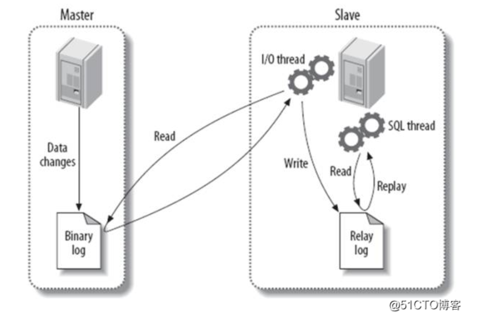

<!--
 * @Description: mysql日志比较
 * @Version: Beata1.0
 * @Autor: 【B站&公众号】Rong姐姐好可爱
 * @Date: 2020-09-07 22:13:30
 * @LastEditors: 【B站&公众号】Rong姐姐好可爱
 * @LastEditTime: 2020-09-07 22:56:17
-->

上周五面试，看过我当天的文章应该知道，非常的惨，遇见了很多原理性的问题回答的都勉勉强强，有些甚至当场死亡；那天问到一个关于mysql的问题，面试官不屑的问：

> 你说弄了一个MySQL的高可用主从集群，那你解释一下，MySQL里面undo log 、redo log 、 bin log 的区别

说实话，我本来以为我疫情在家弄得一个高可用集群架构上已经非常牛逼了，之所以这样有底气的说，是因为目前这套架构已经用在正式服了，不论是自己做的百万压测，还是线上的用户模拟，数据库的集群性能都表现了不赖；有一说一，那个TPS、QPS很抢眼，虽然这里有那么一丢丢的自吹；

### 主从复制
好了，不说那个破架构的问题了（连原理都没有搞清楚，再牛逼的架构也是破的，海市蜃楼一样）；回到问题的本身，当时听到面试官的问题，他说的三个英文单词，我tm就知道一个bin log ，因为在主从复制中，看过官方的架构图，知道有bin log 和 relay log ，气就气在没有提半毛钱的relay log的事，而是搞出了什么undo log 、redo log 我直接当场死亡了...

上面的原理图就可以很明显的看到 bin log 和 relay log 其中从英文单词上就很容易理解：
> binary log : 二进制日志 
> 
> relay log ： 中继日志

这里，二进制日志（bin log）用于复制，在主从复制中，从库利用主库上的binlog进行重播，实现主从同步；而relay log

> Mysql 主节点将binlog写入本地，从节点定时请求增量binlog，主节点将binlog同步到从节点。从节点单独进程会将binlog 拷贝至本地 relaylog中。从节点定时重放relay log。

简单来说，bin log 和 relay log都是用在主从复制中的，binlog是主节点在进行数据变更时，sql等信息的保留文件，而relay log是从节点中bin log的“备份”，只是这个”备份“是通过IO thread线程来完成的；

既然都说了主从复制和原理图了，就抛砖引玉，用我自己的话来总结一下简单的主从复制原理吧~

> 在已经建立主从关系的两个数据库master和slave节点上，当用户需要更新一条数据时，会像平时操作单节点数据库一样，生成一条sql语句（就是我们常说的增删改查），然后在master节点上执行，此时master节点就会记录sql到bin log日志文件中，在这个机制之下方便数据的恢复和持久化；执行完成后，会通知已经建立主从关系的下属slave节点，通过IO thread线程将master节点的日志读取写入到relay log中，暂时可以理解为备份（当然，这不是简单想cv战士那样进行复制，而是特有的机制）；复制过程或者完成后，slave节点下的SQL thread 线程就会按照relay log中的sql执行，也就是主从两个数据本质上执行了一样的sql语句，在没有故障的情况下，理论上是可以保证主从数据一致性的

上面这句话，只是简单说明一下主从流程，在一些高并发的场景下，会有很多问题，当然也有对应的解决方案，这个我们放在后面说。

此刻，我问一句，你学废了吗？？ 我是已经废了...

### 类型汇总

在MySQL数据库中，一共有七种日志类型（我了解到的）；分别是：
- **重做日志（redo log）**
- **回滚日志（undo log）**
- **二进制日志（binlog）**
- **中继日志（relay log）**
- 错误日志（errorlog）
- 慢查询日志（slow query log）
- 一般查询日志（general log）

主要说说把我问死亡的**重做日志（redo log）**和**回滚日志（undo log）**

#### 重做日志（redo log）

>确保事务的持久性。防止在发生故障的时间点，尚有脏页未写入磁盘，在重启mysql服务的时候，根据redo log进行重做，从而达到事务的持久性这一特性。
- 作用

确保事务的持久性。

防止在发生故障的时间点，尚有脏页未写入磁盘，在重启mysql服务的时候，根据redo log进行重做，从而达到事务的持久性这一特性。

- 内容

物理格式的日志，记录的是物理数据页面的修改的信息，其redo log是顺序写入redo log file的物理文件中去的。

- 产生：

事务开始之后就产生redo log，redo log的落盘并不是随着事务的提交才写入的，而是在事务的执行过程中，便开始写入redo log文件中。
- 释放：

当对应事务的脏页写入到磁盘之后，redo log的使命也就完成了，重做日志占用的空间就可以重用（被覆盖）。

#### 回滚日志（undo log）

> 保存了事务发生之前的数据的一个版本，可以用于回滚，同时可以提供多版本并发控制下的读（MVCC），也即非锁定读

- 作用

保存了事务发生之前的数据的一个版本，可以用于回滚，同时可以提供多版本并发控制下的读（MVCC），也即非锁定读

- 内容
- 
逻辑格式的日志，在执行undo的时候，仅仅是将数据从逻辑上恢复至事务之前的状态，而不是从物理页面上操作实现的，这一点是不同于redo log的。

- 产生

事务开始之前，将当前是的版本生成undo log，undo 也会产生 redo 来保证undo log的可靠性

- 释放 
  
当事务提交之后，undo log并不能立马被删除，
而是放入待清理的链表，由purge线程判断是否由其他事务在使用undo段中表的上一个事务之前的版本信息，决定是否可以清理undo log的日志空间。

### 戛然而止

看到这里，心中的迷惑解除了不少，今天花了一上午去研究这个问题，真的是知道得越多，发现自己不知道的也越多，有时候有种越描越黑的感觉；不过，回顾这个问题，那天没有回答上来确实自己能力上还是很欠缺的。 没办法，恶补就是了....MySQL的每一个日志类型抽出来总结，都可以写很多，后面升入了再继续更新吧，今天就这样,我还是先把这些记一下（记忆力警告）

最后，今天你学废了吗？？