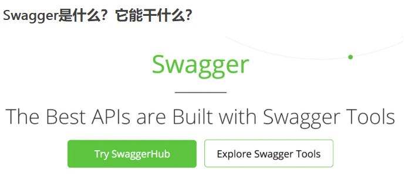
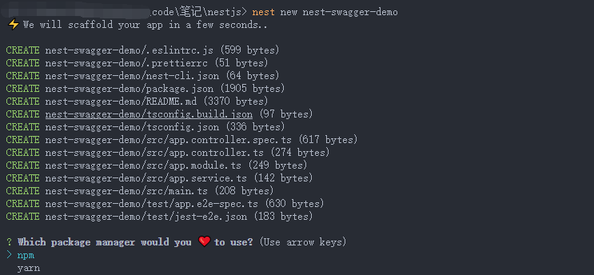
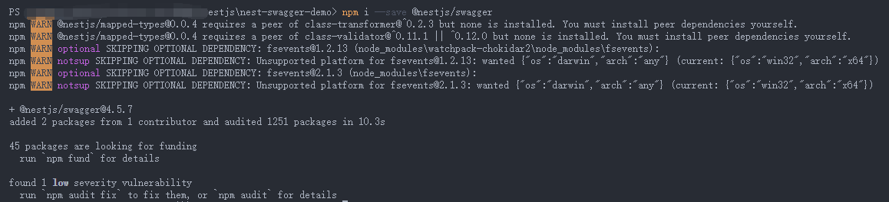
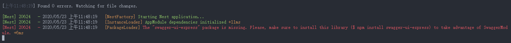
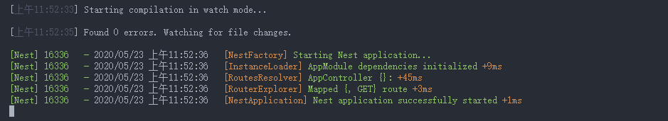
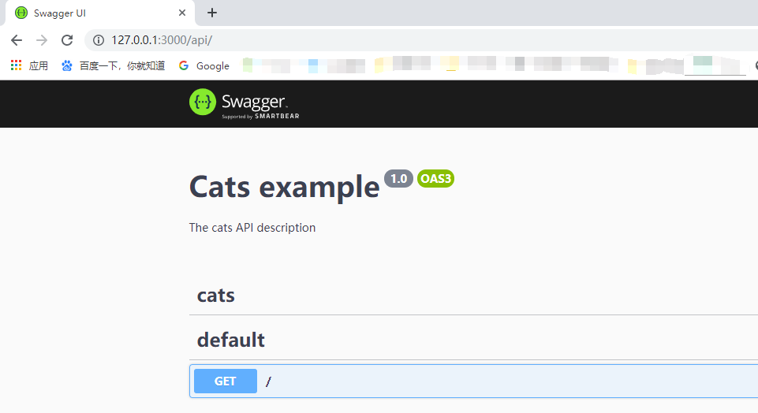
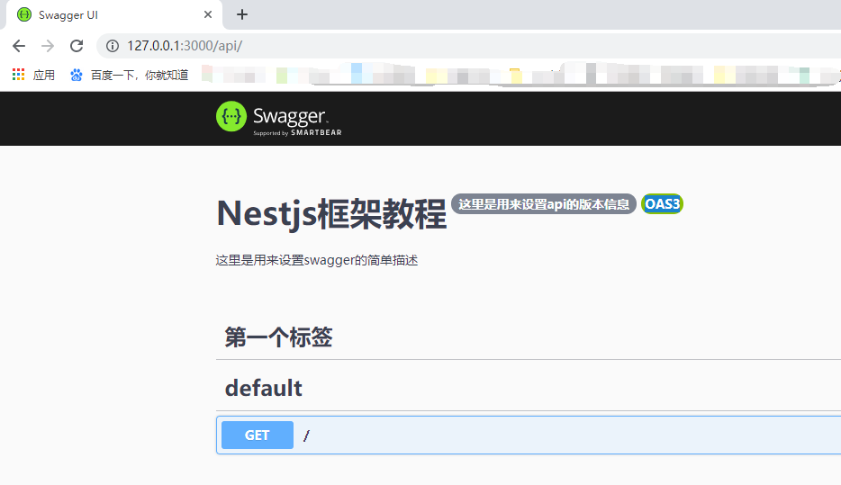
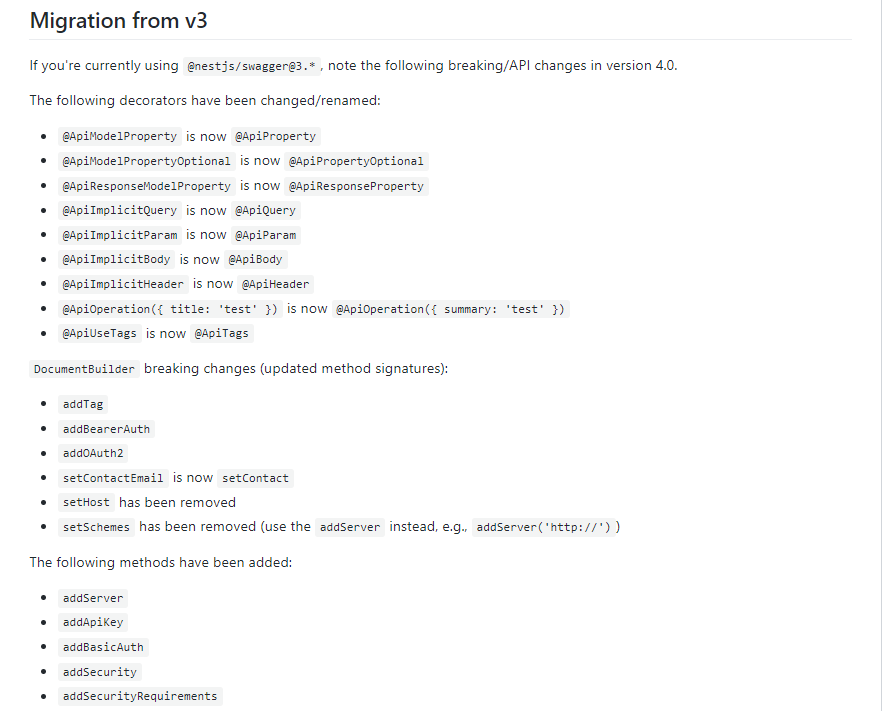

## nestjs整合swagger快速生成api文档

#### swagger介绍

相信无论是前端还是后端开发，都或多或少地被接口文档折磨过。前端经常抱怨后端给的接口文档与实际情况不一致。后端又觉得编写及维护接口文档会耗费不少精力，经常来不及更新。其实无论是前端调用后端，还是后端调用后端，都期望有一个好的接口文档。但是这个接口文档对于程序员来说，就跟注释一样，经常会抱怨别人写的代码没有写注释，然而自己写起代码起来，最讨厌的，也是写注释。所以仅仅只通过强制来规范大家是不够的，随着时间推移，版本迭代，接口文档往往很容易就跟不上代码了。


发现了痛点就要去找解决方案。解决方案用的人多了，就成了标准的规范，这就是Swagger的由来。通过这套规范，你只需要按照它的规范去定义接口及接口相关的信息。再通过Swagger衍生出来的一系列项目和工具，就可以做到生成各种格式的接口文档，生成多种语言的客户端和服务端的代码，以及在线接口调试页面等等。这样，如果按照新的开发模式，在开发新版本或者迭代版本的时候，只需要更新Swagger描述文件，就可以自动生成接口文档和客户端服务端代码，做到调用端代码、服务端代码以及接口文档的一致性。

但即便如此，对于许多开发来说，编写这个yml或json格式的描述文件，本身也是有一定负担的工作，特别是在后面持续迭代开发的时候，往往会忽略更新这个描述文件，直接更改代码。久而久之，这个描述文件也和实际项目渐行渐远，基于该描述文件生成的接口文档也失去了参考意义。所以作为Java届服务端的大一统框架Spring，迅速将Swagger规范纳入自身的标准，建立了Spring-swagger项目，后面改成了现在的Springfox。通过在项目中引入Springfox，可以扫描相关的代码，生成该描述文件，进而生成与代码一致的接口文档和客户端代码。这种通过代码生成接口文档的形式，在后面需求持续迭代的项目中，显得尤为重要和高效。

[nestjs/swagger官方地址](https://docs.nestjs.com/recipes/swagger)

#### 框架集成

如果你学习过express框架，现在正在学习nestjs框架，可以很明确的告诉你，nestjs框架支持express拓展，也就是说已有express框架经验的开发者，在上手、利用nestjs框架进行开发时将如鱼得水。这里提到express的主要原因是，swagger可以很好的集成到express框架或者nestjs框架中，当然对于利用Spring Boot、Spring Cloud等Spring全家桶来说，swagger也有很好的集成。这里就介绍express框架和nestjs框架关于swagger的集成适用。

#### express集成swagger

需要下载ui文件，进行静态文件渲染，可参考：https://www.bbsmax.com/A/mo5kyrrKzw/

#### nestjs集成swagger

[Demo实例](nest-swagger-demo)

- 安装

```bash
## 安装@nestjs/swagger ，推荐cnpm安装
npm i --save @nestjs/swagger
```

- 适用swagger

```typescript
import { NestFactory } from '@nestjs/core';
import { SwaggerModule, DocumentBuilder } from '@nestjs/swagger';
import { ApplicationModule } from './app.module';

async function bootstrap() {
  const app = await NestFactory.create(ApplicationModule);

  // swagger参数配置
  const options = new DocumentBuilder()
    .setTitle('Cats example')
    .setDescription('The cats API description')
    .setVersion('1.0')
    .addTag('cats')
    .build();
  // 启动文档
  const document = SwaggerModule.createDocument(app, options);
  // 设置访问路由，这里是 项目主页/api
  SwaggerModule.setup('api', app, document);
  // 项目端口监听
  await app.listen(3001);
}
bootstrap();

```

- 集成过程

1.创建`nest-swagger-demo`项目

```bash
## 创建
nest new nest-swagger-demo
## 切换进行项目主目录
cd nest-swagger-demo
## 用vs-code打开项目命令
code .
```



选择npm的方式创建，之前[文章](nestjs项目创建初始化入门.md)有详细说明

2.下载并配置swagger




3.运行

前面有介绍到nestjs的各种环境启动模式，目前用dev启动

```bash
npm run start:dev
```

若出现



则说明缺少`swagger-ui-express`模块，该模块主要是用来可视化显示swagger的ui界面

```bash
## 安装，--save 模块记录到package.json中
npm install swagger-ui-express --save
## 可用ctrl+c停止当前项目运行
```

安装模块成功后，重新启动项目，如下便是项目启动成功



4.访问swagger可视化页面

在上面的options定义的时候，设置了swagger的启动路由为`/api`,且默认项目启动端口为3000，因此，可以通过访问http://127.0.0.1:3000/api来访问swagger界面 



5.swagger配置说明

```javascript
  // swagger参数配置
  const options = new DocumentBuilder()
    .setTitle('Cats example')
    .setDescription('The cats API description')
    .setVersion('1.0')
    .addTag('cats')
    .build();
  // 启动文档
  const document = SwaggerModule.createDocument(app, options);
  // 设置访问路由，这里是 项目主页/api
  SwaggerModule.setup('api', app, document);
```

- setTitle  设置标题
- setDescription 设置api文档描述
- setVersion  设置api的版本号
- addTag  设置标签

```javascript
// swagger参数配置
const options = new DocumentBuilder()
.setTitle('Nestjs框架教程')
.setDescription('这里是用来设置swagger的简单描述')
.setVersion('这里是用来设置api的版本信息')
.addTag('第一个标签')
.build();
// 启动文档
const document = SwaggerModule.createDocument(app, options);
// 设置访问路由，这里是 项目主页/api
SwaggerModule.setup('api', app, document);
```



#### 多个swagger文档

有时候我们需要分为前台接口和后台接口的情况下，我们可以编写多个文档，修改，把上面的文档拆分成两个文档

```javascript
import { NestFactory } from '@nestjs/core';
import { DocumentBuilder, SwaggerModule } from '@nestjs/swagger';
import { AppModule } from './app.module';
import { UserModule } from './user/user.module';
 
async function bootstrap() {
  const app = await NestFactory.create(AppModule);
  const options = new DocumentBuilder()
    .setTitle('用户信息文档')
    .setDescription('用于用户信息的增删改查')
    .setVersion('1.0')
    .addTag('用户,安全')
    .build();
 
  const userDocument = SwaggerModule.createDocument(app, options, {
    include: [UserModule], // 包含的模块
  });
  SwaggerModule.setup('api/user', app, userDocument);
    
// 全部文档，若没有include则默认全部
  const secondOptions = new DocumentBuilder()
    .setTitle('整体文档')
    .setDescription('包含了测试文档和前台应用文档')
    .setVersion('1.0')
    .addTag('用户,安全')
    .build();
 
  const appDocument = SwaggerModule.createDocument(app, secondOptions, {
    include: [AppModule, UserModule],
  });
  SwaggerModule.setup('api', app, appDocument);

// 启动项目，监听端口
  await app.listen(3000);
}
bootstrap();
```

#### swagger新特性

[github地址](https://github.com/nestjs/swagger)  

[官方api说明]()

