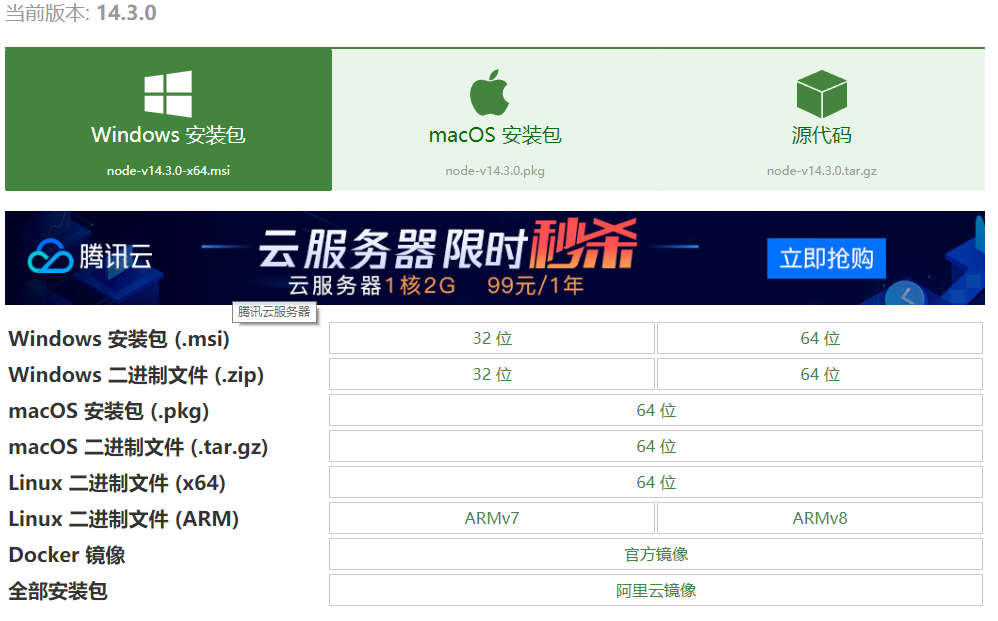
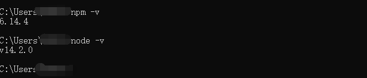
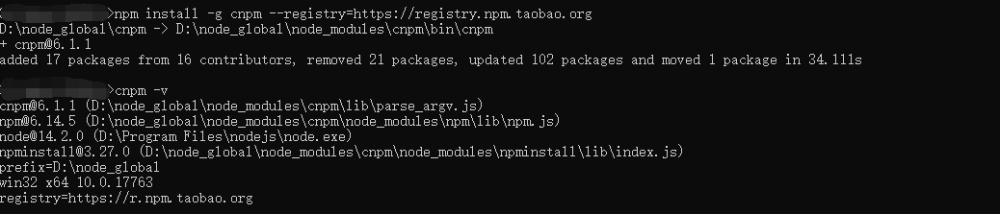
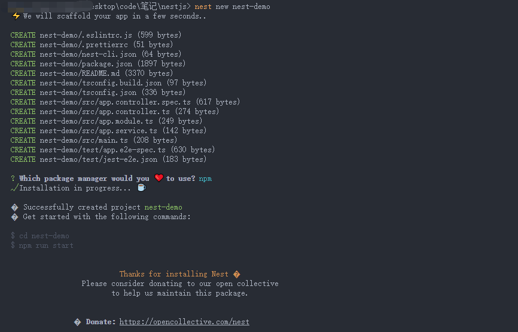
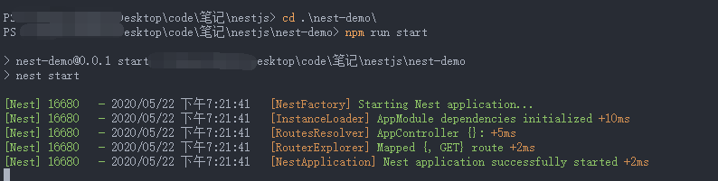
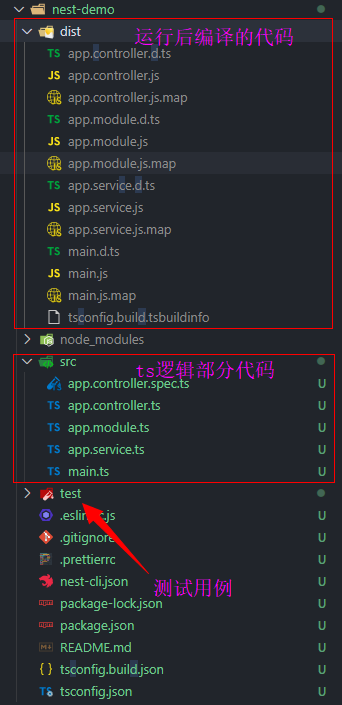
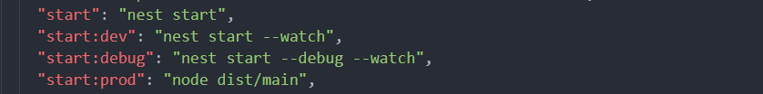

## nestjs项目创建初始化入门

#### 开发要求

- 开发工具
  - nodejs 
  - npm或者yarn
- 开发平台
  - vs code 

#### 环境搭建

- nodejs的安装

首先，访问[nodejs下载页面](http://nodejs.cn/download/)进行nodejs安装包下载,目前最新版到v14.3.0



下载完成后，点击安装包直接`next`进行安装，如果你有洁癖，对软件的安装路径有要求，不希望安装在系统盘，可以自行修改软件安装路径；

- node环境监测

安装完成后，可以在cmd界面，通过执行查看是否安装成功；**注意：一般安装nodejs的时候，会一起安装npm，无需独立安装npm不同版本；也无需配置环境变量；**

```bash
## 检查npm版本
npm -v
## 检查当前nodejs的版本
node -v
```



- 配置cnpm加速

众所周知，nodejs的官方镜像源在国外，国内由于不可抗因素，在访问npm官方源的时候出现网络缓慢、延迟甚至下载失败的情况，因此需要更换为国内镜像，目前比较流行的是淘宝的cnpm源，基本是跟国外的npm源保持同步，能够有效的提高npm包下载速度；

```bash
## 安装cnpm淘宝源
npm install -g cnpm --registry=https://registry.npm.taobao.org
## 检查cnpm是否安装成功
cnpm -v
```



- vs code安装

直接[官网](https://code.visualstudio.com/Download)下载安装，注意可以自定义安装目录；

#### 项目创建

使用 Nest CLI 建立新项目非常简单。 只要确保你已经安装了 npm，然后在你的 OS 终端中使用以下命令：

- npm方式

```bash
## 全局安装nestjs/cli
$ npm i -g @nestjs/cli
## 创建项目，名为nest-demo
$ nest new nest-demo
```

- yarn方式

```bash
## 全局安装nestjs/cli
$ yarn global add @nestjs/cli
## 创建项目，名为nest-demo
$ yarn new nest-demo
```



如上，表示项目创建成功，并且是适用npm的方式进行的项目创建，按照提示，切换目录进行到`nest-demo`的主目录下，进行程序运行



#### 目录介绍

进入创建好的`nest-demo`项目中，基础目录如下：

```bash
nest-demo
├── README.md
├── nest-cli.json
├── node_modules/
├── nodemon-debug.json
├── nodemon.json
├── package-lock.json
├── package.json
├── src
│   ├── app.controller.spec.ts
│   ├── app.controller.ts
│   ├── app.module.ts
│   ├── app.service.ts
│   └── main.ts
├── test
│   ├── app.e2e-spec.ts
│   └── jest-e2e.json
├── tsconfig.build.json
├── tsconfig.json
├── tsconfig.spec.json
└── tslint.jso
```




看到目录，如果你熟悉angular，一定会觉得相似，基本也是基于MVC的模块设计。主要有

- controller :控制器
- service：服务层
- module：模型

其中`main.ts`中可以定义服务启动端口，中间件，全局管道等设置，相信在后续的学习中，你会对此更加了解；

```bash
import { NestFactory } from '@nestjs/core';
import { AppModule } from './app.module';

async function bootstrap() {
  const app = await NestFactory.create(AppModule);
  ## 启动端口为3000
  await app.listen(3000);
}
## 执行启动函数
bootstrap();
```

#### 启动介绍



在项目的package.json文件中，项目初始化的时候，定义了四种项目启动脚本，来适配开发中遇到的各种环境；

```bash
## 正式环境下运行，项目上线时适用【线上稳定】
npm run start
## 开发环境下运行，项目开发时适用
npm run start:dev
## debug环境下运行，项目debug查找问题时适用
npm run start:debug
## 生产环境下运行，项目投入生产，准备上线时适用
npm run start:prod
```

#### Demo原代码

[nest-demo](nest-demo)