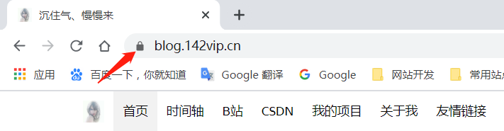

### 什么是SSL证书？

>本文已被收录在
>
>- 个人博客：[https://blog.142vip.cn/2018/04/nginx%E4%B8%8Bssl%E7%9A%84%E9%85%8D%E7%BD%AE](https://blog.142vip.cn/2018/04/nginx下ssl的配置)
>- 
>
>

> SSL证书是[数字证书](https://baike.baidu.com/item/数字证书/326874)的一种，类似于驾驶证、护照和营业执照的电子副本。因为配置在服务器上，也称为SSL服务器证书。
>
> SSL 证书就是遵守 SSL协议，由受信任的数字证书颁发机构CA，在验证服务器身份后颁发，具有服务器身份验证和数据传输加密功能。
>
> SSL证书通过在客户端浏览器和[Web服务器](https://baike.baidu.com/item/Web服务器)之间建立一条SSL安全通道（Secure socket layer(SSL)安全协议是由Netscape Communication公司设计开发。该安全协议主要用来提供对用户和服务器的认证；对传送的数据进行加密和隐藏；确保数据在传送中不被改变，即数据的完整性，现已成为该领域中全球化的标准。由于SSL技术已建立到所有主要的浏览器和[WEB服务器](https://baike.baidu.com/item/WEB服务器)程序中，因此，仅需安装[服务器证书](https://baike.baidu.com/item/服务器证书/808219)就可以[激活](https://baike.baidu.com/item/激活/310525)该功能了），即通过它可以激活SSL协议，实现数据信息在客户端和服务器之间的加密传输，可以防止数据信息的泄露，保证了双方传递信息的安全性，而且用户可以通过服务器证书验证他所访问的网站是否是真实可靠。数字签名又名数字标识、签章 (即 Digital Certificate，Digital ID )，提供了一种在网上进行身份验证的方法，是用来标志和证明网络通信双方身份的数字信息文件，概念类似日常生活中的司机驾照或身份证。 数字签名主要用于发送安全电子邮件、访问安全站点、网上招标与投标、网上签约、网上订购、网上公文安全传送、网上办公、网上缴费、网上缴税以及网上购物等安全的网上电子交易活动。(摘自--百度百科)

说到底，SSL证书就是网络安全证书，就好像你拿着你的身份证去证明，你就是你一样；同样，在互联网的世界里，当进行网络的请求时，也需要安全的通信方式，当然这里只是类比，通信方式待深究。SSL能够帮助进行浏览器与Web客户端之间的“认证”，当你配置完SSL证书后，就是这样的效果：



出现锁则表示该站点是支持https访问，同理也就说明该站点已经安装好SSL证书了。

### SSL证书配置

目前很多云服务器厂商都有支持免费的域名证书，像阿里云、七牛云这两个笔者都有使用过，而且主流的都是CA证书，申请下来流程简单，可以很快的拿到pem、key文件；

### 配置详步骤

- 创建证书存放目录

```bash
## 创建cert目录
mkdir cert
## 在cert目录下存放对应的pem、key加密文件
```

- 修改nginx.conf配置

```bash
server {
    listen 443;
    server_name 142vip.cn; // 你的域名
    ssl on;
    ##  改成你的证书的名字
    ssl_certificate  cert/214292799730473.pem;
    ## 你的证书的名字
    ssl_certificate_key cert/214292799730473.key; 
    ssl_session_timeout 5m;
    ssl_ciphers ECDHE-RSA-AES128-GCM-SHA256:ECDHE:ECDH:AES:HIGH:!NULL:!aNULL:!MD5:!ADH:!RC4;
    ssl_protocols TLSv1 TLSv1.1 TLSv1.2;
    ssl_prefer_server_ciphers on;
    location / {
    	root html;
        index index.html index.htm;
    }
}
server {
    listen 80;
    ## 监控的域名，对应着证书的域名
    server_name 142vip.cn;
    ## 把http的域名请求转成https
    rewrite ^(.*)$ https://$host$1 permanent; 
}
## 注意，若在启动时提醒ssl on过期，则说明在新的nginx版本中，不支持ssl on，需要将ssl on删除，同时将listen 443 修改为 listen 443 ssl;
```

配置完成后，检查一下nginx配置文件是否可用，有successful表示可用。

```bash
# 检查nginx配置文件的健康状况
nginx -t 
```

配置正确后，重新加载配置文件使配置生效：

```bash
## 重新加载配置，生效
nginx -s reload 
```

至此，nginx的https访问就完成了，并且通过rewrite方式把所有http请求也转成了https请求，更加安全。

如需重启nginx，用以下命令：

```bash
## 停止
service nginx stop
## 启动
service nginx start 
## 重启
service nginx restart
## 对应的docker操作
docker stop nginx容器名

docker start nginx容器名

docker restart nginx容器名
```

**注意配置将http请求转化为https请求；**

至此，nginx配置ssl的基本conf文件修改已经完成了，相比能够实现基础的ssl证书配置，后面将会结合nginx和个人网站总结一篇较为详细的线上站点SSL证书从申请到配置完成、落地实现的过程....后面见


