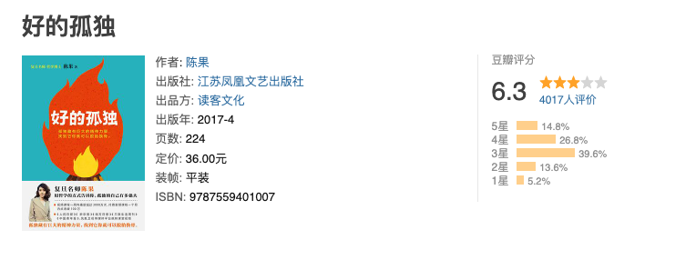

# 好的孤独

每个人都有孤独的时候，但孤独并不一定不好，有些人喜欢热闹，有些人喜欢清静。
人往往在繁忙的工作生活中忘记了思考这三个问题：
`我是谁？`、`我从哪里来？`、`我要到那里去？`

这本书给了我一些启示。

《好的孤独》是作者陈果所写的一本关于孤独和独处的书籍。书中通过个人经历和观察，探讨了孤独对个人成长、内心探索和心灵平静的重要性，以及如何拥抱和赋予孤独以正面意义

## 喜欢的话

- 孤独不一定那么不堪忍受，或许只有它能让我们学会如何与自己好好相处；
  死亡不一定如我们想象的那么阴森恐怖，或许它只是人辛劳一生后进入某个温柔的无梦之眠；
  人生的苦难不一定那么面目可憎，或许它富有某种异乎寻常的营养，使我们经历过后活得更强大……

- 事实上，只有无法接受真实自我的人，才会用虚构的美丽自己骗自己，那是一种直面真相的瘫软无力。如果一个人无可避免地生而有弱点，那么不能接受自己有弱点，恐怕才是他最无可救药的“弱点”。

- 我们大可以活成我们自己，活得更本色一点、更真实一些，这才是对自己的真诚与善待。
- 我们能欺骗的往往是信任我们的人，而信任我们的人最不能承受的就是我们欺骗他们。
- 生活的“重负”，若细细回味，其中也一定饱含“恩赐”。
- 殊不知，生活之为生活，苦与乐皆是她的真味，谁要是拒绝接受生活之苦，注定也会被剥夺生活之乐；两者之间往往不存在取舍，要么全要，要么一样也没有。
- “孤独”是由自我思想的丰富性而带来的对独处的近乎贪婪的偏好与享受，那是一种对自我充实饱满的精神生活的不紧不慢的消化、悠然自得的回味，娴静而从容。
- 母亲曾对我说“人总是对最亲密的人最残忍”，恐怕就是因为当我们距离太近了，对方身上的缺点就被放大了，那些远观时曾引起我们赞叹不已的优点却成了近看时的盲点，人们就此遗忘了尊重与爱，于是不再包容、不再心存感恩。
- 实际上，人格魅力，根本在人格–一个人的人格有多高，决定了其魅力有多大。
- “功利之盛”能压倒人，“修养之美”能愉悦人，“灵魂之高贵”能拯救人。“内功”是“成功”的精髓，唯有它能使人发现并创造幸福。我相信，真正的“成功”必然内含着“幸福”，而人生最高的“成功”莫过于“内心的幸福”！
- 木心先生所说的“不知原谅了什么，诚觉世事皆可原谅。”
- “知我所能，我所能者，尽善尽美”；“知我所不能，我所不能者，虚怀若谷”。
- 那些在我们失意之时闻风而散的往往正是原本蜂拥而至的人。而恰恰是那些责备我们轻率、批评我们自以为是，让我们懊恼不已、败兴而归的人，在此时会源源不断地提供最强大的精神支持。
- 道德不道德，其得失全在于一个人独处之时的“扪心自问”。问一问我们的这颗心：我这么做，“安”乎？“心安则为之。”
- 道德发乎天性，落于心安，类似于“本能”，不是一个人再三权衡后去“行善”，而是心有不忍，于是身体力行。
- 其实，道德不道德，其得失全在于一个人独处之时的“扪心自问”——问一问我们的这颗心：我这么做，“安”乎？——“心安则为之”。
- 所谓的“自由”“并不意味着能做自己想做的”，而是意味着“能拒绝自己不想做的”
- 幸福不在于得到多少，而在于计较多少，计较得越少越幸福。
- 也就是说用哲学思考使自己在向死之境中不断提升精神境界，从而超越死亡。这种超越不是让我们可以不死，而是让我们可以平静而坦然地面对死亡，然后自由而欢乐地迎向生活。
- 我们知道的东西越多，就会发现有更多东西是我们所不知道的。我们不知道的远比我们知道的要多得多。
- 我们很多人都渴望自己能够聪明智慧，或是能上通天文、下晓地理、博闻广识，或是能在某一个领域内、某一个问题上具有超乎寻常的洞见、胜人一筹的悟性。
- 错并不会因为我们如何解释而变成对的。对别人造成的烦恼和伤害，也并不因为我们给出了一个合理解释而一笔勾销。
- 干扰我们的，不是事物本身，而是我们对事物的看法， 看不见的不一定就不存在

- 一沙一世界，一花一天堂；双手握无限，刹那是永恒。

-

人们经常是不讲道理的、没有逻辑的和以自我为中心的，不管怎样，你要原谅他们。即使你是友善的，人们可能还是会说你自私和动机不良，不管怎样，你还是要友善。当你功成名就，你会有一些虚假的朋友，和一些真实的敌人，不管怎样，你还是要取得成功。即使你是诚实的和率直的，人们可能还是会欺骗你，不管怎样，你还是要诚实和率直。你多年来营造的东西，有人在一夜之间把它摧毁，不管怎样，你还是要去营造。如果你找到了平静和幸福，他们可能会嫉妒你，不管怎样，你还是要快乐。你今天做的善事，人们往往明天就会忘记，不管怎样，你还是要做善事。即使把你最好的东西给了这个世界，也许这些东西永远都不够，不管怎样，把你最好的东西给这个世界。你看，说到底，它是你和上帝之间的事，而绝不是你和他人之间的事。

## 一些思考

我开始重新思考孤独的概念。以前我常常将`孤独`与`寂寞`混淆，但现在我明白了：**`孤独`可以是一种积极的选择，是为自己创造的宝贵时刻。
**

每天可以给自己留出一段时间，与自己独处，思考生活、目标，倾听内心的声音。

书中提到的社交压力和互联网的影响让我深思。不要太在意别人的认可，更多更多地回归内心，培养自己的独立思考和自我价值感。

**生命是用来体验的，而人生是一场旅行。放轻松，关关难过关关过**

## 参考资料

- <https://book.douban.com/subject/27028523/>
