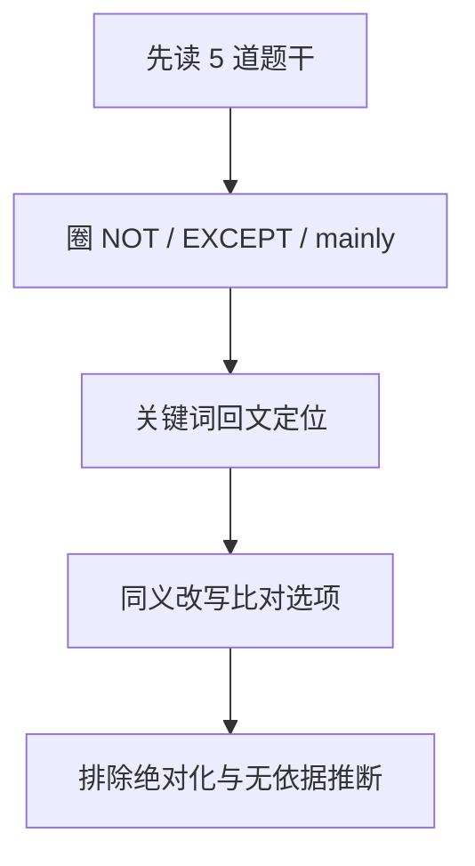

# 专业英语应试

上午卷末为 **技术英语阅读**（题量以当年试卷为准）。本篇合并 **阅读步骤 + 题干句式 + 分主题词表 + 构词法**，目标是用有限时间拿到稳定分，并与 [考试技巧与复习路线](/ruan-kao/soft-design/topics/exam-skills.html) 中的上午节奏一致：**先题干、再定位、不全文翻译**。

---

## 一、阅读步骤（考场版）

1. **读题干**：圈 `NOT`、`EXCEPT`、`mainly`、`best` 等，分清要找「正确」还是「错误」、主旨还是细节。
2. **不逐句翻译**：用题干关键词 **回文定位**（专有名词、数字、引号内术语、首字母大写产品名）。
3. **同义改写**：正确项常为 **paraphrase**；原句照搬要警惕陷阱。
4. **排极端**：绝对化、文中无依据的推断优先排除。

---

## 二、题干与选项常用句式

| 英文 | 含义 |
|------|------|
| According to the passage / paragraph … | 据文章/某段 |
| It can be inferred / concluded that … | 可推断/得出结论 |
| The word “…” is closest in meaning to … | 词义猜测 |
| Which of the following is **NOT** true? | 选 **错误** 项 |
| The main idea / primary purpose … | 主旨/写作目的 |
| The author mentions … in order to … | 举例目的 |
| is essential / critical / crucial for … | 对…必不可少 |
| is prone to / vulnerable to … | 易于遭受… |
| mitigates / alleviates … | 减轻、缓解 |
| imposes overhead / incurs latency | 额外开销/延迟 |

---

## 三、软件开发与工程（超高频）

| English | 中文 |
|-----------|------|
| requirements specification | 需求规格说明 |
| feasibility study | 可行性研究 |
| traceability | 可追溯性 |
| baseline | 基线 |
| work breakdown structure (WBS) | 工作分解结构 |
| regression testing | 回归测试 |
| integration testing | 集成测试 |
| acceptance testing | 验收测试 |
| stub / driver | 桩模块/驱动模块 |
| coupling / cohesion | 耦合/内聚 |
| maintainability / portability | 可维护性/可移植性 |
| technical debt | 技术债 |
| agile / Scrum / sprint / backlog | 敏捷/Scrum/迭代/待办 |
| continuous integration / deployment (CI/CD) | 持续集成/部署 |
| refactoring | 重构 |
| anti-pattern | 反模式 |

---

## 四、面向对象与 UML

| English | 中文 |
|-----------|------|
| encapsulation / inheritance / polymorphism | 封装/继承/多态 |
| association / aggregation / composition | 关联/聚合/组合 |
| generalization / realization | 泛化/实现 |
| dependency | 依赖 |
| lifeline / activation | 生命线/激活条 |
| synchronous / asynchronous message | 同步/异步消息 |
| state transition / guard condition | 状态迁移/守卫条件 |
| design pattern | 设计模式 |
| creational / structural / behavioral | 创建型/结构型/行为型 |
| singleton / factory method / abstract factory | 单例/工厂方法/抽象工厂 |
| adapter / decorator / facade / proxy | 适配器/装饰/外观/代理 |
| observer / strategy / template method | 观察者/策略/模板方法 |

---

## 五、数据结构与算法

| English | 中文 |
|-----------|------|
| time complexity / space complexity | 时间/空间复杂度 |
| asymptotic notation (Big-O) | 渐近记号 |
| stack / queue / deque | 栈/队列/双端队列 |
| linked list / doubly linked | 链表/双向链表 |
| binary tree / balanced tree | 二叉树/平衡树 |
| traversal (preorder, inorder, postorder) | 遍历（前/中/后序） |
| hash table / collision / load factor | 哈希表/冲突/装填因子 |
| directed acyclic graph (DAG) | 有向无环图 |
| shortest path / minimum spanning tree | 最短路径/最小生成树 |
| topological sort | 拓扑排序 |
| divide and conquer / dynamic programming / greedy | 分治/动态规划/贪心 |
| memoization | 记忆化 |
| backtracking | 回溯 |
| stable sort | 稳定排序 |

---

## 六、数据库与事务

| English | 中文 |
|-----------|------|
| schema / instance | 模式/实例 |
| candidate key / primary key / foreign key | 候选码/主码/外码 |
| functional dependency / normalization | 函数依赖/规范化 |
| transaction / ACID properties | 事务/ACID |
| concurrency control / isolation level | 并发控制/隔离级别 |
| deadlock / livelock / starvation | 死锁/活锁/饥饿 |
| two-phase locking (2PL) | 两段锁 |
| query optimization / index / clustered | 查询优化/索引/聚簇 |
| redundancy / anomaly (insertion, deletion, update) | 冗余/插入删除更新异常 |

---

## 七、操作系统与体系结构

| English | 中文 |
|-----------|------|
| process / thread / context switch | 进程/线程/上下文切换 |
| scheduling / preemptive / non-preemptive | 调度/抢占/非抢占 |
| semaphore / mutex / critical section | 信号量/互斥量/临界区 |
| paging / page fault / thrashing | 分页/缺页/抖动 |
| virtual memory / working set | 虚拟内存/工作集 |
| file system / inode / directory | 文件系统/inode/目录 |
| throughput / latency | 吞吐量/延迟 |
| pipeline hazard (data, structural, control) | 流水线冒险 |
| cache hit ratio | Cache 命中率 |

---

## 八、网络与安全

| English | 中文 |
|-----------|------|
| packet switching / circuit switching | 分组交换/电路交换 |
| latency / bandwidth / jitter | 时延/带宽/抖动 |
| routing / forwarding | 路由选择/转发 |
| subnet mask / CIDR / NAT | 子网掩码/CIDR/NAT |
| three-way handshake / congestion control | 三次握手/拥塞控制 |
| denial-of-service (DoS) / firewall / IDS | 拒绝服务/防火墙/入侵检测 |
| encryption / decryption / symmetric / asymmetric | 加/解密/对称/非对称 |
| digital signature / certificate authority (CA) | 数字签名/认证机构 |
| authentication / authorization / integrity | 认证/授权/完整性 |
| phishing / malware / Trojan | 钓鱼/恶意软件/木马 |

---

## 九、构词法速记（猜词）

| 词缀/词根 | 含义 | 例 |
|-----------|------|-----|
| inter- | 相互、之间 | interoperability |
| intra- | 内部 | intranet |
| multi- / poly- | 多 | multiprocessing |
| mono- / uni- | 单 | unicast |
| -ization | …化 | parallelization |
| -able / -ibility | 可… | scalability |
| over- / under- | 过度/不足 | overhead |
| re- | 再 | refactoring |

---

## 十、背诵建议

- **每天约 20 词**：英↔中，以 **三至八节** 为主循环。
- **与上午选择题联动**：同一概念中英文都认识，可用中文知识 **反推** 选项。
- **不背长句**：只背 **动词短语 + 名词短语**（如 `mitigate risk`, `enforce policy`）。

---

## 相关

- [专题速记与拿分要点](/ruan-kao/soft-design/topics/topic-cram.html)
- [考试技巧与复习路线](/ruan-kao/soft-design/topics/exam-skills.html)
- [真题统计与命题套路](/ruan-kao/soft-design/topics/paper-patterns.html)
- [算法应试与范式要点](/ruan-kao/soft-design/topics/pm-algorithm.html)
- [设计模式应试要点](/ruan-kao/soft-design/topics/patterns-exam.html)

## 真题整卷梳理（上 / 下午） {#papers-am-pm}

- [上午综合知识 · 真题应试梳理](/ruan-kao/soft-design/topics/morning-papers-guide.html)
- [下午案例分析 · 真题应试梳理](/ruan-kao/soft-design/topics/afternoon-papers-guide.html)
