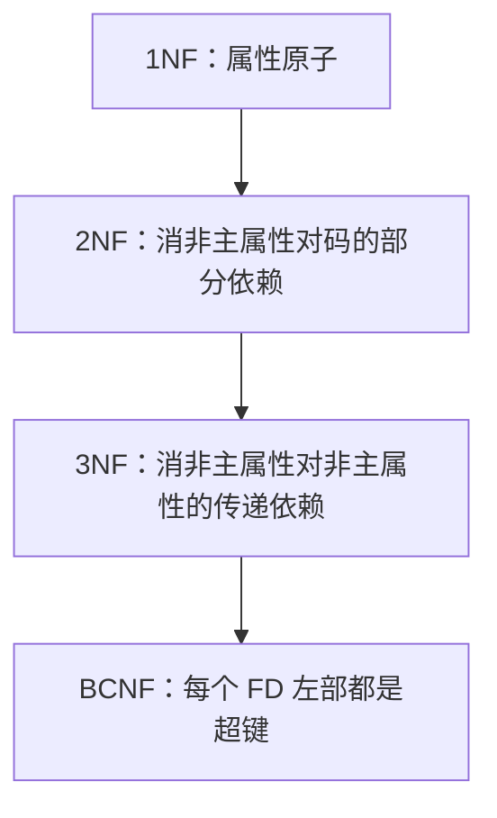

# 数据库系统

> **快拿分**：范式判定（1NF～BCNF）、事务并发异常与隔离、封锁/XS 与两段锁、关系代数与 SQL 语义、E-R 转关系——**上午下午双线高频**，术语写全可抢步骤分。

### 范式阶梯（从「破坏什么」记）

### 并发异常一眼表

| 现象 | 典型成因 | 与隔离级别关系（概念） |
|------|-----------|------------------------|
| 脏读 | 读到未提交数据 | 读已提交以上可避免 |
| 不可重复读 | 两次读之间被他人更新 | 可重复读以上可避免 |
| 幻读 | 两次读之间被他人插入/删除行 | 串行化 / 部分实现用间隙锁 |

## 一、知识与应试（考点·难点·知识点合一）

### 1.1 模型与三级模式

- **三级模式两级映像**：外模式-模式-内模式；**逻辑/物理独立性**由哪级映像保证。
- **完整性**：实体、参照、用户定义；主码/外码约束。

### 1.1.1 三级模式与设计阶段

| 层次 / 阶段 | 产物 | 拿分关键词 |
|-------------|------|------------|
| 需求分析 | 数据流图、数据字典、需求说明书 | 确定系统边界与用户需求 |
| 概念结构设计 | E-R 图 | 按用户观点建模，独立于具体 DBMS |
| 逻辑结构设计 | 关系模式、规范化 | 将 E-R 图转换为关系模式 |
| 物理结构设计 | 存储结构、索引、存取路径 | 面向具体 DBMS 与性能 |
| 实施 | 建库、装载数据、编写应用 | 从设计落地 |
| 运行维护 | 监控、备份、调优、变更 | 保证系统长期可用 |

**三级模式**：外模式面向用户视图，模式是数据库全局逻辑结构，内模式描述物理存储。外模式/模式映像保证逻辑独立性，模式/内模式映像保证物理独立性。

### 1.2 关系代数与 SQL

- **选择 \(\sigma\)** 行、**投影 \(\pi\)** 列；自然连接去重复列；**除法**表达「全部」类查询。
- **SQL**：`WHERE` 在分组前，`HAVING` 在分组后；`COUNT(*)` 与 `COUNT(col)` 对 NULL 区别。
- **〔真题〕**：`GROUP BY` 列与 `SELECT` 非聚合列一致性。

### 1.3 范式与分解

- **1NF** 原子性；**2NF** 消除非主属性对码的**部分依赖**；**3NF** 消除**传递依赖**；**BCNF** 左部含超键。
- **〔难点〕**：无损分解检验、BCNF 分解可能**丢失依赖**——按题意选「保持依赖」或「到 BCNF」。
- **〔易错〕**：候选码求法：从不出现在 FD **右部**的属性入手尝试闭包。

### 1.3.1 范式判定一眼表

| 范式 | 通过条件 | 常见题干信号 |
|------|----------|--------------|
| 1NF | 每个属性不可再分 | 表中出现“多个电话/多值属性”通常违反 |
| 2NF | 在 1NF 基础上，非主属性完全依赖候选码 | 联合主键的一部分能推出非主属性 |
| 3NF | 在 2NF 基础上，非主属性不传递依赖候选码 | `主键 -> A -> B`，且 B 是非主属性 |
| BCNF | 每个非平凡函数依赖的决定因素都是超键 | 左部不是候选码/超键 |
| 4NF | 消除非平凡多值依赖 | 多个相互独立的多值事实放在同一关系 |

**全码**：关系模式的所有属性共同构成候选码。遇到“所有属性都是主属性”时，2NF/3NF 的判断要格外小心。

### 1.3.2 弱实体与 E-R 符号

| E-R 元素 | 常见图形 | 关系化要点 |
|----------|----------|------------|
| 实体 | 矩形 | 转换为关系表 |
| 弱实体 | 双矩形 | 主键通常 = 强实体主键 + 部分键 |
| 联系 | 菱形 | `m:n` 转独立联系表 |
| 识别联系 | 双菱形 | 弱实体依赖强实体存在 |
| 属性 | 椭圆 | 转换为表字段 |
| 多值属性 | 双椭圆 | 常单独成表 |
| 派生属性 | 虚线椭圆 | 通常不直接存储 |

### 1.4 事务与并发

- **ACID**；并发问题：丢失更新、脏读、不可重复读、幻读。
- **封锁**：共享 S、排他 X；一级/二级/三级协议与禁止现象对应。
- **两段锁**：加锁段与解锁段，保证可串行化。
- **恢复**：日志 **REDO**（已提交）/ **UNDO**（未提交）。

## 二、速记与背诵

| 范式 | 记法 |
|------|------|
| 1NF | 属性原子，不放重复组 |
| 2NF | 无部分依赖（非主属性完全依赖码） |
| 3NF | 无传递依赖（非主属性不依赖非主属性） |
| BCNF | 每个 FD 左部都是超键 |

- **幻读**：同一查询两次**行数变多**（与不可重复读区分看题干）。

## 三、下午关联

- E-R 转关系、补全主外键、写 `CREATE TABLE` 约束——与 [数据库设计](/ruan-kao/soft-design/applied/db-design.html) 同一套能力。

## 四、考场检查

- 写 FD 闭包、候选码时 **符号与下标** 与题干一致。
- SQL 填空：连接条件漏写会变成笛卡尔积。
