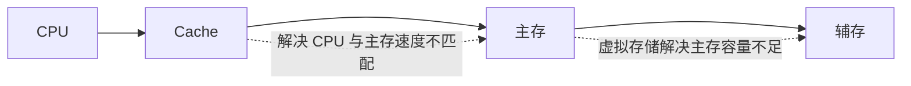

# 计算机组成与体系结构

> **快拿分**：补码范围、寻址方式辨析、RISC/CISC 对比、RAID 特性、流水线三种冒险、中断与 DMA 场景——上午卷 **高频且套路固定**，计算题注意单位换算。

## 一、知识与应试（考点·难点·知识点合一）

### 1.1 数据表示与运算

- **进制**：二/八/十六互化；十六与二进制「一位拆四位」最快。
- **机器码**：原码、反码、补码、移码定义；**补码**加减最常用；溢出：双符号位异或、或进位异或。
  - **〔易错〕**：\(n\) 位**定点整数补码**表示范围 \([-2^{n-1},\,2^{n-1}-1]\)，负端多一个。
- **IEEE754 单精度**：1 符号 + 8 阶（偏置 127）+ 23 尾数；隐含位；阶全 0/全 1 为特殊值。
  - **〔真题〕**：非规格化、Inf、NaN 的阶码与尾数组合判断。

### 1.2 校验

- **奇偶**：只能检奇数位错，不能定位。
- **海明**：关系 \(2^r \ge k+r+1\)（\(k\) 数据位，\(r\) 校验位）；校验位占 \(1,2,4,\dots\) 位。
  - **〔难点〕**：求校验位、指错位序，考场按题给步骤表做，勿跳步。
- **CRC**：生成多项式除法（模 2），余数为 FCS。

### 1.1.1 机器码速查表

| 编码 | 负数处理 | 0 的形式 | 常考点 |
|------|----------|----------|--------|
| 原码 | 最高位为符号位，数值位不变 | `+0`、`-0` 两种 | 原点对称，计算不方便 |
| 反码 | 符号位不变，负数数值位取反 | `+0`、`-0` 两种 | 常作为补码过渡 |
| 补码 | 反码末位加 1 | 只有一个 0 | 计算机加减法主用；负数多表示一个 |
| 移码 | 在补码基础上符号位取反 | 只有一个 0 | 常用于浮点阶码，只表示整数 |

**转换顺序**：真值 → 原码 → 反码 → 补码 → 移码。正数四种编码的数值位通常相同，负数才是考点。

### 1.3 CPU、指令与流水线

- **执行周期**：取指 → 译码 → 取数 → 执行 → 写回（表述因教材略异，选选项时对齐题干）。
- **寻址方式**：立即（最快）、寄存器、直接、寄存器间接、间接、相对、基址、变址——**速度、访存次数、重定位能力**为常考点。
- **RISC vs CISC**：指令条数、寻址方式种类、硬布线/微程序、定长指令、流水线友好度。
- **流水线冒险**：结构（资源冲突）、数据（**RAW** 最常见）、控制（分支）。
  - **〔真题〕**：插入气泡条数、加速比 \(=\) 流水级数理想值受冒险限制。

### 1.3.1 控制器与寄存器：程序员可见/不可见

| 类别 | 典型寄存器 | 记忆方式 |
|------|------------|----------|
| 程序员可见 | 通用寄存器、程序状态字 PSW、程序计数器 PC、累加寄存器 AC | 汇编/程序状态能直接感知 |
| 程序员不可见 | 指令寄存器 IR、数据缓冲寄存器 DR、地址寄存器 AR | CPU 内部执行指令时临时使用 |

控制器不仅负责指令执行流程，还要处理中断、异常等事件；运算器负责算术和逻辑运算。

### 1.3.2 RISC 与 CISC 高频对比

| 维度 | RISC | CISC |
|------|------|------|
| 指令数量 | 少而简单 | 多而复杂 |
| 指令长度 | 多为定长 | 可变长较常见 |
| 寻址方式 | 少 | 多 |
| 控制方式 | 硬布线控制为主 | 微程序控制常见 |
| 流水线 | 更利于流水线 | 实现较复杂 |
| 访存 | Load/Store 结构，算术逻辑多在寄存器间完成 | 指令可直接访存 |

### 1.4 存储体系与 I/O

- **Cache 映射**：直接（易冲突）、全相联（成本高）、**组相联**（折中）；命中率与平均访存时间估算。
- **RAID**：0 无冗余；1 镜像；5 分布式奇偶校验（常考「允许坏几块盘」类概念）。
- **I/O**：程序查询（简单 CPU 占用高）、中断（中低速）、**DMA**（块设备、CPU 初始化后少干预）。
- **Flynn**：SISD、SIMD、MISD、MIMD——记典型实例。
- **可靠性**：串联 \(R=\prod R_i\)；并联 \(R=1-\prod(1-R_i)\)。

### 1.4.1 存储层次与映射

| Cache 映射 | 特点 | 易错点 |
|------------|------|--------|
| 直接映像 | 主存块只能放入 Cache 固定位置 | 冲突率高，但实现简单 |
| 全相联映像 | 主存块可放入任意 Cache 块 | 命中判断成本高 |
| 组相联映像 | 组间直接映像，组内全相联 | 是两者折中，题目常考定义 |

### 1.4.2 I/O 控制方式对比

| 方式 | CPU 参与度 | 适用场景 | 考点 |
|------|------------|----------|------|
| 无条件传送 | 默认外设已就绪 | 简单外设 | 不查询状态 |
| 程序查询 | CPU 反复查询外设状态 | 低速、简单 | CPU 忙等，效率低 |
| 中断 | 外设就绪后通知 CPU | 中低速外设 | CPU 不必一直等待 |
| DMA | CPU 初始化，数据块由 DMA 控制器搬运 | 磁盘、网卡等批量传输 | 数据在内存与 I/O 设备间直接传送 |
| IOP | 专用 I/O 处理机执行 I/O 命令 | 大型系统 | 分担主机 I/O 管理 |

### 1.4.3 RAID 快速判别

| 级别 | 核心 | 冗余 | 速记 |
|------|------|------|------|
| RAID 0 | 条带化 | 无 | 快，但任一盘坏可能丢数据 |
| RAID 1 | 镜像 | 有 | 可靠，成本高 |
| RAID 3 | 位/字节级条带 + 专用校验盘 | 有 | 校验盘可能瓶颈 |
| RAID 5 | 块级条带 + 分布式奇偶校验 | 有 | 常考：可容忍 1 块盘故障 |
| RAID 6 | 双重分布式校验 | 有 | 可容忍 2 块盘故障 |

## 二、速记与背诵

| 主题 | 一句话 |
|------|--------|
| 补码范围 | 负数比正数多一个：\(-2^{n-1}\) |
| 海明码 | 检错纠错看码距：检错码距 2，纠 1 错码距 3 |
| 流水线冒险 | 结数 RAW（数据）、分支控制 |
| RAID0/1/5 | 0 快无冗余，1 镜像贵，5 一块校验盘级容错 |
| DMA | 大批量、减轻 CPU |
| RISC | 少寻址、定长、利于流水 |

## 三、考场检查

- 带宽题：**位宽 × 频率** 是否与题干单位（B/s、b/s）一致。
- 海明码：先算 \(r\) 再画位序，避免少一位。
