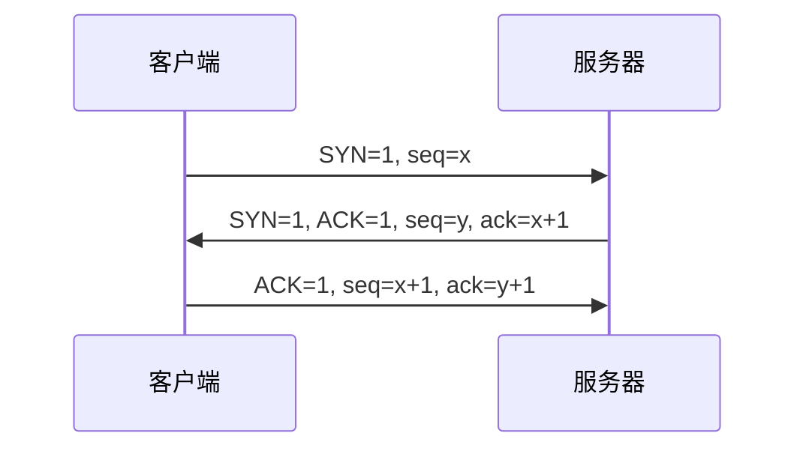

# 计算机网络

> **快拿分**：OSI 与 TCP/IP 层对应、子网划分与路由聚合、常用**端口**、TCP 握手与拥塞阶段、HTTP/HTTPS/DNS 角色——**记表格比啃大段快**。

### OSI ↔ TCP/IP 速记表

| OSI（7 层） | TCP/IP（4 层） | 常考关联 |
|-------------|----------------|----------|
| 应用 / 表示 / 会话 | **应用** | HTTP、DNS、SMTP、FTP 控制 |
| 传输 | **传输** | TCP、UDP；端口号 |
| 网络 | **网际** | IP、ICMP、路由；子网划分 |
| 数据链路 / 物理 | **网络接口** | 帧、MAC；交换机 |

### 设备、协议、地址一眼定位

| 层次 | 设备 / 协议 | 地址或数据单位 | 高频坑 |
|------|-------------|----------------|--------|
| 物理层 | 中继器、集线器 | 比特 | 不识别 MAC/IP |
| 数据链路层 | 网桥、交换机、CSMA/CD、CSMA/CA | 帧、MAC 地址 | 交换机按 MAC 转发 |
| 网络层 | 路由器、IP、ICMP、ARP/RARP | 分组、IP 地址 | ARP：IP → MAC；RARP 反向 |
| 传输层 | TCP、UDP | TCP 字节流；UDP 报文 | TCP 可靠，UDP 开销小 |
| 应用层 | HTTP、DNS、SMTP、NFS、SNMP | 应用报文 | NFS 是网络文件服务，SNMP 是网络管理 |

### TCP 三次握手（考场只记旗标与顺序）

> 挥手四次：多一次「被动关闭方」的 ACK+FIN 组合，选项常考「为何不是三次」。

## 一、知识与应试（考点·难点·知识点合一）

### 1.1 体系结构与物理层

- **OSI 七层**：物数网传会表应；与 TCP/IP 四层对应关系。
- **奈氏 / 香农**：无噪与有噪信道极限（套公式注意 log 底）。
- **编码**：曼彻斯特、差分曼彻斯特——**自含时钟**用于同步。

### 1.2 链路层与局域网

- **停等、GBN、SR**：窗口与信道利用率小题。
- **CSMA/CD**：争用期 \(2\tau\)、最小帧长与链路长度。
- **WLAN**：CSMA/**CA**（冲突避免）。

| 协议 | 场景 | 关键词 |
|------|------|--------|
| CSMA/CD | 传统共享式以太网 | 冲突检测，边发边听 |
| CSMA/CA | 无线局域网 | 冲突避免，难以边发边检测冲突 |
| Token Ring | 令牌环 | 拿到令牌才能发送 |

### 1.3 网络层与传输层

- **IPv4**：首部字段；**子网/CIDR**；私有地址段（A/B/C 三类）。
- **路由**：RIP 距离向量；OSPF 链路状态；BGP 域间路径向量。
- **TCP**：三次握手、四次挥手；可靠序号确认；**拥塞**：慢开始、拥塞避免、快重传、快恢复——**cwnd/ssthresh 曲线题**。
- **UDP**：无连接、首部短、实时场景。

### 1.4 应用层与安全

- **HTTP/1.1** 持久连接；**HTTPS** = HTTP + TLS。
- **DNS**：递归与迭代解析。
- **FTP**：控制 21、数据 20；**SMTP/POP3/IMAP** 角色。
- **防火墙 / VPN / IDS**：概念辨析题常见。

## 二、速记与背诵

| 端口 | 协议 |
|------|------|
| 20 | FTP 数据 |
| 21 | FTP 控制 |
| 23 | Telnet |
| 25 | SMTP |
| 53 | DNS |
| 67/68 | DHCP |
| 69 | TFTP |
| 80 | HTTP |
| 110 | POP3 |
| 161 | SNMP |
| 443 | HTTPS |

| 命令 | 用途 |
|------|------|
| `ipconfig` | 查看本机 TCP/IP 配置 |
| `ping` | 测试连通性 |
| `tracert` | 跟踪到目标主机的路径 |
| `nslookup` | 查询 DNS 解析 |
| `netstat` | 查看网络连接、端口等状态 |
| `route` | 查看/配置路由表 |

- **私网**：10/8，172.16–31/12，192.168/16。

## 三、考场检查

- 子网题：先算主机位数，再核对 **网络地址与广播地址** 是否落在选项。
- TCP 题：看清问的是**发送窗口**还是**拥塞窗口**。
