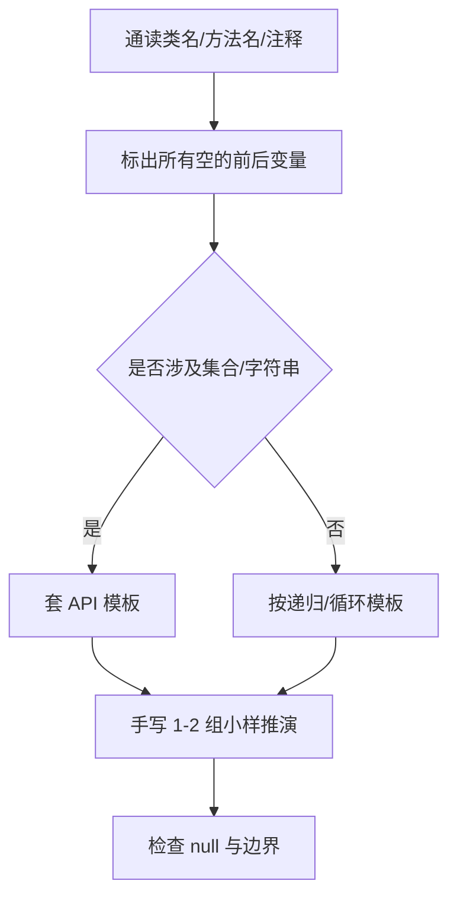

# Java程序填空（下午选填）

> **重要**：下午「程序填空」在历年试卷中曾出现 **C 或 Java** 两种载体，**是否二选一、是否必做**以**当年题本说明与答题卡要求**为准。本篇按你当前复习目标 **专攻 Java**，与 [算法设计填空](/ruan-kao/soft-design/applied/algo-fill.html)、[真题统计与命题套路](/ruan-kao/soft-design/topics/paper-patterns.html)（算法/程序矩阵）对照使用。

## 一、Java 卷与 C 卷的差异（决定填空写法）

| 维度 | Java 常见考法 | 复习注意 |
|------|---------------|----------|
| 内存与指针 | 无显式指针，用 **引用**、`null` 判断 | `if (node == null)` 先于访问成员 |
| 字符串 | `String` 不可变；拼接多用 **`StringBuilder`** | 循环里少用 `+` 拼大字符串 |
| 集合 | **`List` / `Map` / `Set`** + `ArrayList` / `HashMap` / `HashSet` | 泛型类型与 `import java.util.*` 题面是否已给 |
| 遍历 | 增强 for、`Iterator`、`ListIterator` | 填空常考 **`hasNext()` / `next()`** |
| 排序与比较 | **`Arrays.sort`**、`Collections.sort`、`Comparable` / `Comparator` | `compareTo` 返回值正负零 |
| 面向对象 | 抽象类/接口、多态、方法重写 | 空位常在 **`super`**、构造链、接口实现类名 |

## 二、历年真题风格归纳（能力向，非背题）

在公开回忆版与主流解析中，Java 程序填空题 **反复出现的能力点**如下（与具体年份卷面脱钩，避免杜撰原文）：

| 能力块 | 典型空位 | 得分点 |
|--------|----------|--------|
| 集合与映射 | `put`/`get`、`containsKey`、遍历 `entrySet` | API 名拼写正确、泛型一致 |
| 链表/树 | `next`/`left`/`right`、递归终止条件 | **`null` 判断**、返回值接好 |
| 栈/队列 | `Deque` 的 `push/pop/peek` 或 `LinkedList` 作队列 | **空栈/空队列**不弹 |
| 字符串处理 | `charAt`、`substring`、`toCharArray` | 下标 `0..length()-1` |
| 排序与查找 | `Arrays.sort(a)`、`Arrays.binarySearch`（先 sort） | 是否要求 **稳定排序** 用 `Collections.sort` 稳定列表 |
| 面向对象 | 接口回调、模板方法里 **`this`** / 多态调用 | 方法签名与父类/接口一致 |

## 三、高频 API 速查（背诵用）

### 3.1 `List` / `ArrayList`

```java
List<Integer> list = new ArrayList<>();
list.add(x);                    // 尾部
list.get(i);                    // 按下标
list.size();                    // 元素个数
list.isEmpty();
list.remove(list.size() - 1);   // 常配合栈语义
```

### 3.2 `Map` / `HashMap`

```java
Map<String, Integer> map = new HashMap<>();
map.put(key, val);
map.getOrDefault(key, 0);       // 计数题常用
map.containsKey(key);
for (Map.Entry<String, Integer> e : map.entrySet()) {
    String k = e.getKey();
    Integer v = e.getValue();
}
```

### 3.3 `String` / `StringBuilder`

```java
s.length();                     // 不是 length
s.charAt(i);
new StringBuilder().append(a).append(b).toString();
```

### 3.4 `Comparable` / `Comparator`

```java
// 类内：自然序
public int compareTo(Item o) { return this.w - o.w; }

// 排序：匿名比较器
Arrays.sort(a, (x, y) -> Integer.compare(x[0], y[0]));
Collections.sort(list, Comparator.comparingInt(p -> p.id));
```

## 四、填空「抢分」操作顺序



1. **变量名、类型与上下文一致**（题面已声明的 `List<Node>` 不要写成 `ArrayList` 除非空在 `new` 处）。
2. **先写 `null` 与边界**，再写核心语句，阅卷常按「是否安全」给步骤印象分。
3. **`return` 类型**：递归题别漏 `return` 分支。
4. **泛型**：`List` 元素类型与 `get` 后强转是否已用泛型消掉——以题面为准。

## 五、与「算法大题」的衔接

- 同一套卷中，**算法设计题**常为伪代码/Java 风格混合；**程序填空**为完整类中挖空。
- 算法思想见 [算法设计填空](/ruan-kao/soft-design/applied/algo-fill.html)；**考什么算法、哪类空最常挖**见 [算法应试与范式要点](/ruan-kao/soft-design/topics/pm-algorithm.html)，按卷统计见 [真题统计与命题套路](/ruan-kao/soft-design/topics/paper-patterns.html#stats-algo)。

## 六、自建「Java 填空错题本」模板（推荐）

| 日期 | 卷别 | 空位主题 | 正确答案要点 | 错因 |
|------|------|----------|----------------|------|
|  |  | 如 HashMap 计数 | `getOrDefault` +1 | API 不熟 |

将手边真题卷按上表记录 5～10 套，比任何二手「统计表」对你个人更真实。
