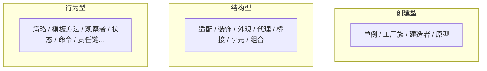

# UML与设计模式

> **快拿分**：类图 **多重度与关系类型**；用例 **include/extend**；模式题 **写标准角色名**（Context、Strategy…）+ **模式英文**——与教材图示一致即稳。

### 用例：include 还是 extend？

| 判断 | `<<include>>` | `<<extend>>` |
|------|----------------|---------------|
| 是否必须执行 | **必须**（缺了主用例不完整） | **可选**（条件满足才发生） |
| 典型表述 | 「必然」「首先要」 | 「可能」「有时」「若…则」 |
| 箭头方向 | 基本用例 → 被包含用例 | 扩展用例 → 基本用例 |
| 记忆 | **include = 硬包含** | **extend = 外挂扩展** |

### GoF 三类（结构记忆）

## 一、知识与应试（考点·难点·知识点合一）

### 1.1 类图与关系

- **依赖** < **关联** < **聚合** < **组合**（整体-部分强度递增）。
- **泛化**（继承）、**实现**（接口）。
- **〔难点〕**：**组合**部分随整体销毁；**聚合**部分可独立存在。
- **多重度**：`1`、`0..1`、`*`、`1..*` 等按题补全。

| 关系 | 卷面关键词 | 画法 / 填空注意 |
|------|------------|----------------|
| 依赖 | 使用、调用、参数、局部变量 | 虚线箭头，方向指向被依赖者 |
| 关联 | 持有、知道、导航 | 实线，可补角色名与多重度 |
| 聚合 | 部分可脱离整体存在 | 空心菱形放整体端 |
| 组合 | 部分随整体创建/销毁 | 实心菱形放整体端 |
| 泛化 | 继承、父类/子类 | 空心三角指向父类 |
| 实现 | 接口/实现类 | 虚线空心三角指向接口 |

### 1.2 用例图与行为图

- **include**：公共步骤**必执行**；**extend**：在**扩展点条件**满足时附加。
- **顺序图**：生命线、同步/异步消息、`alt/opt/loop` 框。
- **状态图**：状态、事件、守卫；与活动图区别（状态 vs 控制流）。

### 1.3 GoF 模式（下午高频）

| 模式 | 关键词 |
|------|--------|
| 工厂方法 | 子类决定实例化 |
| 抽象工厂 | 产品族 |
| 适配器 | 接口转换 |
| 装饰 | 动态叠加职责 |
| 外观 | 统一对外接口 |
| 代理 | 控制访问 |
| 策略 | 算法互换 |
| 模板方法 | 骨架固定、步骤可覆盖 |
| 观察者 | 通知订阅 |
| 状态 | 状态对象改变行为 |
| 命令 | 请求封装为对象 |

- **〔真题〕**：给类图问模式名；或给场景选模式（「算法可替换」→策略等）。

### 1.4 设计原则

- **开闭**：对扩展开放、对修改关闭；**依赖倒置**：依赖抽象而非具体。

## 二、速记与背诵

- **include 必走，extend 看条件**。
- **适配转接口，装饰包一层，外观挡复杂，代理管访问**。
- **策略换算法，模板定骨架，观察者广播**。

## 三、考场检查清单

- [ ] 组合/聚合菱形是否画对（实心组合、空心聚合）
- [ ] 用例关系是否写成 `extend`，不要写成 `exclude`
- [ ] 模式名英文拼写与教材一致
- [ ] 多重度与题干「一个部门多名员工」等叙述一致
