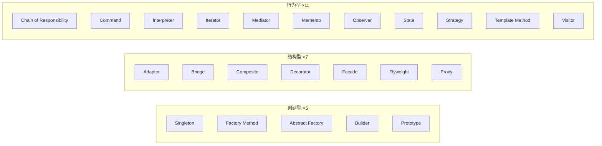

# UML与设计模式

> **快拿分**：类图 **多重度与关系类型**；用例 **include/extend**；模式题 **写标准角色名**（Context、Strategy…）+ **模式英文**——与教材图示一致即稳。

### 用例：include 还是 extend？

| 判断 | `<<include>>` | `<<extend>>` |
|------|----------------|---------------|
| 是否必须执行 | **必须**（缺了主用例不完整） | **可选**（条件满足才发生） |
| 典型表述 | 「必然」「首先要」 | 「可能」「有时」「若…则」 |
| 箭头方向 | 基本用例 → 被包含用例 | 扩展用例 → 基本用例 |
| 记忆 | **include = 硬包含** | **extend = 外挂扩展** |

### GoF 三类：10 秒区分（软考常考）

| 类型 | 核心问题 | 记一句 | 数量 |
|------|----------|--------|------|
| **创建型** | **怎么 new 出来** | 隐藏创建细节，让系统少依赖具体类 | **5** |
| **结构型** | **怎么拼在一起** | 类/对象组合成更大结构，接口仍好用 | **7** |
| **行为型** | **怎么分工协作** | 对象间通信、算法与职责怎么分配 | **11** |

**考场快判口诀**

- 题干强调 **唯一实例、分步构建、克隆、工厂/产品族** → 先想 **创建型**。
- 题干强调 **接口转换、包装一层、统一入口、树形整体-部分、共享对象、替身** → 先想 **结构型**。
- 题干强调 **算法可换、状态变行为变、通知订阅、请求封装、沿链传递、访问聚合** → 先想 **行为型**。

> **23 种** = GoF 经典全集（软考下午程序填空与 UML 题多考其中 **加粗** 模式）。速扫表见 [设计模式应试要点](/ruan-kao/soft-design/topics/patterns-exam.html)。

## 一、知识与应试（考点·难点·知识点合一）

### 1.1 类图与关系

- **依赖** < **关联** < **聚合** < **组合**（整体-部分强度递增）。
- **泛化**（继承）、**实现**（接口）。
- **〔难点〕**：**组合**部分随整体销毁；**聚合**部分可独立存在。
- **多重度**：`1`、`0..1`、`*`、`1..*` 等按题补全。

| 关系 | 卷面关键词 | 画法 / 填空注意 |
|------|------------|----------------|
| 依赖 | 使用、调用、参数、局部变量 | 虚线箭头，方向指向被依赖者 |
| 关联 | 持有、知道、导航 | 实线，可补角色名与多重度 |
| 聚合 | 部分可脱离整体存在 | 空心菱形放整体端 |
| 组合 | 部分随整体创建/销毁 | 实心菱形放整体端 |
| 泛化 | 继承、父类/子类 | 空心三角指向父类 |
| 实现 | 接口/实现类 | 虚线空心三角指向接口 |

### 1.2 用例图与行为图

- **include**：公共步骤**必执行**；**extend**：在**扩展点条件**满足时附加。
- **顺序图**：生命线、同步/异步消息、`alt/opt/loop` 框。
- **状态图**：状态、事件、守卫；与活动图区别（状态 vs 控制流）。

### 1.3 GoF 23 种设计模式（分类 · 意图 · 举例 · 角色）

下午题常见两种：**给类图/代码空填模式名与角色**；**给场景选模式**。下表按 **创建型 → 结构型 → 行为型** 排列；**粗体** 为近年卷面高频。

---

#### 一、创建型（5）——关心「对象的诞生」

| 模式 | 意图（背一句） | 生活/业务举例（帮助记忆） | 典型角色 / 卷面空位 |
|------|----------------|---------------------------|---------------------|
| **Singleton** 单例 | 保证类 **只有一个实例**，全局访问点 | 配置中心、线程池、日志管理器「全系统一份」 | `getInstance()`、私有构造 |
| **Factory Method** 工厂方法 | **子类决定** 实例化哪一个具体产品 | 文档应用：`WordDocument` / `PdfDocument` 由子类工厂创建 | `Creator`、`Product`、`createProduct()` |
| **Abstract Factory** 抽象工厂 | 创建 **一族相互关联** 的产品，且族可切换 | UI 主题：**Win 按钮+滚动条** vs **Mac 按钮+滚动条** 成套换肤 | `AbstractFactory`、`AbstractProductA/B` |
| **Builder** 建造者 | **分步构建** 复杂对象，同一过程不同表示 | 套餐：`Director` 按步骤组装汉堡+可乐；要「儿童餐/豪华餐」换 `Builder` | **`Builder`、`ConcreteBuilder`、`Director`、`Product`** |
| **Prototype** 原型 | 用 **克隆** 复制已有对象，少调 `new` | 简历模板复制后改姓名；图形编辑器「复制粘贴」图形 | `clone()`、`Prototype` |

**创建型易混**

| 对比 | 分辨 |
|------|------|
| 工厂方法 vs 抽象工厂 | 工厂方法：**一个产品等级** 由子类选具体类；抽象工厂：**多产品成族** 一起换 |
| 建造者 vs 抽象工厂 | 建造者：**同一构建流程、逐步装配**；抽象工厂：**一次性拿齐一族产品** |
| 单例 vs 静态类 | 单例可 **多态、延迟加载、可被继承**（题里常考「全局唯一」） |

---

#### 二、结构型（7）——关心「类和对象的组合」

| 模式 | 意图（背一句） | 生活/业务举例 | 典型角色 / 卷面空位 |
|------|----------------|---------------|---------------------|
| **Adapter** 适配器 | 把 **不兼容接口** 转成客户端期望的接口 | 欧标插头 → 转接头 → 国标插座；旧系统 API 包一层给新系统调 | `Target`、`Adaptee`、`Adapter` |
| **Bridge** 桥接 | **抽象与实现分离**，两维度独立扩展 | 遥控器（抽象）+ 电视机/音响（实现）；跨平台 **消息发送** × **加密算法** | **`Abstraction`、`Implementor`** |
| **Composite** 组合 | **树形** 结构，统一对待叶子与容器 | 文件夹/文件；菜单/菜单项；组织架构「部门-员工」 | `Component`、`Leaf`、`Composite` |
| **Decorator** 装饰 | **动态** 给对象叠加职责（包装） | 咖啡 + 加奶 + 加糖；`InputStream` 套 `Buffered` 再套 `GZIP` | `Component`、`Decorator`、`ConcreteDecorator` |
| **Facade** 外观 | 为子系统提供 **统一、简单** 的对外接口 | 开机键一键启动：CPU/内存/硬盘子系统对外只暴露 `computer.start()` | `Facade`、多个 `Subsystem` |
| **Flyweight** 享元 | **共享** 细粒度对象，用外在状态区分 | 围棋棋子：黑白各 **一个** 享元对象，位置存在外部；文字编辑器字符样式共享 | `FlyweightFactory`、`intrinsic/extrinsic state` |
| **Proxy** 代理 | 为对象提供 **替身**，控制访问 | 明星经纪人挡电话；懒加载大图；权限校验后再访问真实对象 | `Subject`、`RealSubject`、`Proxy` |

**结构型易混（软考最爱考）**

| 对比 | 分辨 |
|------|------|
| **适配器 vs 装饰 vs 代理** | 适配：**改接口**；装饰：**同接口加功能**；代理：**同接口控访问**（常伴延迟/权限） |
| **外观 vs 适配器** | 外观：**简化一堆子系统**，接口可全新；适配：**一对一转接口** |
| **桥接 vs 策略** | 桥接：**结构**上拆「抽象/实现」两继承体系；策略：**行为**上换算法对象 |
| **组合 vs 装饰** | 组合：**树形部分-整体**；装饰：**一层层包装同一接口** |

---

#### 三、行为型（11）——关心「对象如何协作」

| 模式 | 意图（背一句） | 生活/业务举例 | 典型角色 / 卷面空位 |
|------|----------------|---------------|---------------------|
| **Chain of Responsibility** 责任链 | 请求沿 **处理者链** 传递，直到有人处理 | 请假：组长 → 经理 → 总监；过滤器链、异常处理链 | `Handler`、`handleRequest()`、`setSuccessor` |
| **Command** 命令 | 把 **请求封装成对象**，支持撤销/队列/日志 | 遥控器按键 = 命令对象；编辑器 **撤销/重做**、事务队列 | `Command`、`Receiver`、`Invoker` |
| **Interpreter** 解释器 | 为 **文法** 定义解释类（表达式树） | 简单计算器 `a+b`；正则、规则引擎（上午选择常考概念） | `AbstractExpression`、`Terminal/Nonterminal` |
| **Iterator** 迭代器 | **顺序访问** 聚合元素，不暴露内部结构 | `for-each` 遍历列表；多种遍历方式（正序/逆序） | `Iterator`、`Aggregate` |
| **Mediator** 中介者 | 多对象 **不直接引用**，经中介通信 | 聊天室：用户只连 **Mediator**，不两两直连；机场塔台调度飞机 | `Mediator`、`Colleague` |
| **Memento** 备忘录 | **保存/恢复** 对象内部状态，不破坏封装 | 游戏存档；编辑器 **快照** 回滚 | `Originator`、`Memento`、`Caretaker` |
| **Observer** 观察者 | **一对多**，主题变则通知观察者 | 公众号推送；MVC 中 Model 变 View 更新；股票行情订阅 | **`Subject`、`Observer`、`attach/notify/update`** |
| **State** 状态 | **状态对象** 改变则行为改变（像换类） | 订单：待支付/已发货/已完成；电梯运行/停止/维修 | **`Context`、`State`、`ConcreteState`** |
| **Strategy** 策略 | 封装 **可互换算法**，运行时选用 | 出行：步行/公交/打车 **策略** 可换；排序比较器 `Comparator` | **`Context`、`Strategy`、`ConcreteStrategy`** |
| **Template Method** 模板方法 | **骨架在父类固定**，子类实现部分步骤 | 泡茶/泡咖啡：烧水相同，「放茶叶/放咖啡」子类不同 | `AbstractClass`、`templateMethod()`、钩子方法 |
| **Visitor** 访问者 | **不改元素类**，在外部加新操作 | 对 AST 各节点做「类型检查/代码生成」；报表导出遍历不同部门节点 | `Visitor`、`visit(Element)`、`accept()` |

**行为型易混（必背）**

| 对比 | 分辨 |
|------|------|
| **策略 vs 状态** | 策略：客户端 **主动换** 算法；状态：随 **内部状态迁移** 自动换行为 |
| **策略 vs 模板方法** | 策略：**组合** 算法对象；模板：**继承** 覆写步骤 |
| **观察者 vs 中介者** | 观察者：**主题发布**，观察者订阅；中介者：**中心枢纽**，同事互不直连 |
| **命令 vs 策略** | 命令：封装 **一次操作/请求**（常带撤销）；策略：封装 **算法族** |
| **状态 vs 策略** | 状态类图常像策略，但语境是 **状态机/生命周期** → 状态 |

---

#### 1.3.1 按题型速查（上午选择 + 下午填空）

| 题干关键词 | 优先模式 |
|------------|----------|
| 全局唯一、单实例 | Singleton |
| 子类决定创建哪种产品 | Factory Method |
| 成套换肤、产品族 | Abstract Factory |
| 分步组装、同样构建不同表示 | **Builder** |
| 克隆、复制已有对象 | Prototype |
| 旧接口、不兼容、转接 | Adapter |
| 两个维度独立变化 | **Bridge** |
| 树形、部分-整体一致对待 | Composite |
| 动态叠加功能、包装 | Decorator |
| 简化子系统、统一入口 | Facade |
| 大量重复对象、共享内部状态 | Flyweight |
| 延迟加载、权限、替身 | Proxy |
| 沿链传递、逐级审批 | Chain of Responsibility |
| 撤销、重做、请求对象化 | Command |
| 文法、表达式 | Interpreter |
| 遍历集合、不暴露内部 | Iterator |
| 多对象互聊、降低网状依赖 | Mediator |
| 存档、恢复快照 | Memento |
| 订阅通知、发布 | **Observer** |
| 订单状态、会员等级变行为 | **State** |
| 算法可替换、运行时切换 | **Strategy** |
| 固定流程、子类填步骤 | Template Method |
| 对结构加新操作、不改原类 | Visitor |

- **〔真题〕**：给类图问模式名；或给场景选模式（「算法可替换」→ **Strategy**；「一对多通知」→ **Observer**）。程序填空常考 **Builder / Bridge / State / Strategy / Observer** 角色类名，见 [设计模式应试要点](/ruan-kao/soft-design/topics/patterns-exam.html)。

### 1.4 设计原则

- **开闭**：对扩展开放、对修改关闭；**依赖倒置**：依赖抽象而非具体。

## 二、速记与背诵

### UML

- **include 必走，extend 看条件**。

### 三类总括

- **创建**：单例唯一，工厂造对象，抽象工厂造一族，建造者分步装，原型靠克隆。
- **结构**：适配转接口，桥接拆两维，组合成树，装饰包一层，外观挡复杂，享元要共享，代理管访问。
- **行为**：责任链传递，命令可撤销，解释器文法，迭代器遍历，中介者居中，备忘录存档，观察者广播，状态机换行为，策略换算法，模板定骨架，访问者加操作。

### 23 模式英文速记（对照卷面填空）

| 创建型 | 结构型 | 行为型 |
|--------|--------|--------|
| Singleton | Adapter | Chain of Responsibility |
| Factory Method | Bridge | Command |
| Abstract Factory | Composite | Interpreter |
| Builder | Decorator | Iterator |
| Prototype | Facade | Mediator |
| | Flyweight | Memento |
| | Proxy | Observer |
| | | State |
| | | Strategy |
| | | Template Method |
| | | Visitor |

## 三、考场检查清单

- [ ] 组合/聚合菱形是否画对（实心组合、空心聚合）
- [ ] 用例关系是否写成 `extend`，不要写成 `exclude`
- [ ] 模式名英文拼写与教材一致
- [ ] 多重度与题干「一个部门多名员工」等叙述一致
