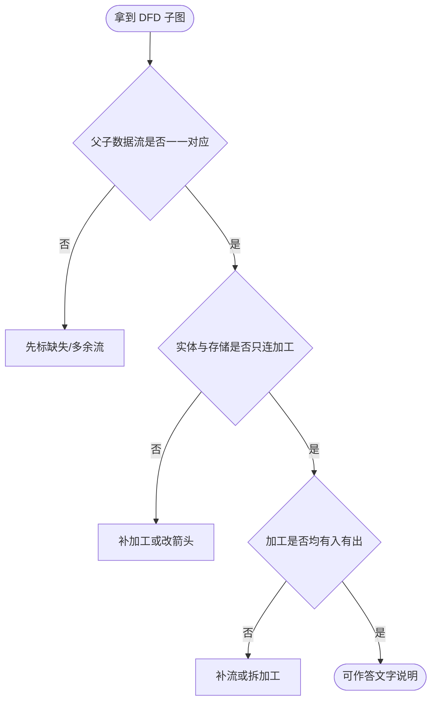

# 数据流图与结构化分析

> **快拿分**：**平衡规则** + 数据流命名与题干一致 + 外部实体不直连存储（须经加工）+ 不写控制流——DFD 题 **步骤分大**，写满比空想重要。

### 判题流程（先跑一遍再落笔）

## 一、知识与应试（考点·难点·知识点合一）

### 1.1 成分与分层

- **四种成分**：外部实体 E、加工 P、数据存储 D、数据流（命名箭头）。
- **上下文图（0 层）**：**单个加工**表示目标系统，与外部实体之间的流。
- **分层**：父图子图编号；子图细化某一加工。

### 1.2 平衡（必考能力）

- 子图的所有 **输入/输出数据流** 必须与父图中该加工的流 **在名称与方向上对应**（子图可拆分细化，但不可凭空出现父图没有的新流）。
- **〔难点〕**：找「缺失数据流」——对照父图列表逐条打勾；找「错误命名」——同一语义不同名。

### 1.3 数据守恒与规范

- 加工至少 **一入一出**；数据存储一般既有读也有写（除非题设只读库等）。
- **数据字典**、加工说明与 DFD 加工一一对应。
- **〔易错〕**：DFD **不表示控制、时序、模块调用**，不要把「控制流」「事件顺序」画进去。

### 1.4 常见设问与阅卷点

- 「补充缺失的加工/数据流」「指出图中错误」「说明某加工输入输出」。
- **得分**：名称来自业务名词（与题干一致）；箭头方向与加工逻辑一致；实体与存储 **不经加工不得直连**（经典扣分点）。

## 二、速记与背诵

- **平衡**：父子流对得上。
- **三不能**：不能实体连存储、不能只有入没有出、不能把控制当数据。

## 三、考场检查清单

- [ ] 每条父图进/出流在子图都有落点
- [ ] 数据流名与数据字典一致
- [ ] 无「控制」「判断」类命名流
- [ ] 加工编号与题意分层一致
