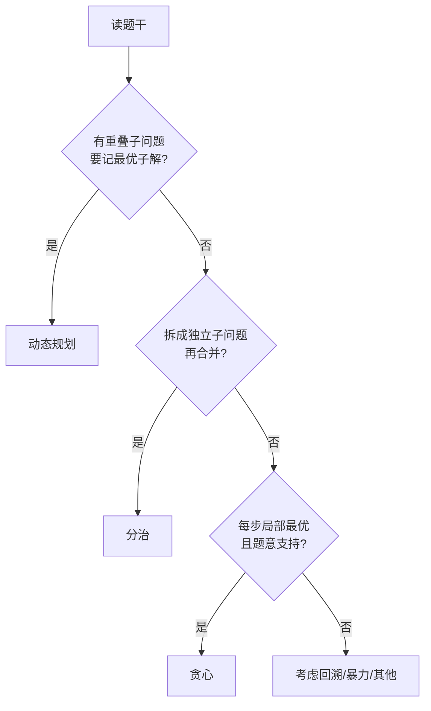

# 算法设计填空

> **快拿分**：**变量名与上下文一致**；循环 **上界/下界** 与题给数组长度一致；DP **01 背包内层逆序**；递归 **基准情形**——阅卷按空给分，**猜结构合理的式子**优于留空。
> **配套**：[下午算法题考频与应试预测](/ruan-kao/soft-design/topics/pm-algorithm.html) · [Java程序填空](/ruan-kao/soft-design/applied/java-fill.html)

---

## 〇、动态规划 · 分治 · 贪心（概念、区别、复杂度）

下午第四题（算法填空）与上午选择题常考 **范式识别 + 复杂度阶 + 填空位置**。下表先 **10 秒定类**，再按类背模板。

### 0.1 一句话概念

| 范式 | 核心思想 | 记一句 |
|------|----------|--------|
| **动态规划 DP** | 把大问题拆成 **重叠子问题**，**记住** 子问题最优解，自底向上（或记忆化）拼出全局最优 | **拆 + 重叠 + 记表** |
| **分治** | 把问题 **互不重叠** 地拆成规模更小的子问题，**分别求解再合并** | **拆 + 不重叠 + 合并** |
| **贪心** | 每步做 **当前看起来最好** 的选择，希望全局最优（需 **贪心选择性质**） | **每步局部最优，一般不回头** |

### 0.2 三者区别（软考最爱考）

| 维度 | 动态规划 | 分治 | 贪心 |
|------|----------|------|------|
| 子问题关系 | **重叠**（同一子问题算多次） | **独立**（子问题互不影响） | 往往 **无显式「子问题表」**，一步接一步 |
| 是否保证最优 | 在 **最优子结构 + 重叠** 成立时 **保证** | 合并正确则 **保证**（如归并排序） | **不一定**；题里常 **已暗示** 可贪心 |
| 典型实现 | `dp` 数组、填表顺序、转移方程 | 递归 + `mid` + `merge`/`combine` | **排序** + 一次扫描 / 选最大最小 |
| 下午填空特征 | `dp[i][j] = …`、初值、**循环方向** | `mid`、递归出口、左右区间 | `sort` 关键字、`if` 比较、累加器 |
| 与回溯对比 | 用表 **避免重复计算** | 子问题 **不必回溯** | **不回溯**；回溯是 **穷举+剪枝** |

### 0.3 考场 30 秒快判（题干信号）

| 看到这些 → | 优先想 |
|------------|--------|
| 0-1 背包、钢条切割、最长公共子序列、编辑距离、路径数、「方案数/最大价值」且 **子结构重复** | **DP** |
| 假币称重、归并/快排、二分、大整数乘法分块、「分成两半再合并」 | **分治** |
| 活动安排、霍夫曼编码、**分数背包**、按截止时间/结束时间排序后贪心、最小生成树选边 | **贪心** |
| n 皇后、全排列、Hamilton 路径、「尝试+撤销」 | **回溯**（不是本节三范式，但常与之混） |

**易混**

- **0-1 背包** → **DP**（物品不能拆分）；**分数背包** → **贪心**（可按比例取）。
- **钢条切割 / 硬币凑金额（无限枚）** → 多为 **DP**；**硬币凑金额（面额可贪心，如 1,5,10）** 上午可能考 **贪心是否最优**。
- **假币** → **分治**（三分或二分称重），不是 DP。

---

### 0.4 举例说明（帮助记忆）

#### 动态规划

| 例题 | 记忆点 | 状态（写什么） | 典型复杂度 |
|------|--------|----------------|------------|
| **0-1 背包** | 每件物品 **最多选一次**；下午卷高频 | `dp[v]` 或 `dp[i][v]`：容量 `v` 下最大价值 | 时间 \(O(nW)\)，空间 \(O(W)\) 滚动数组 |
| **钢条切割** | 一根钢条切几段使总价最大（2018 上样本） | `dp[i]`：长度为 `i` 的最大收益 | 时间 \(O(n^2)\)，空间 \(O(n)\) |
| **最长公共子序列 LCS** | 两串公共子序列最长 | `dp[i][j]`：前缀 `i,j` 的 LCS 长度 | 时间 \(O(mn)\)，空间 \(O(mn)\) 或滚动 \(O(\min(m,n))\) |
| **爬楼梯 / 路径数** | 到第 `i` 阶方案数 | `dp[i]=dp[i-1]+dp[i-2]` 或网格 `dp[i][j]` | 时间 \(O(n)\) 或 \(O(mn)\) |
| **硬币凑满（最少枚）** | 面额不限次数 | `dp[amount]`：凑 `amount` 最少币数 | 时间 \(O(n \cdot amount)\) |

**DP 书写四步（下午填空按此顺序想）**

1. **定义** `dp` 含义（一行注释也算分）
2. **初值**（`dp[0]=0`、第一行第一列等）
3. **转移**（`max/min/+` 来自哪几个下标）
4. **循环顺序**（01 背包：**容量 `v` 从大到小**）

#### 分治

| 例题 | 记忆点 | 分什么 / 怎么合 | 典型复杂度 |
|------|--------|-----------------|------------|
| **假币问题** | 三秤或一秤找假币（2017 上） | 分成 **2 或 3 堆** 称重，缩小范围 | 称重次数 \(O(\log n)\) 量级 |
| **归并排序** | 先分后 **merge** 有序段 | `mid` 分左右，`merge` 合并 | 时间 \(O(n\log n)\)，空间 \(O(n)\) |
| **快速排序** | `partition` 后递归左右 | `pivot` 划分 | 平均 \(O(n\log n)\)，最坏 \(O(n^2)\)；空间 \(O(\log n)\) 栈 |
| **二分查找** | 有序数组找目标 | 中点比较，缩一半 | 时间 \(O(\log n)\)，空间 \(O(1)\) |
| **大整数乘法（概念）** | 拆成两半再组合 | Karatsuba 等 | 优于 \(O(n^2)\)（上午选择了解即可） |

**分治填空常考空**：`mid = (lo + hi) / 2` 或 `lo + (hi-lo)/2`；**递归出口** `lo >= hi`；`merge` 时 **双指针** `i,j`。

#### 贪心

| 例题 | 记忆点 | 贪心策略 | 典型复杂度 |
|------|--------|----------|------------|
| **活动安排** | 最多参加几场不冲突活动 | 按 **结束时间** 排序，能选就选 | \(O(n\log n)\) 排序 + \(O(n)\) 扫描 |
| **霍夫曼编码** | WPL 最小 | 每次合并 **权值最小** 两棵树 | \(O(n\log n)\)（与上午哈夫曼一致） |
| **分数背包** | 物品可 **按比例** 取 | 按 **单位价值** 降序装填 | \(O(n\log n)\) |
| **Prim / Kruskal（概念）** | 最小生成树 | 选 **当前最小边**（满足不成环） | Kruskal 排序边 \(O(E\log E)\) |

**贪心填空常考空**：**排序比较器** 关键字；`if ( … )` 里 **局部最优条件**；累加器 **初值**（0 或 1）。

---

### 0.5 时间 / 空间复杂度对照（常考经典题）

> 记 **阶** 即可应对上午选择；下午填空若问循环层数，对照下表反推。

| 问题 | 范式 | 时间复杂度 | 空间复杂度 | 备注 |
|------|------|------------|------------|------|
| 0-1 背包 | DP | \(O(nW)\) | \(O(W)\) 滚动 / \(O(nW)\) 二维 | \(W\) 为容量上界 |
| 完全背包 | DP | \(O(nW)\) | \(O(W)\) | 内层容量常 **正序** |
| 钢条切割 | DP | \(O(n^2)\) | \(O(n)\) | |
| LCS | DP | \(O(mn)\) | \(O(mn)\) 或优化 | |
| 矩阵链乘 | DP | \(O(n^3)\) | \(O(n^2)\) | 区间 DP，按 **长度** 枚举 |
| 假币（三分） | 分治 | \(O(\log_3 n)\) 次称重 | \(O(1)\) | 每次缩到 1/3 |
| 归并排序 | 分治 | \(O(n\log n)\) | \(O(n)\) | 稳定 |
| 快速排序 | 分治 | 平均 \(O(n\log n)\)，最坏 \(O(n^2)\) | \(O(\log n)\) 栈 | 不稳定 |
| 二分查找 | 分治 | \(O(\log n)\) | \(O(1)\) | |
| 活动安排 | 贪心 | \(O(n\log n)\) | \(O(1)\) | 排序主导 |
| 分数背包 | 贪心 | \(O(n\log n)\) | \(O(1)\) | |
| 霍夫曼树 | 贪心 | \(O(n\log n)\) | \(O(n)\) | 上午 WPL 题 |

**主定理（分治递归式，上午偶考）**

若 \(T(n)=aT(n/b)+f(n)\)，\(a\ge1,b>1\)：与 \(n^{\log_b a}\) 比较 \(f(n)\) 定阶。
例：归并 \(a=2,b=2,f(n)=O(n)\) → \(T(n)=O(n\log n)\)。

### 0.6 速记口诀

- **DP**：重叠子问题，**定义转移初值序**；背包 **01 逆序、完全正序**。
- **分治**：**分、治、合**；记 `mid` 与 **出口**。
- **贪心**：**先排序再扫描**；问「是否最优」要警惕 **反例**（上午选择）。

---

## 一、知识与应试（考点·难点·知识点合一）

### 1.1 读题与定式

- 先标输入、输出、约束（\(n\) 范围暗示 \(O(n^2)\) 还是 \(O(n\log n)\)）。
- **DP**：定义 `dp[...]` 含义 → 转移 → 初值 → 答案下标；注意 **填循环顺序**（背包类常 **内层逆序**）。
- **贪心**：排序关键字 + 一次扫描；空多在 **比较条件** 与 **累加器**。
- **回溯**：递归/栈；**剪枝条件**、**撤销选择**、递归出口。
- **分治**：`mid`、递归边界、`merge`/`partition` 中空位。

### 1.2 边界与易错

- **off-by-one**：`i < n` 还是 `i <= n` 以题意下标从 0 或 1 为准。
- **初值**：求最大置极小；计数从 0；布尔「能否」类注意**或/与**组合。
- **〔难点〕**：LIS 二分、`tails` 数组填空——严格照题给伪代码，勿换写法。

### 1.3 书写习惯

- 与前后文 **同一命名风格**（`dp`/`f`、`w`/`weight`）。
- 多分支 `if` 把 **最苛刻条件放前** 可减少嵌套（也降低漏写 else 风险）。

## 二、速记与背诵

- **范式**：重叠子问题 → **DP**；独立子问题合并 → **分治**；局部最优排序扫描 → **贪心**（详见 **§〇**）。
- **背包 01**：`for i` 物品，`for v` 容量 **down to w[i]**。
- **区间 DP**：长度 `len` 从小到大枚举。
- **图 DFS**：`visited` 标记 + 邻接表遍历。

## 三、考场检查清单

- [ ] 每个填空代入边界 \(n=0, n=1\) 手推
- [ ] 返回值与题问「最大/最小/个数」一致
- [ ] 无死循环（尤其 `while` 条件）
