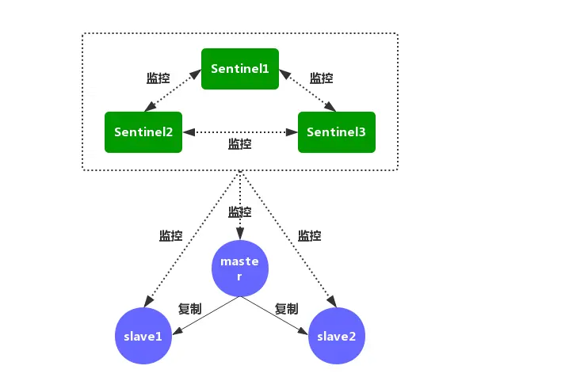
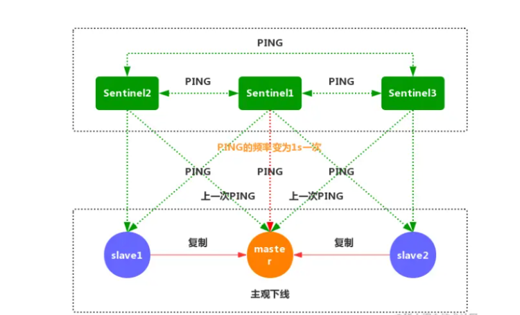
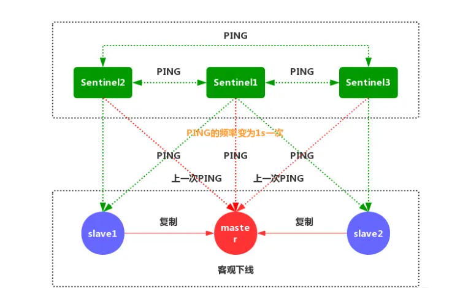

## 哨兵模式

基本原理
Redis的Sentinel系统用于管理多个Redis，主要执行:

- 监控：Sentinel会不断的检查主从服务器运行状态
- 提醒：当某个Redis服务器出现故障，可通过API或者其他应用程序发送通知
- 自动故障迁移：当一个主服务器不能正常工作时，Sentinel会进行一次故障自动迁移，会将失效主服务器的从服务器选举出一个新的主服务器，剩下的从服务器将会自动连接复制选举出来的新服务器的数据。
- 配置提供者：在 Redis Sentinel 模式下，客户端应用 在初始化时连接的是 Sentinel 节点集合，从中获取主节点 的信息。



Redis的Sentinel系统是一个分布式的系统，可以在系统中配置一个或多个Sentinel

主观下线和客观下线
默认情况下，每个Sentinel 节点会以 每秒一次 的频率对 Redis 节点和 其它 的 Sentinel 节点发送 PING 命令，并通过节点的 回复
来判断节点是否在线。

- 主观下线：适用于所有 主节点 和 从节点。如果在 down-after-milliseconds 毫秒内，Sentinel 没有收到 目标节点 的有效回复，则会判定
  该节点为主观下线。



- 客观下线： 只适用于 主节点。如果 主节点 出现故障，Sentinel 节点会通过 sentinel is-master-down-by-addr 命令，向其它
  Sentinel 节点询问对该节点的状态判断。如果超过 <quorum> 个数的节点判定 主节点 不可达，则该 Sentinel 节点会判断 主节点 为
  客观下线。



### 快速搭建

```yaml
##
## 功能：redis主从集群 1主2从
## 使用：
##   - docker-compose up -d
## 默认密码：123456
##
## 参考链接：https://blog.51cto.com/u_15127508/4395149

version: '2'
services:
  redis-master-6380:
    image: redis:latest
    container_name: redis-master-6380
    restart: always
    command: redis-server --port 6380 --requirepass 123456  --appendonly yes
    ports:
      - "6380:6380"
    networks:
      net:
        ipv4_address: 172.19.0.3

  redis-slave-6381:
    image: redis:latest
    container_name: redis-slave-6381
    restart: always
    command: redis-server --slaveof redis-master-6380 6380 --port 6381  --requirepass 123456 --masterauth 123456  --appendonly yes
    ports:
      - "6381:6381"
    networks:
      net:
        ipv4_address: 172.19.0.4

  redis-slave-6382:
    image: redis:latest
    container_name: redis-slave-6382
    restart: always
    command: redis-server --slaveof redis-master-6380 6380 --port 6382  --requirepass 123456 --masterauth 123456 --appendonly yes
    ports:
      - "6382:6382"
    networks:
      net:
        ipv4_address: 172.19.0.5


  redis-sentinel-26380:
    image: redis:latest
    container_name: redis-sentinel-26380
    ports:
      - "26380:26379"
    command: redis-sentinel /usr/local/etc/redis/sentinel.conf
    volumes:
      - ./conf/redis-sentinel-26380.conf:/usr/local/etc/redis/sentinel.conf
    networks:
      net:
        ipv4_address: 172.19.0.11

  redis-sentinel-26381:
    image: redis:latest
    container_name: redis-sentinel-26381
    ports:
      - "26381:26379"
    command: redis-sentinel /usr/local/etc/redis/sentinel.conf
    volumes:
      - ./conf/redis-sentinel-26381.conf:/usr/local/etc/redis/sentinel.conf
    networks:
      net:
        ipv4_address: 172.19.0.12

  redis-sentinel-26382:
    image: redis:latest
    container_name: redis-sentinel-26382
    ports:
      - "26382:26379"
    command: redis-sentinel /usr/local/etc/redis/sentinel.conf
    volumes:
      - ./conf/redis-sentinel-26382.conf:/usr/local/etc/redis/sentinel.conf
    networks:
      net:
        ipv4_address: 172.19.0.13
## 创建桥接网络
networks:
  ## 桥接网络名称，配合文件前缀，最后为dev_test_env_net  参考：https://www.jianshu.com/p/d70c61d45364
  net:
    driver: bridge
    # external: true
    ipam:
      driver: default
      config:
        - subnet: 172.19.0.0/24
          ## 网关
          gateway: 172.19.0.1
```

[//]: # (注意修改各容器redis映射的配置文件;[源码]&#40;../../../../code/redis/sentinel&#41;)