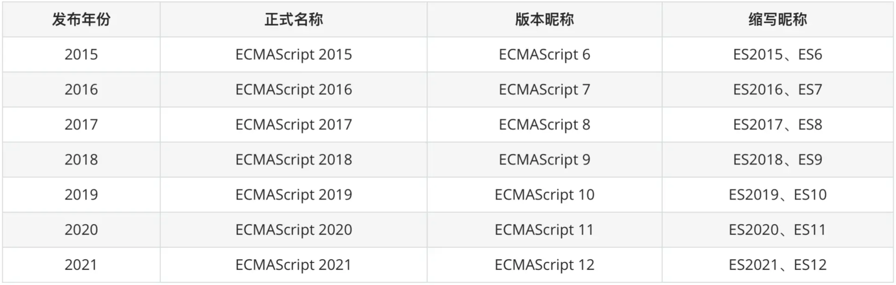

# ECMAScript

`JavaScript` 由 `Brendan Eich` 于 1995 年发明，并于 1997年成为 `ECMA` 标准。

`ECMAScript` 是`JavaScript`的正式名称。`ECMAScript` 版本已缩写为 `ES1`、`ES2`、`ES3`、`ES5` 和 `ES6`。

**自 2016 年起，版本按年份命名（ECMAScript 2016、2017、2018、2019、2020）。**

- [ES2009特性一览(ES5)]()
- [ES2015特性一览(ES6)]()
- [ES2016特性一览(ES7)]()
- [ES2017特性一览(ES8)]()
- [ES2018特性一览(ES9)]()
- [ES2019特性一览(ES10)]()
- [ES2020特性一览(ES11)]()
- [ES2021特性一览(ES12)]()
