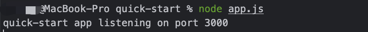
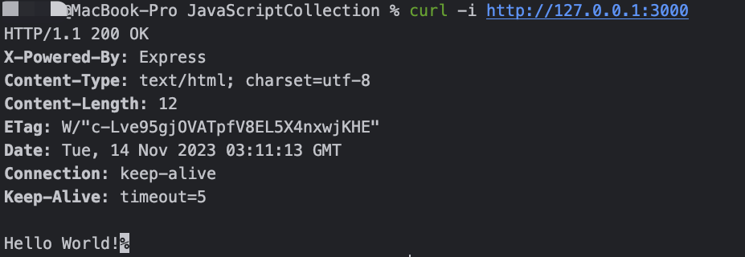

# 快速入门

`Express`是基于 Node.js 平台，`快速`、`开放`、`极简`的 Web 开发框架

- `Express` 是一个保持最小规模的灵活的 Node.js Web 应用程序开发框架，为 Web 和移动应用程序提供一组强大的功能。
- 使用选择的各种 HTTP 实用工具和中间件，快速方便地创建强大的 API。
- `Express` 提供精简的基本 Web 应用程序功能，而不会隐藏您了解和青睐的 Node.js 功能。
- 许多 流行的开发框架 都基于 `Express`

## 安装

安装`express`模块，目前最新版本为[4.18.2](https://www.npmjs.com/package/express?activeTab=versions)

```bash
## 生产环境安装express
npm install express --save

## 临时安装
npm install express --no-save
```

## 简单服务

使用`express`模块，可以快速实现简单的API服务

在项目中新建`app.js`文件，并输入：

@[code js](@code/express/apps/quick-start-demo/app.js)

在终端运行命令：

```bash
node app.js
```



- 使用`lsof -i:3000`查看服务端端口是否被监听

- 使用`curl -i http://localhost:3000` 请求API接口，返回：



查看这里的一个简单的API服务例子

## 参考

- <https://www.expressjs.com.cn/>
- <https://www.npmjs.com/package/express>
