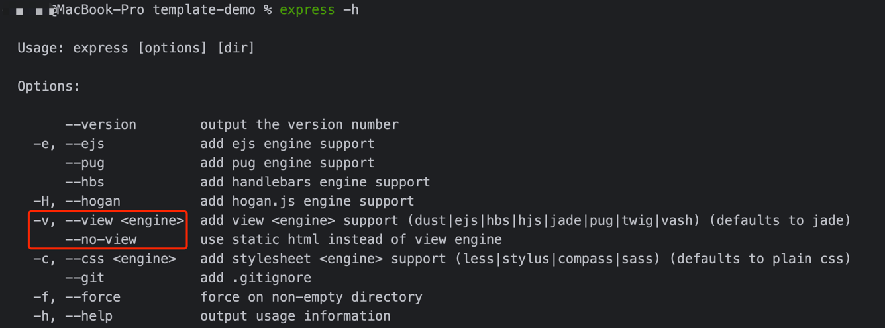
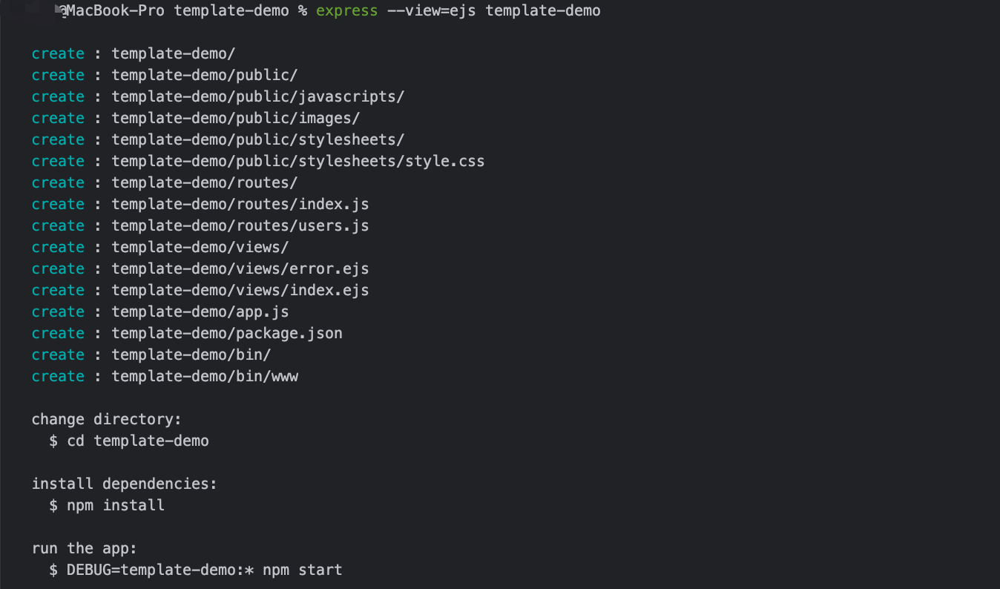
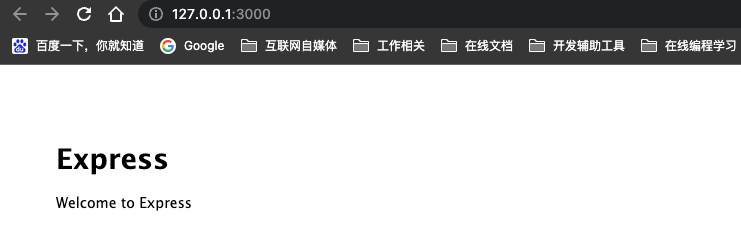

# 模板项目

`Express`框架提供了应用程序生成器，就是预先约定一些`Express`框架项目的开发规范，例如：`目录约束`、`路由约束`...

通过应用生成器工具 `express-generator`模块 可以快速创建一个应用的结构，可以在此基础上形成基于`Express`框架的模板项目

## 安装依赖

Node版本大于8.2.0或者更高时，可以使用npx命令来运行Express模板生成项目，执行命令：

```bash
npx express-generator
```

也可全局安装`express-generator`模块，执行命令：

```bash
npm install -g express-generator
```

安装完成后，执行命令：

```bash
# 列出可用命令参数
express -h
```



这里重点关注下`-v`、`--view`参数，用来指定`Express`项目的前端页面模版渲染引擎

> 在工程化发展历史中，很多框架在早期设计中都支持前后端一体开发，不像现在更多地是前后端分离。
> 模版渲染引擎就是在后端服务中去开发、渲染前端页面，类似的技术有：`jsp`、`ejs`等。

## 创建项目

在了解`express`命令的基本可用参数后，可以直接创建名为`template-demo`模版项目，执行命令：

```bash
# 创建模板项目，使用ejs模板引擎
express --view=ejs template-demo
```

对于纯后端的应用，可以使用`--no-view`参数，创建不带模板渲染引擎的模板项目，执行命令：

```bash
# 创建模板项目，不试用渲染引擎
express --no-view template-demo
```

可以清晰地看见新创建了`template-demo`项目：



注意下项目中的目录结构：

- public目录： 存放前端静态资源，例如：js代码、css代码
- view目录：存放前端页面，在前后端混合开发中，该目录可以用渲染引擎来接受后端数据
- routes目录：后端服务路由，一般用来约定restFul接口
- app.js：项目的入口文件，Node项目一般以`index.js`、`app.js`作为入口文件，类似与Java开发中的`main.java`文件
- package.json：项目信息、依赖包管理配置文件，可以在里面声明`项目信息`、`开发脚本`、`依赖版本`等信息
- bin：这里是框架约定的入口文件，实际开发中可以将该逻辑整合到`app.js`中

在命令行中使用命令：

```bash
# 启动服务
node ./bin/www

# 查看端口
lsof -i:3000
```

当发现端口3000被监听时，可以在浏览器中打开地址：<http://localhost:3000>，查看Express模板项目的运行情况:



## 简单改造

可能是由于Node发展原因，`express-generator`最近更新已经是好几年前了，这就导致了模板中的一些语法，在现在的工程化浪潮中已经那么规范了。

例如： 模板代码中随处可见的`var`关键字定义变量，会导致变量声明作用域问题，现在一般推荐使用`let`、`const`来声明

所以接下来，会对代码做一些简单的修改

### 推荐ES6语法

统一使用Eslint规则，对模板项目中的代码做一些格式化，例如：

改造前：

```js
const express = require('express')
const router = express.Router()

/* GET users listing. */
router.get('/', (req, res, next) => {
  res.send('respond with a resource')
})

module.exports = router
```

改造后：

```js
const express = require('express')
const router = express.Router()

/* GET home page. */
router.get('/', (req, res, next) => {
  res.render('index', { title: 'Express' })
})

module.exports = router
```

### 脚本管理

在上面的演示中，启动项目是使用命令：`node ./bin/www`，实质就是执行www文件中的服务监听方法。
在综合性项目中一般对服务命令做统一管理，即利用`package.json`中的`scripts`字段，例如：

```json5
// 项目脚本
"scripts": {
    // 开发环境启动服务
    "dev": "node ./bin/www",
    // 清理依赖
    "clean": "find . -name \"node_modules\" -type d -exec rm -rf '{}' + "
}
```

一般项目会配置`dev`、`start`、`stop`、`build`等命令

### 入口文件

在模板项目中，Express框架将项目启动的入口文件放在bin目录下管理，可以看到存在www的子文件，我想这里是为了方便
前后端混合开发时候，去区分业务。现在更多的是采用微服务的架构，一个项目做一类业务，让项目更加短效、精悍，目标更强。

因此这里更加推荐：**利用`app.js`来整合项目的启动逻辑，将`app.js`作为入口文件，删除bin整个目录**

改造后的app.js:

@[code js](@code/express/apps/template-demo/app.js)

### 脚本优化

将入口文件改造好后，可以直接使用`node app.js`启动项目，再访问<http://127.0.0.1:3000>访问路由。

这里比较推荐将该命令集成到scripts字段中统一管理，例如：

```json5
// 项目脚本
"scripts": {
    // 开发环境启动服务
    "dev": "node app.js",
}
```

## 参考

- <https://www.npmjs.com/package/express-generator>
- <https://www.expressjs.com.cn/starter/generator.html>
