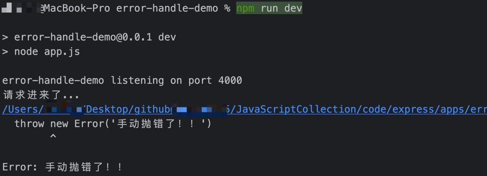
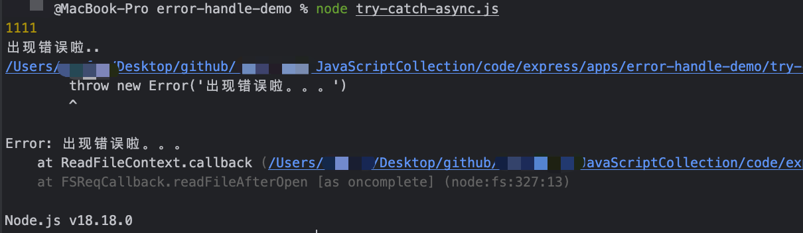

# 错误处理

在项目运行时，可能因为各种因素会产生运行错误、异常，捕获、处理同步和异步时出现的错误这个过程就是`错误处理`。

Express框架提供了一个默认的错误处理程序，因此在使用框架时不需要编写自己的错误处理逻辑，就可以使用框架级别的错误处理。

怎么理解这里的`Express框架提供默认错误处理程序`呢？ 例如：

@[code js](@code/express/apps/error-handle-demo/app.js)

手动抛出错误，看Express框架能否捕获到错误。 在终端命令中执行：

```bash
# 启动服务
node app.js

# 或执行脚本
npm run dev
```

服务启动后，对接口进行简单的请求：

```bash
# Get请求
curl -i http://127.0.0.1:4000
```

服务端在收到客户端的请求后，会进行处理。由于在代码逻辑中手动抛错的，这里的请求并不会接收到响应数据，查看服务端日志会发现
手动`throw`抛出来的错误会被捕获到：



## 捕获错误

在Node.js中存在同步、异步的编程思想。对于异步执行的方法，如果执行过程中出现错误，无法在顶部进行`try catch`捕获，例如：

@[code js](@code/express/apps/error-handle-demo/try-catch-async.js)

启动服务，会发现在回调函数中throw的错误，无法捕获，没有打印出catch中输出的日志



**因为：回调函数本质是异步执行的**

在Express框架甚至整个Node.js编程里，`异步编程`、`回调函数`是两个无法避免的话题，例如：

- 接口中使用回调函数
- 中间件异步函数处理
- ...

所以，对于框架层面的错误处理，Express框架对于不同的场景，提供了捕获异常解决方案。

对于从路由处理程序和中间件调用的异步函数返回的错误，必须将它们传递给该next()函数，例如：

```js
app.get('/', (req, res, next) => {
  fs.readFile('/xxx', (err, data) => {
    if (err) {
      // 将错误丢给Express框架
      next(err)
    }
    else {
      res.send(data)
    }
  })
})
```

从 Express 5 开始，返回 Promise 的路由处理程序和中间件将next(value)在拒绝或抛出错误时自动调用，例如：

```js
app.get('/userInfo', async (req, res, next) => {
  const { id } = req.params
  // await同步执行
  const user = await getUserInfoById(id)
  res.send(user)
})
```

上面使用了await关键字，可以将异步函数转为同步来处理，对于同步函数在流程执行上是顺序的，所以可以直接交由Express框架来进行统一捕获

- 如果getUserInfoById抛出错误或Promise对象中的reject，next函数将使用抛出的错误或reject的值进行调用。
- 如果未提供拒绝值，next 将使用 Express 路由器提供的默认错误对象进行调用。

**对于next()函数，传递除了路由外的一切值，Express框架都会当做错误来处理，这个错误会被全局捕获到，并且跳过任何剩余的非错误处理路由和中间件函数**

## 简单写法

在后面了解中间件的处理逻辑后，将会更加全面地说明Express框架里中间件的使用方法。

对于多个中间件处理，只提供错误，通常可以做一些简写，例如：

```js
app.get('/test', [
  function (req, res, next) {
    // 这里可以将fs操作的异常，传到next函数中，最后交由框架处理
    fs.writeFile('/inaccessible-path', 'data', next)
  },
  function (req, res) {
    res.send('OK')
  }
])
```

上面的fs操作，如果没有出现做出，就会调用后面的一个中间件，完成整个接口的业务逻辑。

对于异步函数、回调函数则需要手动捕获错误并利用next()函数才能被Express框架的统一错误捕获，例如：

```js
// 测试
app.get('/', (req, res, next) => {
  setTimeout(() => {
    try {
      throw new Error('BROKEN')
    }
    catch (err) {
      next(err)
    }
  }, 100)
})
```

如果缺少`try...catch`逻辑，Express 将不会捕获错误。

对于处理链较长，可以依赖于全局对象来处理错误，使用处理程序链来依赖同步错误捕获，将异步代码减少到一些琐碎的事情，例如：

```js
app.get('/', [
  function (req, res, next) {
    fs.readFile('/maybe-valid-file', 'utf-8', (err, data) => {
      res.locals.data = data
      next(err)
    })
  },
  function (req, res) {
    res.locals.data = res.locals.data.split(',')[1]
    res.send(res.locals.data)
  }
])
```

上面的这些方式，目的都是为了将错误交由Express框架来处理，重点就是需要理解：“异常捕获无法捕捉到异步函数中的错误”

## 错误处理函数

Express框架提供了默认的错误处理机制，可以处理应用程序中可能遇到的错误。那怎么实现这种逻辑呢？

在洋葱圈模型中，服务端接口处理流程可以理解为一个又一个中间件，每个中间件负责一部分业务逻辑，运行时都会依次压入堆栈。而Express框架的错误处理机制，
本质上也是一个中间件，对于异步函数的处理，想要被框架层面捕获到，需要借助`next()`函数。因为`next()`函数是向下传递的，将值传到下一个中间件。

默认的错误处理机制的中间件函数被压入到中间件堆栈的末尾执行。

如果将错误传递给`next()`并且不在自定义错误处理程序中处理它，则它将由内置错误处理程序处理；错误将与堆栈跟踪一起写入客户端。 堆栈跟踪信息将不会显示在生产环境中

当写入错误时，框架将会添加一些额外信息到响应中：

- 从`err.status`或`err.statusCode` 设置`res.statusCode`。如果该值超出 `4xx` 或 `5xx` 范围，则会设置为 `500`
- `res.statusMessage`根据状态码设置。
- 在生产环境中，正文将为状态代码消息的`HTML`，否则将为`err.stack`
- 对象中指定的任何标头`err.headers`

@[code js](@code/express/apps/error-handle-demo/handle.js)

理解Express框架的统一错误处理机制，可以自定义错误处理函数，进一步封装错误响应信息，约定前后端规范...

## 参考

- <https://juejin.cn/post/7081658867549437989>
- <https://expressjs.com/en/guide/error-handling.html>
