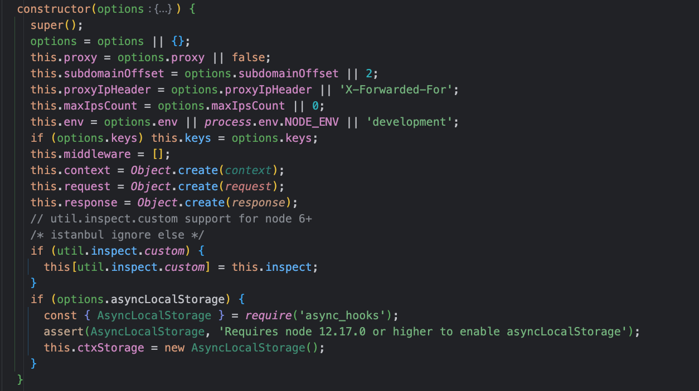
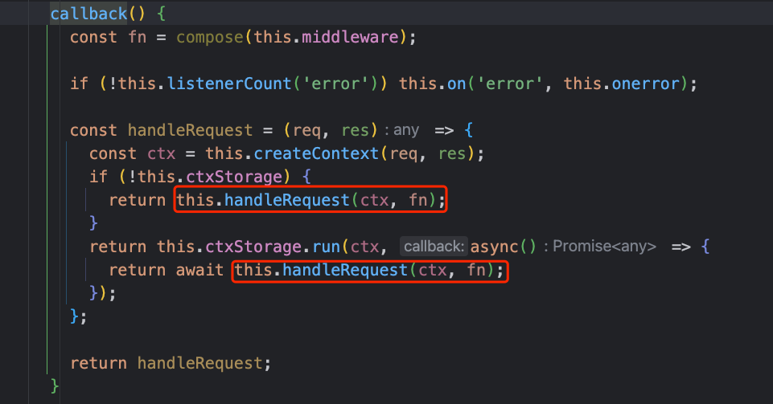

# Application应用对象

`Koa` 应用程序是一个包含一组中间件函数的对象，它是按照类似`堆栈`的方式组织和执行的。

如何理解这里的类似堆栈的方式呢？直接下面的例子：

@[code js](@code/koa/koa-run-sort.js)

当服务运行起来时，会先准备一个栈，等待着被调用，暂且称为`调用栈`。 在调用栈里面，三个中间件一次进入栈中，
其中第一个中间件会被压到栈底。

进入栈的顺序（中间件1在栈底）：

```mermaid
---
title: 中间件调用流程
---
stateDiagram-v2
    客户端 --> 中间件1
    中间件1 --> 中间件2
    中间件2 --> 中间件3
    中间件3 --> 服务端
```

执行调用的顺序（栈顶的中间件函数先执行）：

```mermaid
---
title: 执行流程
---
flowchart TD
    服务端-->中间件3 --> 中间件2--> 中间件1 --> 客户端
```

其中，在中间的处理函数中存在两个参数:

- `ctx` 当前请求的上下文对象
- `next` 下一个中间件的执行器

利用`next()`可以获取到下一个执行函数的返回结果。例如：在中间件2中可以拿到中间件3的返回结果


到这里应该就能慢慢地理解koa的app对象是如何工作的、调用链路、顺序是怎样的，这也就是来的洋葱圈模型

此刻，想到那首歌：”如果你愿意一层一层地剥开我的心，你会发现、你会讶异....“

## 设置App属性

在使用koa时，一般是利用Koa模块new一个app对象

```js
const Koa = require('koa')

// 构造函数创建对象
const app = new Koa({ proxy: true })
```

通过Koa的构造函数源码，可以看到options支持的一些参数:



- `app.env` 默认是 NODE_ENV 或 "development"
- `app.keys` 签名的 cookie 密钥数组
- `app.proxy` 当真正的代理头字段将被信任时
- `app.subdomainOffset` app.subdomains 偏移量，默认为 2
- `app.proxyIpHeader` 代理 ip 消息头, 默认为 `X-Forwarded-For`
- `app.maxIpsCount` 从代理 ip 消息头读取的最大 ips, 默认为 0 (代表无限)

```js
const Koa = require('koa')

// 利用构造函数修改属性
const app1 = new Koa({ proxy: true })

// 定义创建完动态修改属性
const app2 = new Koa()
app2.proxy = true
```

## app.listen

> 创建HTTP服务，简体端口

创建并返回 HTTP 服务器，将给定的参数传递给 Server#listen()，例如：

```js
const Koa = require('koa')
const app = new Koa()
// 监听3000端口
app.listen(3000)
```

那么利用`app.listen`函数到底做了什么呢？不妨查看下`koa`源码，点击`listen`即可：


其实可以理解app.listen就是语法糖，调用时利用`http.createServer`创建服务端，即等价于：

```js
const http = require('node:http')
const Koa = require('koa')
const app = new Koa()
const server = http.createServer(app.callback())
// 监听端口
server.listen(3000)
```

当然，如果你需要将程序作为`Https`或者多个地址，`http`、`https`、`koa`模块都能很好的支持,例如：

```js
const http = require('node:http')
const server = http.createServer(app.callback())
// 监听端口
server.listen(3000)

const https = require('node:https')
const httpsServer = https.createServer(app.callback())
httpsServer.listen(6000)
```

运行起来后，可以检查端口是否被监听


## app.callback

在上面的启动服务端端口的`app.listen`语法糖中可以很清晰的看到`app.callback()`，查看源码：



作用是：

> 对于活跃的`Node.js`的`http`服务端,返回请求的处理器回调函数来处理请求，即：**返回适用于 `http.createServer()` 方法的回调函数来处理请求**

## app.use

当你需要使用中间件时，可以使用`app.use`方法，传入对应的中间件处理函数，即可调用，查看源码：


`use()`方法返回的是`this`对象，也就是当`use()`方法执行完中间件函数后，返回的是自己的`app`原型，熟悉原型链调用的可以知道**use()方法支持链式调用**

例如：

```js
// 中间件的使用
app.use(middlewareStep1)
app.use(middlewareStep2)
app.listen(4000)
```

等价于：

```js
// 链式调用
app
  .use(middlewareStep1)
  .use(middlewareStep2)
  .listen(4000)
```

## app.context

`app.context`是从其创建 `ctx` 的原型。可以通过编辑 `app.context` 为 `ctx` 添加其他属性，例如：

```js
// 初始化context中的database变量
app.context.database = initDataBase()

// 执行中间件，打印ctx的database变量
app.use((ctx) => {
  console.log(ctx.database)
})
```

可以将`ctx`对象理解为当前运行服务的全局上下文对象，支持全局修改、使用

## 错误处理

按照上面的方式，简单的启动服务端并监听端口，虽然服务可以启动，但这样的服务是稳定性是无法保证的，同时对于服务运行期间出现的错误也是无法及时处理的。

对于Node.js程序，在服务启动时一般是需要对错误进行统一处理、全局捕获的，避免各种错误导致服务进程退出却没有感知

常见的操作如下：

```js
app.on('error', (err) => {
  console.error('server error', err)
})
```

监听`error`事件

默认情况下，将所有错误输出到 `stderr`，除非 `app.silent` 为 true。
当 `err.status` 是 404 或 `err.expose` 是 true 时默认错误处理程序也不会输出错误。

对于客户端/服务端请求交互出现错误、无法响应时，`context`上下文仍然可以在实例中传递，例如：

```js
// 监听error事件
app.on('error', (err, ctx) => {
  console.error('server error', err, ctx)
})
```

当应用级错误发生、`error`事件监听触发时，可以及时打印出错误信息

## 更多

`Application`对象的可用API还是非常多的，具体可以参考：[Application API](https://github.com/koajs/koa/blob/master/lib/application.js)

## 一些实践

@[code js](@code/koa/koa-app.js)
