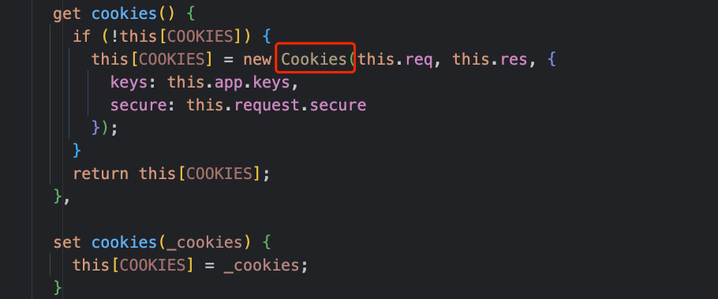

# Context上下文

在客户端/服务器端发生数据交互时，`Node.js`的`request`对象、`response`对象应用非常频繁。 在Koa框架中，Context上下文就是将
request对象、response对象进行封装。为编写Web应用程序、API时提供很多、很方便的方法

对于每个客户端请求，`Koa`框架都会创建一个`Context`上下文对象，在请求的处理流程中，作为中间件的参数引用，一般用ctx表示，例如:

```js
app.use(ctx => {
  // Context对象
  console.log(ctx)
  // Koa的Request对象
  console.log(ctx.request)
  // Koa的Response对象
  console.log(ctx.response)
})
```

为方便起见，许多上下文的访问器和方法直接委托给它们的 `ctx.request`对象或 `ctx.response`对象 ，不然的话它们是相同的。
例如：

- `ctx.type` 和 `ctx.length` 委托给 `response` 对象
- `ctx.path` 和 `ctx.method` 委托给 `request` 对象

## API方法

### ctx.req和ctx.request

Node的request对象，包含客户端请求的详细信息

### ctx.res和ctx.response

`Node`的`response`对象，包含服务端响应的详细信息，需要注意的是：绕过`koa`的`response`统一处理是不被支持的。

避免使用:

- `res.statusCode`
- `res.writeHead()`
- `res.write()`
- `res.end()`

例如：

```js
app.use(async(ctx, next) => {
  ctx.body = 'hello world'
  ctx.status = 200
  ctx.res.statusCode = 500
})
```

### ctx.state

推荐的命名空间，可以将信息传递到中间件或者前端视图，例如：

```js
// 从DB中查询用户信息
const userInfo=await User.findAll()
// 将用户信息绑在state上
ctx.state.userInfo=userInfo
```

### ctx.app

上下文中的app对象，是对应用程序实例的引用，例如：

```js
const app=new Koa()

app.use(ctx=>{
  // ctx.app是对app的引用，返回true
  console.log(ctx.app === app)
})
```

### ctx.cookies

服务端关于`Cookie`的使用，挂载到`Context`上下文中，可以实现对`Cookie`的操作，查看源码：



利用`Cookies`包进行管理，将`Cookies`对象挂在到`Context`对象中

设置Cookie信息

```js
ctx.cookies.set('name',"142vip")
// 支持options可选参数
ctx.cookies.set('web',"142vip.cn",{})
```

获取Cookie信息

```js
const name =ctx.cookies.set('name')
// 支持options可选参数
const webInfo=ctx.cookies.set('web',{})
```

实质上是基于cookies模块实现的，可以查看[Cookies API](https://github.com/pillarjs/cookies)

### ctx.throw

用来抛出指定错误码的错误，结合全局中间件可以对抛出的错误进行全局捕获，然后分类处理。 同样，对于Koa框架程序抛出错误
如果没有中间件去处理错误，框架层面也能对部分错误码做处理。

抛错方式：

```js
ctx.throw(400)
ctx.throw(400, '参数错误');
ctx.throw(400, '参数错误', { message:'缺少必要参数' });
```

`ctx.throw`其实是对`http-errors`模块的一层封装，当你使用`ctx.throw(400, '参数错误')`时，等价于:

```js
// 定义错误信息
const error = new Error('参数错误');
error.status = 400;
error.expose = true;
// 抛错
throw error;
```

注意，这是**用户级错误**，并用 `err.expose` 标记，这意味着消息适用于客户端响应。
通常不是错误的详细内容，因为服务端不应该把故障详细信息返回给客户端。

### ctx.assert

类似与node 的 assert() 方法，可以用来程序断言，例如：

```js
// 断言ctx.state.user是否为空
ctx.assert(ctx.state.user, 401, 'User not found. Please login!');
```

语法格式如下：

- `ctx.assert(value, [status], [msg], [properties])`

当`value`值判断为`!value`，非真，抛出状态码为`status`、错误信息为`msg`的错误。

实质上，`ctx.assert`是封装`http-assert`来实现的，详细用法可以参考：[http-assert API](https://github.com/jshttp/http-assert)。

### 更多

`Context`对象的可用API还是非常多的，具体可以参考：[Context API](https://github.com/koajs/koa/blob/master/lib/context.js)

## 一些实践

@[code js](@code/koa/koa-context.js)
