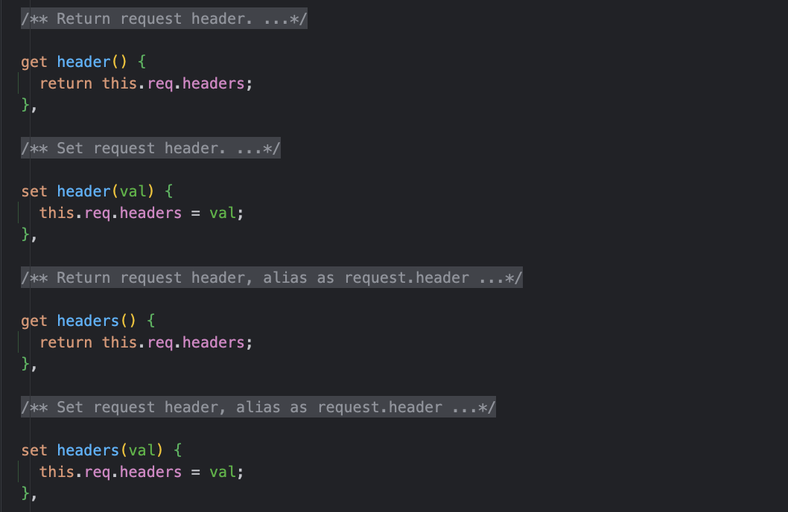
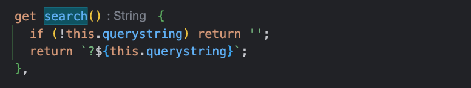
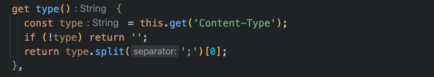

# Request对象

`Koa`框架的 `Request` 对象是对 `Node` 的 原生请求对象进一步封装，提供了很多对 `HTTP` 服务器开发有用的功能、API方法。

## API方法

### request.header

请求头对象信息，也支持设置请求头对象信息

```js
app.use(async (ctx, next) => {
  // 获取
  console.log(ctx.request.header)
  // 设置
  ctx.request.header = {
    reference: 'https://code.142vip.cn'
  }
  await next()
})
```

可能会疑惑这里的`ctx.request.header`,可以将这里的`Context`上下文上的`Request`理解为`Node`的`Request`对象，查看源码：



可以看到`request.header`和`request.headers`是等价的，我想这里应该是版本升级时兼容用户惯用思维吧

### request.method

- 获取请求方法
- 设置请求头方法

由于可以实现对method类型修改，因此可以用于在单点登录、请求转发等业务中实现方法类型重写

### request.length

以数字的形式返回请求的 `Content-Length`字段，，如果为空串时，则返回`undefined`

### request.url

### request.originUrl

获取请求原始URL。

### request.origin

获取URL的来源，包括 `protocol` 和 `host`。例如：

```js
console.log(ctx.request.origin)
// => https://code.142vip.cn
```

### request.href

获取完整的请求URL，包括 `protocol`、`host` 和 `url`。例如：

```js
console.log(ctx.request.href)
// => https://code.142vip.cn?from=koa
```

### request.path

- 获取请求路径名
- 设置请求路径名，并在存在时保留查询字符串

### request.querystring

- 根据 `?` 获取原始查询字符串
- 设置原始查询字符串

例如：

```js
// 查询
console.log(ctx.request.querystring)

// 设置
ctx.request.querystring = '?a=1&b=2'
```

### request.search

查询、设置客户端请求的原始查询字符串，查看源码：



和`querystring`类似，如果`querystring`不存在时返回空串，存在时在返回`?querystring`,用来显示原始查询字符串

### request.host

存在时获取主机（主机名+端口）。当 `app.proxy` 是 true 时支持 `X-Forwarded-Host`，否则使用 `Host`地址

### request.type

获取请求上下文中的 `Content-Type` 字段的值，查看源码：



从源码的`split`方法可以知道： 这里的`type()`只能获取到`mine-type`

### request.charset

存在时获取请求字符集，不存在则返回`undefined`,例如：

```js
ctx.request.charset
// => "utf-8"
```

### request.query

请求时的查询字符串，可以设置、获取该对象，没有查询字符串时，返回空对象，例如：

```js
// curl https://code.142vip.cn?color=blue&size=small

// 获取查询字符串
console.log(ctx.request.query)
// 输出对象： {color:"blue",size:'small'}

// 设置查询字符串
ctx.query = { next: '/login' }
```

### request.ip

请求远程地址。 当 `app.proxy` 是 true 时支持 `X-Forwarded-Proto`。

### request.ips

当 `X-Forwarded-For` 存在并且 `app.proxy` 被启用时，这些 `ips` 的数组被返回，从上游 -->下游排序。 **禁用时返回一个空数组**。

例如：

- 如果值是 "client, proxyClient1, proxyClient2"，将会得到数组 `["client", "proxyClient1", "proxyClient2"]`。
- 大多数反向代理（nginx）都通过 `proxy_add_x_forwarded_for` 设置了 `x-forwarded-for`，这带来了一定的安全风险。
- 恶意攻击者可以通过伪造 `X-Forwarded-For` 请求头来伪造客户端的ip地址。
- 客户端发送的请求具有 `forged` 的 `X-Forwarded-For` 请求头。
- 再由反向代理转发之后，`request.ips` 将是 `['forged', 'client', 'proxyClient1', 'proxyClient2']`。

### 更多

`Request`对象的可用API还是非常多的，具体可以参考：[Request API](https://github.com/koajs/koa/blob/master/lib/request.js)

## 一些实践

@[code js](@code/koa/koa-request.js)
